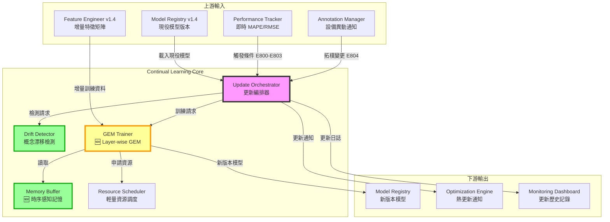

# PRD v1.1: 持續學習與模型線上更新
# (Continual Learning & Online Model Update)

**文件版本:** v1.1-Reviewed (GEM Algorithm Optimized)  
**日期:** 2026-02-26  
**負責人:** Oscar Chang / HVAC 系統工程團隊  
**目標模組:** 
- `src/continual_learning/update_orchestrator.py` (新增)
- `src/continual_learning/gem_trainer.py` (新增)
- `src/continual_learning/drift_detector.py` (新增)
- `src/continual_learning/memory_buffer.py` (新增)
- `src/monitoring/performance_tracker.py` (擴充)

**上游契約:** 
- `src/training/model_registry.py` (v1.4+, Model Registry Index)
- `src/monitoring/performance_tracker.py` (v1.0+, 即時性能指標)
- `src/etl/feature_engineer.py` (v1.4+, 增量特徵矩陣)
- **Interface Contract v1.2** (Error Code Hierarchy E800-E829)

**下游契約:** 
- `src/optimization/engine.py` (v1.3+, 模型熱更新通知)
- `src/training/model_registry.py` (v1.4+, 新版本模型註冊)

**預估工時:** 12 ~ 15 個工程天（含 GEM 演算法實作、漂移檢測、資源管理、審查修正）

---

## 1. 執行總綱與設計哲學

### 1.1 為何需要持續學習？

HVAC 系統面臨**概念漂移 (Concept Drift)** 挑戰：

| 漂移類型 | 成因 | 影響 |
|:---|:---|:---|
| **設備老化** | 熱交換器結垢、壓縮機磨損 | 相同工況下耗電增加 5-15% |
| **季節變遷** | 夏季極端高溫、冬季低負載 | 模型未見過的工況組合 |
| **控制策略調整** | 工程師修改 Setpoint 邏輯 | 既有特徵-目標關係改變 |
| **設備擴充** | 新增冷卻水塔或變頻器 | 拓樸結構改變 |

傳統批次訓練的模型在部署後 3-6 個月內，MAPE 可能從 3% 劣化至 8-12%，導致優化決策失準。

### 1.2 v1.1 核心設計原則

1. **生命週期保鮮**: 模型不是一次性產品，而是需要持續進化的數位資產
2. **防災難性遺忘**: 使用 **Layer-wise GEM** 保留對歷史極端工況的記憶
3. **輕量級更新**: 線上微調必須在 15 分鐘內完成，不中斷優化服務
4. **智能觸發**: 基於性能監控自動觸發更新，而非盲目定期重訓
5. **安全回滾**: 新版本模型必須通過 A/B 測試，保留一鍵回滾機制
6. **🆕 設備異動感知**: 拓樸變更時自動觸發模型結構調整

### 1.3 與上下游模組的關係



---

## 2. 介面契約規範 (Interface Contracts)

### 2.1 輸入契約

#### 2.1.1 從 Model Registry (v1.4)

```python
class ModelRegistryQueryContract(BaseModel):
    """從 Model Registry 載入現役模型的契約"""
    
    model_id: str  # e.g., "system_total_kw_gnn_v2"
    version: str   # e.g., "20250226_143022"
    
    # 模型檔案路徑
    model_path: Path
    scaler_path: Path
    feature_manifest_path: Path
    
    # 模型元資料
    training_metadata: Dict  # 包含原始訓練配置
    performance_baseline: Dict  # 原始驗證指標
    
    # 🆕 Continual Learning 專用
    update_history: List[Dict]  # 歷次更新記錄
    gem_memory_path: Optional[Path]  # GEM 記憶緩衝檔案
    
    # 🆕 模型架構資訊（用於 Layer-wise GEM）
    model_architecture: Optional[Dict] = None  # 各層參數形狀

class ContinualLearningInputContract(BaseModel):
    """Continual Learning 完整輸入契約"""
    
    # 1. 現役模型資訊
    active_model: ModelRegistryQueryContract
    
    # 2. 增量資料 (最近 N 天的特徵矩陣)
    incremental_data: pl.DataFrame
    data_time_range: Tuple[datetime, datetime]
    
    # 3. 性能監控指標
    recent_performance: PerformanceMetrics
    
    # 4. 🆕 設備異動通知
    equipment_changes: Optional[List[EquipmentChangeEvent]] = None
    
    # 5. 更新策略配置
    update_config: ContinualLearningConfig
```

#### 2.1.2 從 Performance Tracker

```python
class PerformanceMetrics(BaseModel):
    """性能監控指標"""
    
    # 預測準確性指標
    mape_24h: float      # 最近 24 小時 MAPE
    mape_7d: float       # 最近 7 天 MAPE
    rmse_24h: float
    rmse_7d: float
    
    # 漂移檢測指標
    prediction_bias: float  # 系統性偏差
    variance_ratio: float   # 方差變化比率
    
    # 與基準比較
    baseline_mape: float    # 原始驗證 MAPE
    degradation_pct: float  # 劣化百分比
    
    timestamp: datetime

class EquipmentChangeEvent(BaseModel):
    """設備異動事件"""
    
    event_type: Literal[
        "equipment_added",      # 新增設備
        "equipment_removed",    # 移除設備
        "topology_modified",    # 拓樸調整
        "control_re-tuned",     # 控制參數重調
        "maintenance_major"     # 重大維修
    ]
    
    equipment_id: str
    change_description: str
    timestamp: datetime
    
    # 對模型的影響評估
    impact_severity: Literal["low", "medium", "high", "critical"]
    recommended_action: Literal["monitor", "retrain", "immediate_update"]
    
    # 🆕 拓樸變更詳細資訊
    topology_changes: Optional[Dict] = None  # 新增/移除的連接關係
```

### 2.2 輸出契約

```python
class ContinualLearningOutputContract(BaseModel):
    """Continual Learning 輸出契約"""
    
    # 1. 新版本模型資訊
    new_model_version: str  # 自動生成的版本號
    new_model_path: Path
    
    # 2. 更新元資料
    update_metadata: UpdateMetadata
    
    # 3. 性能比較
    performance_comparison: PerformanceComparison
    
    # 4. GEM 記憶緩衝（供下次更新使用）
    gem_memory_path: Path
    
    # 5. 更新決策建議
    deployment_recommendation: Literal[
        "immediate",      # 立即部署
        "ab_test",        # A/B 測試
        "rollback",       # 回滾建議
        "manual_review"   # 人工審查
    ]
    
    # 🆕 6. 設備異動處理結果
    equipment_change_handled: Optional[bool] = None
    topology_updated: Optional[bool] = None

class UpdateMetadata(BaseModel):
    """更新元資料"""
    
    update_id: str  # UUID
    trigger_reason: Literal[
        "performance_degradation",  # 性能劣化
        "scheduled",                # 定期更新
        "equipment_change",         # 設備異動
        "manual",                   # 人工觸發
        "drift_detected"            # 漂移檢測
    ]
    
    # 時間戳
    triggered_at: datetime
    started_at: datetime
    completed_at: datetime
    duration_seconds: float
    
    # 訓練資訊
    training_samples: int
    epochs_trained: int
    final_loss: float
    
    # GEM 專用
    gem_memory_size: int      # 記憶緩衝中的樣本數
    gem_constraints_applied: int  # 應用的梯度約束次數
    
    # 🆕 Layer-wise GEM 統計
    layerwise_constraint_stats: Optional[Dict] = None  # 每層約束應用次數
    
    # 資源使用
    resource_usage: ResourceUsageReport

class PerformanceComparison(BaseModel):
    """新舊模型性能比較"""
    
    # 驗證集性能
    old_model_mape: float
    new_model_mape: float
    mape_improvement: float  # 百分比
    
    old_model_rmse: float
    new_model_rmse: float
    
    # 🆕 災難性遺忘檢測
    old_data_performance: float  # 在舊資料上的性能
    forgetting_ratio: float      # 遺忘比率（越低越好）
    
    # 統計顯著性
    improvement_significant: bool  # 改善是否統計顯著
```

---

## 3. 核心模組實作

### 3.1 更新編排器 (Update Orchestrator)

**檔案**: `src/continual_learning/update_orchestrator.py`

```python
import logging
from typing import Dict, Optional, Literal, List
from datetime import datetime, timedelta
from enum import Enum
import numpy as np

from src.continual_learning.drift_detector import DriftDetector
from src.continual_learning.gem_trainer import GEMTrainer
from src.continual_learning.memory_buffer import EpisodicMemoryBuffer
from src.infrastructure.resource_manager import ResourceManager

class UpdateTriggerType(Enum):
    """更新觸發類型"""
    PERFORMANCE_THRESHOLD = "performance_degradation"  # 性能劣化觸發
    SCHEDULED = "scheduled"                            # 定期觸發
    EQUIPMENT_CHANGE = "equipment_change"              # 設備異動
    MANUAL = "manual"                                  # 人工觸發
    DRIFT_DETECTED = "drift_detected"                  # 漂移檢測觸發

class UpdateOrchestrator:
    """
    持續學習更新編排器
    
    職責：
    1. 監聽多種觸發條件
    2. 協調漂移檢測、GEM 訓練、模型驗證
    3. 管理更新生命週期（觸發→訓練→驗證→部署）
    4. 🆕 處理設備異動事件（拓樸變更）
    5. 資源調度與 OOM 防護
    """
    
    # 性能劣化閾值配置
    DEGRADATION_THRESHOLD_PCT = 15.0  # MAPE 劣化超過 15% 觸發更新
    ABSOLUTE_MAPE_THRESHOLD = 8.0     # 絕對 MAPE 超過 8% 觸發更新
    
    # 定期更新配置
    SCHEDULED_INTERVAL_DAYS = 30      # 預設 30 天定期更新
    
    def __init__(self, config: ContinualLearningConfig):
        self.config = config
        self.logger = logging.getLogger("UpdateOrchestrator")
        
        # 初始化子模組
        self.drift_detector = DriftDetector(config.drift_detection)
        self.gem_trainer = GEMTrainer(config.gem)
        self.memory_buffer = EpisodicMemoryBuffer(config.memory_buffer)
        self.resource_manager = ResourceManager(config.resource)
        
        # 狀態追蹤
        self.last_update_time: Optional[datetime] = None
        self.update_history: List[Dict] = []
        self.active_update: Optional[str] = None
        
        # 🆕 設備異動追蹤
        self.pending_equipment_changes: List[EquipmentChangeEvent] = []
        
        # 🆕 第二次審查修正：分散式鎖定機制（Issue #8）
        self._distributed_lock: Optional[Any] = None
        self._lock_timeout_seconds: int = 3600  # 1 小時超時
        self._init_distributed_lock()
    
    def should_update(
        self, 
        performance_metrics: PerformanceMetrics,
        equipment_changes: Optional[List[EquipmentChangeEvent]] = None
    ) -> Tuple[bool, UpdateTriggerType, str]:
        """
        判斷是否應該觸發模型更新
        
        🆕 新增：處理設備異動事件
        
        Returns:
            (should_update, trigger_type, reason)
        """
        # 🆕 檢查 0: 設備異動（最高優先級）
        if equipment_changes:
            for change in equipment_changes:
                if change.event_type == "topology_modified":
                    self.pending_equipment_changes.append(change)
                    return True, UpdateTriggerType.EQUIPMENT_CHANGE, (
                        f"E804: 檢測到拓樸結構變更 - {change.equipment_id}"
                    )
                elif change.impact_severity in ["high", "critical"]:
                    return True, UpdateTriggerType.EQUIPMENT_CHANGE, (
                        f"E804: 高影響設備異動 - {change.equipment_id}"
                    )
        
        # 檢查 1: 性能劣化閾值
        if performance_metrics.degradation_pct > self.DEGRADATION_THRESHOLD_PCT:
            return True, UpdateTriggerType.PERFORMANCE_THRESHOLD, (
                f"E800: 性能劣化 {performance_metrics.degradation_pct:.1f}% "
                f"超過閾值 {self.DEGRADATION_THRESHOLD_PCT}%"
            )
        
        # 檢查 2: 絕對性能閾值
        if performance_metrics.mape_7d > self.ABSOLUTE_MAPE_THRESHOLD:
            return True, UpdateTriggerType.PERFORMANCE_THRESHOLD, (
                f"E801: 7天MAPE {performance_metrics.mape_7d:.1f}% "
                f"超過閾值 {self.ABSOLUTE_MAPE_THRESHOLD}%"
            )
        
        # 檢查 3: 定期更新
        if self.last_update_time:
            days_since_update = (datetime.now() - self.last_update_time).days
            if days_since_update >= self.SCHEDULED_INTERVAL_DAYS:
                return True, UpdateTriggerType.SCHEDULED, (
                    f"E802: 距上次更新已 {days_since_update} 天，"
                    f"達到定期更新間隔 {self.SCHEDULED_INTERVAL_DAYS} 天"
                )
        
        # 檢查 4: 概念漂移（由 DriftDetector 執行）
        drift_detected, drift_info = self.drift_detector.check_drift(performance_metrics)
        if drift_detected:
            return True, UpdateTriggerType.DRIFT_DETECTED, (
                f"E803: 檢測到概念漂移 - {drift_info}"
            )
        
        return False, None, "性能在可接受範圍內"
    
    def _init_distributed_lock(self):
        """
        🆕 第二次審查修正：初始化分散式鎖定機制（Issue #8）
        
        支援 Redis、檔案系統或記憶體內鎖定
        """
        try:
            # 優先使用 Redis 分散式鎖
            import redis
            redis_client = redis.from_url(os.getenv("REDIS_URL", "redis://localhost:6379"))
            self._distributed_lock = RedisLock(redis_client, "continual_learning_update")
            self.logger.info("使用 Redis 分散式鎖定")
        except ImportError:
            # 退回到檔案鎖
            self._distributed_lock = FileLock("/tmp/continual_learning.lock")
            self.logger.info("使用檔案系統鎖定")
    
    def _acquire_update_lock(self, timeout_seconds: int = 3600) -> bool:
        """
        🆕 取得更新鎖定
        
        Returns:
            是否成功取得鎖定
        """
        if self._distributed_lock is None:
            return True
        
        acquired = self._distributed_lock.acquire(blocking=False)
        if not acquired:
            self.logger.warning("無法取得更新鎖定，可能有其他實例正在執行更新")
        return acquired
    
    def _release_update_lock(self):
        """🆕 釋放更新鎖定"""
        if self._distributed_lock and hasattr(self._distributed_lock, 'release'):
            try:
                self._distributed_lock.release()
            except Exception as e:
                self.logger.warning(f"釋放鎖定時發生錯誤: {e}")
    
    def execute_update(
        self,
        active_model: ModelRegistryQueryContract,
        incremental_data: pl.DataFrame,
        trigger_type: UpdateTriggerType,
        reason: str,
        equipment_changes: Optional[List[EquipmentChangeEvent]] = None
    ) -> ContinualLearningOutputContract:
        """
        執行完整的持續學習更新流程 - 🆕 第二次審查修正：分散式鎖定保護
        
        🆕 新增：設備異動處理路徑
        """
        # 🆕 檢查並取得分散式鎖定
        if not self._acquire_update_lock():
            return ContinualLearningOutputContract(
                new_model_path=None,
                new_version=None,
                metrics=None,
                deployment_recommendation=DeploymentRecommendation(
                    action=DeploymentAction.ABORT,
                    confidence=1.0,
                    reasoning="E815: 無法取得分散式鎖定，另一更新流程正在執行中"
                ),
                forgetting_detected=False,
                forgetting_ratio=0.0
            )
        
        update_id = self._generate_update_id()
        self.active_update = update_id
        started_at = datetime.now()
        
        self.logger.info(f"啟動更新 {update_id}: {reason}")
        
        try:
            # Phase 1: 資源申請
            self.logger.info("Phase 1: 申請訓練資源...")
            resource_allocation = self._allocate_resources()
            
            # Phase 2: 載入現役模型
            self.logger.info("Phase 2: 載入現役模型...")
            old_model = self._load_active_model(active_model)
            
            # 🆕 Phase 2.5: 處理設備異動（拓樸變更）
            topology_updated = False
            if equipment_changes and any(
                c.event_type == "topology_modified" for c in equipment_changes
            ):
                self.logger.info("Phase 2.5: 處理拓樸變更...")
                old_model = self._handle_topology_changes(
                    old_model, equipment_changes, active_model
                )
                topology_updated = True
            
            # Phase 3: 載入或初始化 GEM 記憶緩衝（🆕 添加版本檢查）
            self.logger.info("Phase 3: 準備 GEM 記憶緩衝...")
            memory_loaded = False
            if active_model.gem_memory_path and active_model.gem_memory_path.exists():
                memory_loaded = self.memory_buffer.load(
                    active_model.gem_memory_path,
                    expected_model_version=active_model.version  # 🆕 版本相容性檢查
                )
            
            if not memory_loaded:
                self.logger.info("初始化新的記憶緩衝")
                self._initialize_memory_buffer(old_model, active_model)
            
            # Phase 4: 執行 GEM 訓練
            self.logger.info("Phase 4: 執行 GEM 訓練...")
            training_result = self.gem_trainer.train(
                model=old_model,
                new_data=incremental_data,
                memory_buffer=self.memory_buffer,
                config=self.config.gem
            )
            
            # Phase 5: 性能驗證
            self.logger.info("Phase 5: 驗證新模型性能...")
            validation_result = self._validate_new_model(
                training_result.new_model,
                old_model,
                incremental_data
            )
            
            # Phase 6: 災難性遺忘檢測
            self.logger.info("Phase 6: 檢測災難性遺忘...")
            forgetting_check = self._check_catastrophic_forgetting(
                training_result.new_model,
                old_model
            )
            
            # Phase 7: 生成部署決策
            deployment_rec = self._generate_deployment_recommendation(
                validation_result,
                forgetting_check,
                trigger_type
            )
            
            # Phase 8: 保存結果
            completed_at = datetime.now()
            output = self._package_output(
                update_id=update_id,
                trigger_type=trigger_type,
                reason=reason,
                started_at=started_at,
                completed_at=completed_at,
                training_result=training_result,
                validation_result=validation_result,
                forgetting_check=forgetting_check,
                deployment_rec=deployment_rec,
                resource_allocation=resource_allocation
            )
            
            # 🆕 添加設備異動處理結果
            output.equipment_change_handled = equipment_changes is not None
            output.topology_updated = topology_updated
            
            self.update_history.append(output.update_metadata.dict())
            self.last_update_time = completed_at
            self.active_update = None
            
            self.logger.info(f"更新 {update_id} 完成，建議: {deployment_rec}")
            return output
            
        except Exception as e:
            self.active_update = None
            self.logger.error(f"E810: 更新 {update_id} 失敗: {e}")
            raise ContinualLearningError(f"E810: 持續學習更新失敗: {e}") from e
        
        finally:
            # 釋放資源
            self._release_resources()
    
    def _handle_topology_changes(
        self,
        model: nn.Module,
        equipment_changes: List[EquipmentChangeEvent],
        active_model: ModelRegistryQueryContract
    ) -> nn.Module:
        """
        🆕 處理拓樸變更
        
        當設備拓樸結構改變時：
        1. 重新生成 Adjacency Matrix
        2. 調整 GNN 相關層（若新增/移除設備）
        3. 更新模型配置
        
        Args:
            model: 現役模型
            equipment_changes: 設備異動事件列表
            active_model: 模型註冊資訊
        
        Returns:
            調整後的模型
        """
        from src.features.topology_manager import TopologyManager
        from src.features.annotation_manager import FeatureAnnotationManager
        
        self.logger.info(f"處理 {len(equipment_changes)} 個設備異動事件")
        
        # 重新載入最新拓樸
        annotation_manager = FeatureAnnotationManager(
            site_id=active_model.training_metadata.get('site_id', 'default')
        )
        topology_manager = TopologyManager(annotation_manager)
        
        # 檢查設備增刪
        added_equipment = []
        removed_equipment = []
        
        for change in equipment_changes:
            if change.event_type == "equipment_added":
                added_equipment.append(change.equipment_id)
            elif change.event_type == "equipment_removed":
                removed_equipment.append(change.equipment_id)
        
        self.logger.info(f"新增設備: {added_equipment}, 移除設備: {removed_equipment}")
        
        # 🆕 若為 GNN 模型，調整模型結構
        if hasattr(model, 'gnn_layers') or 'gnn' in active_model.model_id:
            model = self._adjust_gnn_for_topology_change(
                model, added_equipment, removed_equipment, topology_manager
            )
        
        return model
    
    def _adjust_gnn_for_topology_change(
        self,
        model: nn.Module,
        added_equipment: List[str],
        removed_equipment: List[str],
        topology_manager: TopologyManager
    ) -> nn.Module:
        """
        🆕 調整 GNN 模型以適應拓樸變更
        
        策略：
        - 新增設備：初始化新節點的嵌入層
        - 移除設備：標記為無效節點（不刪除以保留知識）
        """
        self.logger.info("調整 GNN 模型結構...")
        
        # 獲取當前設備數
        current_nodes = topology_manager.get_node_count()
        
        # 若模型有節點嵌入層，調整其大小
        if hasattr(model, 'node_embedding'):
            old_embedding = model.node_embedding
            # 創建新的嵌入層
            new_embedding = nn.Embedding(current_nodes, old_embedding.embedding_dim)
            
            # 複製舊設備的嵌入權重
            with torch.no_grad():
                for i in range(min(old_embedding.num_embeddings, current_nodes)):
                    new_embedding.weight[i] = old_embedding.weight[i]
                
                # 新增設備使用鄰居平均初始化
                for eq_id in added_equipment:
                    idx = topology_manager.get_equipment_index(eq_id)
                    neighbors = topology_manager.get_neighbors(eq_id)
                    if neighbors:
                        neighbor_indices = [
                            topology_manager.get_equipment_index(n) 
                            for n in neighbors
                        ]
                        neighbor_indices = [
                            i for i in neighbor_indices 
                            if i < old_embedding.num_embeddings
                        ]
                        if neighbor_indices:
                            new_embedding.weight[idx] = old_embedding.weight[
                                neighbor_indices
                            ].mean(dim=0)
            
            model.node_embedding = new_embedding
            self.logger.info(f"節點嵌入層調整: {old_embedding.num_embeddings} -> {current_nodes}")
        
        return model
    
    def _initialize_memory_buffer(
        self,
        model,
        active_model: ModelRegistryQueryContract
    ):
        """初始化 GEM 記憶緩衝"""
        # 從原始訓練資料中抽樣代表性樣本
        self.logger.info("從原始訓練資料建立初始記憶緩衝...")
        
        # 載入原始訓練資料子集
        original_data = self._load_original_training_samples(
            active_model.training_metadata,
            n_samples=self.config.memory_buffer.initial_size
        )
        
        # 🆕 保存序列上下文（若為時序/GNN模型）
        self.memory_buffer.initialize_from_data(
            original_data, 
            model,
            preserve_context=True  # 🆕 保留時序/GNN上下文
        )
    
    def _check_catastrophic_forgetting(
        self,
        new_model,
        old_model
    ) -> Dict:
        """
        檢測災難性遺忘
        
        🆕 修正：支援時序/GNN 模型的正確評估
        """
        # 🆕 從記憶緩衝中取出舊樣本（含上下文）
        old_samples = self.memory_buffer.get_all_samples()
        
        if not old_samples:
            self.logger.warning("記憶緩衝為空，跳過遺忘檢測")
            return {
                "old_model_mape_on_old_data": 0.0,
                "new_model_mape_on_old_data": 0.0,
                "forgetting_ratio_pct": 0.0,
                "is_acceptable": True
            }
        
        # 🆕 使用支援上下文的預測方法
        old_predictions = self._predict_with_context(old_model, old_samples)
        new_predictions = self._predict_with_context(new_model, old_samples)
        
        # 計算性能指標
        old_mape = self._calculate_mape(old_samples.y, old_predictions)
        new_mape = self._calculate_mape(old_samples.y, new_predictions)
        
        forgetting_ratio = ((new_mape - old_mape) / (old_mape + 1e-8)) * 100
        
        return {
            "old_model_mape_on_old_data": old_mape,
            "new_model_mape_on_old_data": new_mape,
            "forgetting_ratio_pct": forgetting_ratio,
            "is_acceptable": forgetting_ratio < 5.0  # 5% 以內可接受
        }
    
    def _predict_with_context(self, model, samples) -> np.ndarray:
        """
        🆕 使用正確的上下文進行預測
        
        支援：
        - 一般模型：直接預測
        - RNN/時序模型：提供序列上下文
        - GNN 模型：提供 Adjacency Matrix
        """
        predictions = []
        
        for sample in samples:
            # 🆕 檢查樣本是否包含上下文資訊
            if hasattr(sample, 'context') and sample.context:
                context = sample.context
                
                # GNN 模型需要 adjacency_matrix
                if 'adjacency_matrix' in context:
                    pred = model.predict(
                        sample.x,
                        adjacency_matrix=context['adjacency_matrix']
                    )
                # RNN 模型需要序列歷史
                elif 'sequence_history' in context:
                    pred = model.predict(
                        sample.x,
                        sequence_history=context['sequence_history']
                    )
                else:
                    pred = model.predict(sample.x)
            else:
                # 無上下文，直接預測
                pred = model.predict(sample.x)
            
            predictions.append(pred)
        
        return np.array(predictions)
```

---

## 4. GEM (Gradient Episodic Memory) 訓練器

### 4.1 GEM 演算法原理

GEM 解決持續學習中的**災難性遺忘**問題：

```
傳統微調的問題：
- 在新資料上微調模型
- 模型參數為了適應新資料，大幅改變
- 導致在舊資料上性能急劇下降（遺忘）

GEM 的解決方案：
1. 維護一個「情境記憶緩衝」(Episodic Memory Buffer)
   - 儲存代表性的舊樣本
   
2. 計算舊樣本的梯度方向 g_old
   - 這是「應該記住的方向」
   
3. 計算新樣本的梯度方向 g_new
   - 這是「想要學習的方向」
   
4. 如果 g_new 與 g_old 衝突（夾角 > 90°）
   - 🆕 分層投影：在每個網路層分別計算並應用約束
   - 確保學習新知識時不損害舊記憶
```

### 4.2 🆕 Layer-wise GEM 訓練器

**檔案**: `src/continual_learning/gem_trainer.py`

```python
import torch
import torch.nn as nn
import numpy as np
from typing import Dict, List, Tuple
from dataclasses import dataclass

@dataclass
class GEMConstraints:
    """GEM 梯度約束結果"""
    original_gradient: np.ndarray
    projected_gradient: np.ndarray
    constraint_applied: bool
    violation_angle: float  # 度數

@dataclass
class LayerWiseGEMConstraints:
    """🆕 分層 GEM 約束結果"""
    layer_constraints: Dict[str, GEMConstraints]  # 每層的約束
    overall_violation: bool
    avg_violation_angle: float

class GEMTrainer:
    """
    🆕 分層梯度情境記憶訓練器
    
    基於論文: "Gradient Episodic Memory for Continual Learning"
    (Lopez-Paz & Ranzato, NIPS 2017)
    
    🆕 重要改進：
    - 採用 Layer-wise 梯度投影（而非全局平坦化）
    - 避免維度災難導致的梯度正交問題
    - 保留梯度計算圖狀態（不污染主模型梯度）
    
    適用於：
    - 神經網路模型（GNN、MLP、RNN）
    - 需要梯度優化的模型
    """
    
    def __init__(self, config: GEMConfig):
        self.config = config
        self.logger = logging.getLogger("GEMTrainer")
        
        # 約束違反統計
        self.constraint_violations = 0
        self.total_updates = 0
        
        # 🆕 分層約束統計
        self.layer_constraint_stats: Dict[str, int] = {}
    
    def train(
        self,
        model: nn.Module,
        new_data: pl.DataFrame,
        memory_buffer: EpisodicMemoryBuffer,
        config: GEMTrainingConfig
    ) -> GEMTrainingResult:
        """
        執行 Layer-wise GEM 訓練
        
        Args:
            model: 現役模型（將被微調）
            new_data: 新收集的訓練資料
            memory_buffer: 情境記憶緩衝（含舊樣本）
            config: 訓練配置
        """
        self.logger.info(f"開始 Layer-wise GEM 訓練: {len(new_data)} 新樣本, "
                        f"記憶緩衝: {len(memory_buffer)} 樣本")
        
        # 準備資料
        new_loader = self._prepare_data_loader(new_data, config.batch_size)
        
        # 優化器
        optimizer = torch.optim.Adam(
            model.parameters(),
            lr=config.learning_rate,
            weight_decay=config.weight_decay
        )
        
        # 訓練迴圈
        epoch_losses = []
        constraint_history = []
        
        for epoch in range(config.num_epochs):
            epoch_loss = 0
            epoch_constraints = []
            
            for batch_idx, (X_batch, y_batch) in enumerate(new_loader):
                # 1. 計算新資料的梯度
                optimizer.zero_grad()
                
                predictions = model(X_batch)
                new_loss = nn.MSELoss()(predictions, y_batch)
                new_loss.backward()
                
                # 🆕 提取新資料的梯度（按層組織）
                new_grads_by_layer = self._extract_gradient_by_layer(model)
                
                # 2. 🌟 Layer-wise GEM 核心：計算約束
                if len(memory_buffer) > 0:
                    constraint_result = self._apply_layerwise_gem_constraint(
                        model=model,
                        new_grads_by_layer=new_grads_by_layer,
                        memory_buffer=memory_buffer,
                        optimizer=optimizer  # 🆕 傳入 optimizer 以保留計算圖
                    )
                    
                    # 如果發生衝突，投影梯度
                    if constraint_result.overall_violation:
                        self._set_gradient_by_layer(
                            model, 
                            constraint_result.layer_constraints
                        )
                        epoch_constraints.append(constraint_result.avg_violation_angle)
                
                # 3. 參數更新
                optimizer.step()
                
                epoch_loss += new_loss.item()
                self.total_updates += 1
            
            # 記錄 epoch 統計
            avg_loss = epoch_loss / len(new_loader)
            epoch_losses.append(avg_loss)
            
            if epoch_constraints:
                constraint_history.append(np.mean(epoch_constraints))
            
            # Early stopping
            if epoch > 10 and self._check_convergence(epoch_losses):
                self.logger.info(f"Epoch {epoch}: 收斂，提前停止")
                break
            
            if epoch % 5 == 0:
                self.logger.info(f"Epoch {epoch}: loss={avg_loss:.4f}")
        
        # 更新記憶緩衝
        self._update_memory_buffer(memory_buffer, new_data, model)
        
        return GEMTrainingResult(
            new_model=model,
            epochs_trained=len(epoch_losses),
            final_loss=epoch_losses[-1],
            loss_history=epoch_losses,
            constraint_violations=self.constraint_violations,
            avg_violation_angle=np.mean(constraint_history) if constraint_history else 0,
            layerwise_constraint_stats=self.layer_constraint_stats.copy()  # 🆕
        )
    
    def _extract_gradient_by_layer(self, model: nn.Module) -> Dict[str, np.ndarray]:
        """
        🆕 按層提取梯度
        
        Returns:
            層名稱到梯度向量的映射
        """
        grads_by_layer = {}
        
        for name, param in model.named_parameters():
            if param.grad is not None:
                # 按層名稱分組（如 "conv1", "fc2"）
                layer_name = name.split('.')[0]
                if layer_name not in grads_by_layer:
                    grads_by_layer[layer_name] = []
                grads_by_layer[layer_name].append(param.grad.detach().cpu().numpy().flatten())
        
        # 合併每層的梯度
        for layer_name in grads_by_layer:
            grads_by_layer[layer_name] = np.concatenate(grads_by_layer[layer_name])
        
        return grads_by_layer
    
    def _apply_layerwise_gem_constraint(
        self,
        model: nn.Module,
        new_grads_by_layer: Dict[str, np.ndarray],
        memory_buffer: EpisodicMemoryBuffer,
        optimizer: torch.optim.Optimizer
    ) -> LayerWiseGEMConstraints:
        """
        🆕 應用 Layer-wise GEM 梯度約束
        
        核心邏輯：
        1. 對每個網路層分別計算參考梯度
        2. 在每層獨立判斷梯度衝突
        3. 若衝突，在該層投影梯度
        
        🆕 關鍵改進：
        - 使用 .clone() 保存原始梯度
        - 使用臨時 optimizer 計算參考梯度，不污染主計算圖
        """
        # 🆕 保存原始梯度副本（避免污染）
        original_grads = {
            name: param.grad.clone() if param.grad is not None else None
            for name, param in model.named_parameters()
        }
        
        # 計算記憶樣本的參考梯度（按層）
        ref_grads_by_layer = self._compute_reference_gradients_by_layer(
            model, memory_buffer
        )
        
        # 對每層應用 GEM 約束
        layer_constraints = {}
        any_violation = False
        violation_angles = []
        
        for layer_name in new_grads_by_layer:
            if layer_name not in ref_grads_by_layer:
                continue
            
            new_grad = new_grads_by_layer[layer_name]
            ref_grad = ref_grads_by_layer[layer_name]
            
            # 計算內積
            dot_product = np.dot(new_grad, ref_grad)
            
            # 計算夾角
            angle = self._compute_angle(new_grad, ref_grad)
            
            # GEM 約束：如果內積 < 0，需要投影
            if dot_product < 0:
                self.constraint_violations += 1
                any_violation = True
                violation_angles.append(angle)
                
                # 更新統計
                self.layer_constraint_stats[layer_name] = \
                    self.layer_constraint_stats.get(layer_name, 0) + 1
                
                # 投影計算
                ref_norm_sq = np.dot(ref_grad, ref_grad)
                projection_coeff = dot_product / (ref_norm_sq + 1e-8)
                projected_grad = new_grad - projection_coeff * ref_grad
                
                layer_constraints[layer_name] = GEMConstraints(
                    original_gradient=new_grad,
                    projected_gradient=projected_grad,
                    constraint_applied=True,
                    violation_angle=angle
                )
            else:
                layer_constraints[layer_name] = GEMConstraints(
                    original_gradient=new_grad,
                    projected_gradient=new_grad,
                    constraint_applied=False,
                    violation_angle=angle
                )
        
        # 🆕 恢復原始梯度（清除參考梯度計算的殘留）
        for name, param in model.named_parameters():
            if original_grads[name] is not None:
                param.grad = original_grads[name]
        
        return LayerWiseGEMConstraints(
            layer_constraints=layer_constraints,
            overall_violation=any_violation,
            avg_violation_angle=np.mean(violation_angles) if violation_angles else 0.0
        )
    
    def _compute_reference_gradients_by_layer(
        self,
        model: nn.Module,
        memory_buffer: EpisodicMemoryBuffer
    ) -> Dict[str, np.ndarray]:
        """
        🆕 計算記憶樣本的參考梯度（按層）
        
        🆕 關鍵修正：
        - 使用臨時 optimizer 計算，不影響主模型梯度
        - 計算完成後清除臨時梯度
        """
        ref_grads_list: Dict[str, List[np.ndarray]] = {layer: [] for layer in self._get_layer_names(model)}
        
        for memory_sample in memory_buffer.sample_batches(
            self.config.memory_samples_per_update
        ):
            # 🆕 使用臨時 optimizer，不影響主計算圖
            temp_optimizer = torch.optim.SGD(model.parameters(), lr=0)
            temp_optimizer.zero_grad()
            
            # 計算損失並反向傳播
            pred = model(memory_sample.X)
            loss = nn.MSELoss()(pred, memory_sample.y)
            loss.backward()
            
            # 提取該樣本的梯度
            sample_grads = self._extract_gradient_by_layer(model)
            for layer_name, grad in sample_grads.items():
                if layer_name in ref_grads_list:
                    ref_grads_list[layer_name].append(grad)
            
            # 🆕 清除臨時梯度（重要！避免污染）
            temp_optimizer.zero_grad()
            del temp_optimizer
        
        # 平均各層的參考梯度
        ref_grads_by_layer = {}
        for layer_name, grads in ref_grads_list.items():
            if grads:
                ref_grads_by_layer[layer_name] = np.mean(grads, axis=0)
        
        return ref_grads_by_layer
    
    def _set_gradient_by_layer(
        self,
        model: nn.Module,
        layer_constraints: Dict[str, GEMConstraints]
    ):
        """
        🆕 按層設置投影後的梯度
        """
        for name, param in model.named_parameters():
            layer_name = name.split('.')[0]
            
            if layer_name in layer_constraints and param.grad is not None:
                constraint = layer_constraints[layer_name]
                
                if constraint.constraint_applied:
                    # 將投影後的梯度reshape回原始形狀
                    original_shape = param.grad.shape
                    projected_flat = constraint.projected_gradient
                    
                    # 計算該層在 flattened gradient 中的範圍
                    layer_grads = self._extract_gradient_by_layer(model)
                    if layer_name in layer_grads:
                        layer_size = layer_grads[layer_name].size
                        start_idx = 0
                        for ln, grad in layer_grads.items():
                            if ln == layer_name:
                                end_idx = start_idx + grad.size
                                break
                            start_idx += grad.size
                        
                        # 提取該參數對應的部分
                        param_proj = projected_flat[start_idx:end_idx]
                        param.grad = torch.tensor(
                            param_proj.reshape(original_shape),
                            dtype=param.grad.dtype,
                            device=param.grad.device
                        )
    
    def _get_layer_names(self, model: nn.Module) -> List[str]:
        """獲取模型所有層的名稱"""
        layer_names = set()
        for name, _ in model.named_parameters():
            layer_names.add(name.split('.')[0])
        return list(layer_names)
    
    def _compute_angle(self, v1: np.ndarray, v2: np.ndarray) -> float:
        """計算兩個向量的夾角（度數）"""
        cos_angle = np.dot(v1, v2) / (np.linalg.norm(v1) * np.linalg.norm(v2) + 1e-8)
        cos_angle = np.clip(cos_angle, -1.0, 1.0)
        return np.degrees(np.arccos(cos_angle))
```

---

## 5. 🆕 改進的概念漂移檢測器

**檔案**: `src/continual_learning/drift_detector.py`

```python
from typing import Tuple, Dict
import numpy as np
from scipy import stats

class DriftDetector:
    """
    概念漂移檢測器
    
    檢測資料分布或模型性能的顯著變化，
    作為觸發持續學習的依據
    
    🆕 重要改進：
    - 結合 PSI 與 KS 檢定，降低大樣本誤報
    - 限制比對樣本數，避免過度敏感
    """
    
    def __init__(self, config: DriftDetectionConfig):
        self.config = config
        self.baseline_stats = None
    
    def check_drift(self, performance_metrics: PerformanceMetrics) -> Tuple[bool, str]:
        """
        檢測是否發生概念漂移
        
        Returns:
            (drift_detected, description)
        """
        drift_indicators = []
        
        # 檢測 1: 預測偏差漂移
        if abs(performance_metrics.prediction_bias) > self.config.bias_threshold:
            drift_indicators.append(
                f"預測偏差 {performance_metrics.prediction_bias:.3f} "
                f"超過閾值 {self.config.bias_threshold}"
            )
        
        # 檢測 2: 方差變化
        if performance_metrics.variance_ratio > self.config.variance_threshold:
            drift_indicators.append(
                f"方差比率 {performance_metrics.variance_ratio:.2f} "
                f"超過閾值 {self.config.variance_threshold}"
            )
        
        # 檢測 3: 短期 vs 長期性能差異
        if hasattr(performance_metrics, 'mape_24h') and hasattr(performance_metrics, 'mape_7d'):
            short_long_ratio = performance_metrics.mape_24h / (performance_metrics.mape_7d + 1e-8)
            if short_long_ratio > 1.3:  # 短期性能明顯劣於長期平均
                drift_indicators.append(
                    f"短期/長期 MAPE 比率 {short_long_ratio:.2f} 異常"
                )
        
        drift_detected = len(drift_indicators) > 0
        description = "; ".join(drift_indicators) if drift_detected else "無顯著漂移"
        
        return drift_detected, description
    
    def detect_feature_drift(
        self,
        reference_data: np.ndarray,
        current_data: np.ndarray,
        feature_names: List[str],
        max_samples: int = 5000,  # 🆕 限制比對樣本數
        psi_threshold: float = 0.25  # 🆕 PSI 閾值
    ) -> Dict:
        """
        🆕 改進的特徵分布漂移檢測
        
        結合 PSI 與 KS 檢定：
        - PSI: 對大樣本穩定，適合監控分布變化
        - KS: 捕捉局部分布差異
        
        Args:
            reference_data: 參考分布資料
            current_data: 當前分布資料
            feature_names: 特徵名稱列表
            max_samples: 最大比對樣本數（避免 KS 過度敏感）
            psi_threshold: PSI 漂移閾值（0.1=輕微, 0.25=中等, 0.5=嚴重）
        """
        drift_results = {}
        
        # 🆕 限制樣本數（避免 KS 檢定過度敏感）
        if len(reference_data) > max_samples:
            ref_indices = np.random.choice(
                len(reference_data), max_samples, replace=False
            )
            reference_data = reference_data[ref_indices]
        
        if len(current_data) > max_samples:
            cur_indices = np.random.choice(
                len(current_data), max_samples, replace=False
            )
            current_data = current_data[cur_indices]
        
        for i, feature_name in enumerate(feature_names):
            ref_dist = reference_data[:, i]
            cur_dist = current_data[:, i]
            
            # 🆕 計算 PSI（Population Stability Index）
            psi = self._calculate_psi(ref_dist, cur_dist)
            
            # Kolmogorov-Smirnov 檢定
            ks_statistic, p_value = stats.ks_2samp(ref_dist, cur_dist)
            
            # 🆕 綜合判斷漂移
            drift_detected = (
                psi > psi_threshold or  # PSI 超過閾值
                p_value < 0.01  # KS 高度顯著（更嚴格的門檻）
            )
            
            drift_results[feature_name] = {
                "psi": psi,
                "psi_drift_level": self._psi_level(psi),
                "ks_statistic": ks_statistic,
                "ks_p_value": p_value,
                "drift_detected": drift_detected,
                "mean_shift": np.mean(cur_dist) - np.mean(ref_dist),
                "std_ratio": np.std(cur_dist) / (np.std(ref_dist) + 1e-8)
            }
        
        # 統計有多少特徵漂移
        n_drifted = sum(1 for r in drift_results.values() if r["drift_detected"])
        drift_ratio = n_drifted / len(feature_names)
        
        return {
            "feature_results": drift_results,
            "drifted_features_count": n_drifted,
            "drift_ratio": drift_ratio,
            "overall_drift": drift_ratio > 0.2,  # 超過 20% 特徵漂移視為整體漂移
            "max_samples_used": max_samples
        }
    
    def _calculate_psi(self, expected: np.ndarray, actual: np.ndarray, bins: int = 10) -> float:
        """
        🆕 計算 Population Stability Index (PSI)
        
        PSI < 0.1: 無顯著變化
        0.1 <= PSI < 0.25: 輕微變化
        PSI >= 0.25: 顯著變化
        """
        # 使用 expected 資料建立分箱邊界
        breakpoints = np.percentile(expected, np.linspace(0, 100, bins + 1))
        breakpoints[0] = -np.inf
        breakpoints[-1] = np.inf
        
        # 計算各分箱的比例
        expected_percents = np.histogram(expected, breakpoints)[0] / len(expected)
        actual_percents = np.histogram(actual, breakpoints)[0] / len(actual)
        
        # 避免除以零
        expected_percents = np.clip(expected_percents, 1e-10, 1.0)
        actual_percents = np.clip(actual_percents, 1e-10, 1.0)
        
        # 計算 PSI
        psi = np.sum((actual_percents - expected_percents) * np.log(actual_percents / expected_percents))
        
        return psi
    
    def _psi_level(self, psi: float) -> str:
        """根據 PSI 值返回漂移等級"""
        if psi < 0.1:
            return "none"
        elif psi < 0.25:
            return "slight"
        elif psi < 0.5:
            return "moderate"
        else:
            return "severe"
```

---

## 6. 🆕 改進的情境記憶緩衝

**檔案**: `src/continual_learning/memory_buffer.py`

```python
import numpy as np
from collections import deque
from typing import List, Dict, Optional, Tuple
import pickle
from dataclasses import dataclass, field
from datetime import datetime

@dataclass
class MemorySample:
    """
    🆕 改進的記憶樣本
    
    支援時序/GNN 上下文資訊
    """
    x: np.ndarray          # 特徵向量
    y: float               # 目標值
    timestamp: datetime    # 時間戳
    gradient: Optional[np.ndarray] = None  # 預計算的梯度
    importance_score: float = 0.0  # 重要性分數
    
    # 🆕 時序/GNN 上下文資訊
    context: Dict = field(default_factory=dict)
    # context 可能包含：
    # - 'adjacency_matrix': GNN 的鄰接矩陣
    # - 'sequence_history': RNN 的序列歷史
    # - 'equipment_id': 設備識別（用於拓樸感知）

class EpisodicMemoryBuffer:
    """
    情境記憶緩衝
    
    儲存代表性歷史樣本，供 GEM 計算參考梯度使用
    
    替換策略：
    - 環形緩衝（Ring Buffer）：移除最舊的樣本
    - 重要性加權：保留預測誤差大的困難樣本
    
    🆕 改進：
    - 支援時序/GNN 上下文
    - 快取重要性權重（避免重複計算）
    """
    
    def __init__(self, config: MemoryBufferConfig):
        self.config = config
        self.buffer: deque = deque(maxlen=config.max_size)
        self.feature_dim = None
        
        # 🆕 快取重要性權重（避免每次抽樣重新計算）
        self._cached_importance_weights: Optional[np.ndarray] = None
        self._cache_dirty: bool = True  # 標記快取是否需要更新
    
    def add_sample(
        self,
        x: np.ndarray,
        y: float,
        timestamp: datetime,
        importance_score: float = 0.0,
        context: Optional[Dict] = None  # 🆕
    ):
        """添加樣本到記憶緩衝"""
        sample = MemorySample(
            x=x if isinstance(x, np.ndarray) else np.array(x),
            y=y,
            timestamp=timestamp,
            importance_score=importance_score,
            context=context or {}
        )
        
        self.buffer.append(sample)
        
        if self.feature_dim is None:
            self.feature_dim = len(sample.x)
        
        # 🆕 標記快取需要更新
        self._cache_dirty = True
    
    def sample_batches(
        self,
        n_samples: int,
        strategy: str = "uniform"
    ) -> List[MemorySample]:
        """
        從記憶緩衝抽樣
        
        Args:
            n_samples: 抽樣數量
            strategy: "uniform" (均勻) 或 "importance" (重要性加權)
        """
        if len(self.buffer) == 0:
            return []
        
        n = min(n_samples, len(self.buffer))
        
        if strategy == "uniform":
            indices = np.random.choice(len(self.buffer), size=n, replace=False)
        
        elif strategy == "importance":
            # 🆕 使用快取的重要性權重
            scores = self._get_importance_weights()
            indices = np.random.choice(
                len(self.buffer), size=n, replace=False, p=scores
            )
        
        else:
            indices = np.random.choice(len(self.buffer), size=n, replace=False)
        
        return [list(self.buffer)[i] for i in indices]
    
    def _get_importance_weights(self) -> np.ndarray:
        """
        🆕 獲取重要性權重（使用快取機制）
        """
        if not self._cache_dirty and self._cached_importance_weights is not None:
            return self._cached_importance_weights
        
        # 計算並快取權重
        scores = np.array([s.importance_score for s in self.buffer])
        scores = scores / (scores.sum() + 1e-8)
        
        self._cached_importance_weights = scores
        self._cache_dirty = False
        
        return scores
    
    def update_importance_scores(
        self,
        model,
        loss_fn,
        batch_size: int = 32
    ):
        """
        🆕 批量更新重要性分數
        
        在記憶緩衝發生變化後統一更新，避免抽樣時重複計算
        """
        import torch
        
        with torch.no_grad():
            for sample in self.buffer:
                X = torch.tensor(sample.x).float().unsqueeze(0)
                y = torch.tensor([sample.y]).float()
                
                pred = model(X)
                loss = loss_fn(pred, y).item()
                
                # 損失越大 = 越重要
                sample.importance_score = loss
        
        # 標記快取需要更新
        self._cache_dirty = True
    
    def get_all_samples(self) -> List[MemorySample]:
        """獲取所有記憶樣本"""
        return list(self.buffer)
    
    def get_coverage_stats(self) -> Dict:
        """獲取記憶覆蓋統計"""
        if len(self.buffer) == 0:
            return {"empty": True}
        
        timestamps = [s.timestamp for s in self.buffer]
        target_values = [s.y for s in self.buffer]
        
        return {
            "empty": False,
            "size": len(self.buffer),
            "max_size": self.config.max_size,
            "time_coverage_days": (max(timestamps) - min(timestamps)).days,
            "target_min": min(target_values),
            "target_max": max(target_values),
            "target_mean": np.mean(target_values),
            "target_std": np.std(target_values)
        }
    
    def save(self, path: Path, model_version: Optional[str] = None):
        """
        保存記憶緩衝到檔案 - 🆕 第二次審查修正：版本檢查與相容性（Issue #7）
        
        Args:
            path: 儲存路徑
            model_version: 🆕 模型版本號，用於版本相容性檢查
        """
        import hashlib
        
        # 🆕 計算記憶內容的特徵雜湊（用於驗證完整性）
        sample_hashes = [hashlib.md5(s.x.tobytes()).hexdigest()[:8] for s in self.buffer]
        content_hash = hashlib.md5("".join(sample_hashes).encode()).hexdigest()[:16]
        
        data = {
            "version": "2.0",  # 🆕 記憶格式版本
            "model_version": model_version,  # 🆕 關聯的模型版本
            "buffer": list(self.buffer),
            "config": self.config,
            "feature_dim": self.feature_dim,
            "importance_weights": self._cached_importance_weights.tolist() 
                if self._cached_importance_weights is not None else None,
            "content_hash": content_hash,  # 🆕 內容驗證雜湊
            "saved_at": datetime.now().isoformat()
        }
        
        # 原子寫入（先寫臨時檔，再重命名）
        temp_path = path.with_suffix('.tmp')
        with open(temp_path, 'wb') as f:
            pickle.dump(data, f)
        temp_path.replace(path)
    
    def load(self, path: Path, expected_model_version: Optional[str] = None) -> bool:
        """
        從檔案載入記憶緩衝 - 🆕 第二次審查修正：版本相容性檢查（Issue #7）
        
        Args:
            path: 載入路徑
            expected_model_version: 🆕 預期的模型版本號
        
        Returns:
            載入是否成功
        """
        try:
            with open(path, 'rb') as f:
                data = pickle.load(f)
            
            # 🆕 版本相容性檢查
            memory_version = data.get("version", "1.0")
            model_version = data.get("model_version")
            
            if expected_model_version and model_version:
                if not self._check_version_compatibility(model_version, expected_model_version):
                    logging.warning(
                        f"GEM 記憶版本不相容: 記憶版本={model_version}, "
                        f"模型版本={expected_model_version}. 需要重新初始化記憶緩衝。"
                    )
                    return False
            
            self.buffer = deque(data["buffer"], maxlen=data["config"].max_size)
            self.config = data["config"]
            self.feature_dim = data.get("feature_dim")
            self._cache_dirty = True  # 🆕 標記權重需要重新計算
            
            logging.info(f"GEM 記憶載入成功: {len(self.buffer)} 樣本, 版本={memory_version}")
            return True
            
        except Exception as e:
            logging.error(f"GEM 記憶載入失敗: {e}")
            return False
    
    def _check_version_compatibility(self, memory_version: str, model_version: str) -> bool:
        """
        🆕 檢查記憶版本與模型版本的相容性
        
        相容性規則：
        - 主版本號相同視為相容
        - 記憶版本 >= 2.0 需要顯式相容性檢查
        """
        try:
            mem_major = memory_version.split('.')[0]
            model_major = model_version.split('.')[0]
            return mem_major == model_major
        except:
            return False
        
        self.buffer = deque(data["buffer"], maxlen=data["config"].max_size)
        self.config = data["config"]
        self.feature_dim = data.get("feature_dim")
        
        # 🆕 載入快取權重
        if data.get("importance_weights") is not None:
            self._cached_importance_weights = np.array(data["importance_weights"])
            self._cache_dirty = False
    
    def initialize_from_data(
        self,
        data: pl.DataFrame,
        model,
        preserve_context: bool = True  # 🆕
    ):
        """
        🆕 從資料初始化記憶緩衝
        
        Args:
            preserve_context: 是否保存時序/GNN 上下文
        """
        # 選擇代表性樣本（分層抽樣）
        n_samples = min(self.config.initial_size, len(data))
        
        # 按目標值分層
        target_values = data['target'].values if 'target' in data.columns else data.iloc[:, -1].values
        n_bins = min(10, n_samples // 10)
        bins = np.percentile(target_values, np.linspace(0, 100, n_bins + 1))
        
        for i in range(n_bins):
            mask = (target_values >= bins[i]) & (target_values <= bins[i + 1])
            bin_data = data[mask]
            
            if len(bin_data) == 0:
                continue
            
            # 從該分層隨機選擇樣本
            n_from_bin = max(1, int(n_samples / n_bins))
            selected = bin_data.sample(min(n_from_bin, len(bin_data)))
            
            for _, row in selected.iterrows():
                # 🆕 保存上下文資訊
                context = {}
                if preserve_context:
                    # 檢查並保存 Adjacency Matrix（GNN）
                    if 'adjacency_matrix' in row:
                        context['adjacency_matrix'] = row['adjacency_matrix']
                    
                    # 檢查並保存序列歷史（RNN）
                    if 'sequence_history' in row:
                        context['sequence_history'] = row['sequence_history']
                    
                    # 保存設備識別
                    if 'equipment_id' in row:
                        context['equipment_id'] = row['equipment_id']
                
                self.add_sample(
                    x=row[self.feature_cols].values,
                    y=row[self.target_col],
                    timestamp=row.get('timestamp', datetime.now()),
                    context=context
                )
    
    def __len__(self) -> int:
        return len(self.buffer)


class RingBufferStrategy:
    """環形緩衝替換策略"""
    
    @staticmethod
    def should_replace(new_sample: MemorySample, old_sample: MemorySample) -> bool:
        """最舊的樣本總是被替換"""
        return True


class ImportanceBasedStrategy:
    """重要性導向替換策略"""
    
    @staticmethod
    def should_replace(new_sample: MemorySample, old_sample: MemorySample) -> bool:
        """如果新樣本更重要，替換最不重要或最舊的樣本"""
        return new_sample.importance_score > old_sample.importance_score
```

---

## 7. 錯誤代碼 (Error Codes)

| 錯誤代碼 | 層級 | 訊息 | 觸發條件 | 修復行動 |
|:---:|:---:|:---|:---|:---|
| **E800** | Warning | 性能劣化觸發更新 | MAPE 劣化超過閾值 (15%) | 自動觸發更新流程 |
| **E801** | Warning | 絕對性能超標 | 7天MAPE超過 8% | 自動觸發更新流程 |
| **E802** | Info | 定期更新觸發 | 達到定期更新間隔 (30天) | 自動觸發更新流程 |
| **E803** | Warning | 概念漂移檢測 | DriftDetector 檢測到分布變化 | 自動觸發更新流程 |
| **E804** | Warning | 設備異動通知 | 新增/移除/維修設備 | 評估後決定是否更新 |
| **E810** | Error | 更新流程失敗 | GEM 訓練或驗證過程異常 | 檢查日誌；回滾到上一版本 |
| **E811** | Error | 載入現役模型失敗 | Model Registry 無法讀取模型 | 檢查模型路徑與權限 |
| **E812** | Error | GEM 記憶緩衝載入失敗 | 記憶檔案損毀或格式不符 | 重新初始化記憶緩衝 |
| **E820** | Warning | 災難性遺忘檢測 | 新模型在舊資料上性能下降 >15% | 增加 GEM 約束強度；增加記憶樣本數 |
| **E821** | Warning | 記憶緩衝不足 | 記憶樣本數 < 100 | 建議手動觸發全量重訓練 |
| **E822** | Warning | 資源申請失敗 | K8s 無法分配足夠資源 | 等待或降級到輕量模式 |
| **E823** | Info | 回滾建議 | 新版本性能不如舊版本 | 執行自動回滾 |
| **E824** | Info | A/B 測試建議 | 有改善但有輕微遺忘 | 部署到 10% 流量觀察 |
| **🆕 E827** | Warning | 拓樸結構變更 | 設備拓樸發生變化 | 調整 GNN 結構後重新訓練 |
| **🆕 E828** | Error | 設備異動處理失敗 | 無法調整模型結構 | 手動檢查拓樸配置 |
| **🆕 E815** | Warning | 分散式鎖定失敗 | 另一實例正在執行更新 | 等待後重試或檢查殘留鎖 |

---

## 8. 配置與 Pydantic Schema

```python
from pydantic import BaseModel, Field
from typing import Literal, Optional, List

class GEMConfig(BaseModel):
    """GEM 演算法配置"""
    
    # 訓練參數
    learning_rate: float = Field(default=1e-4, ge=1e-6, le=1e-2)
    num_epochs: int = Field(default=50, ge=10, le=200)
    batch_size: int = Field(default=32, ge=8, le=128)
    weight_decay: float = Field(default=1e-5, ge=1e-6, le=1e-3)
    
    # 🆕 Layer-wise GEM 特定參數
    use_layerwise_gem: bool = True  # 🆕 啟用分層 GEM
    memory_samples_per_update: int = Field(default=64, ge=16, le=256)
    samples_to_add: int = Field(default=20, ge=5, le=100)
    
    # 收斂條件
    convergence_patience: int = Field(default=10, ge=3, le=30)
    convergence_threshold: float = Field(default=1e-4, ge=1e-6, le=1e-2)

class MemoryBufferConfig(BaseModel):
    """情境記憶緩衝配置"""
    
    max_size: int = Field(default=1000, ge=100, le=10000)
    initial_size: int = Field(default=500, ge=50, le=5000)
    sampling_strategy: Literal["uniform", "importance"] = "uniform"
    preserve_context: bool = True  # 🆕 保存時序/GNN 上下文

class DriftDetectionConfig(BaseModel):
    """🆕 改進的漂移檢測配置"""
    
    bias_threshold: float = Field(default=0.1, ge=0.01, le=0.5)
    variance_threshold: float = Field(default=1.5, ge=1.1, le=3.0)
    window_size_days: int = Field(default=7, ge=1, le=30)
    
    # 🆕 PSI 配置
    use_psi: bool = True  # 啟用 PSI
    psi_threshold: float = Field(default=0.25, ge=0.1, le=0.5)
    max_samples_for_ks: int = Field(default=5000, ge=1000, le=10000)  # KS 檢定樣本上限

class ResourceConfig(BaseModel):
    """持續學習資源配置"""
    
    # Kubernetes 資源請求
    k8s_memory_request: str = "2Gi"
    k8s_memory_limit: str = "4Gi"
    k8s_cpu_request: str = "1"
    k8s_cpu_limit: str = "2"
    
    # GPU 配置（可選）
    use_gpu: bool = False
    gpu_memory_limit: str = "4Gi"
    
    # 輕量模式（Edge 設備）
    lightweight_mode: bool = False
    max_training_time_minutes: int = Field(default=15, ge=5, le=60)

class ContinualLearningConfig(BaseModel):
    """持續學習總配置"""
    
    # 啟用/停用
    enabled: bool = True
    
    # 觸發配置
    performance_degradation_threshold: float = Field(default=15.0, ge=5.0, le=50.0)
    absolute_mape_threshold: float = Field(default=8.0, ge=3.0, le=15.0)
    scheduled_interval_days: int = Field(default=30, ge=7, le=90)
    
    # 🆕 設備異動處理
    handle_equipment_changes: bool = True
    topology_change_requires_retrain: bool = True
    
    # 子模組配置
    gem: GEMConfig = GEMConfig()
    memory_buffer: MemoryBufferConfig = MemoryBufferConfig()
    drift_detection: DriftDetectionConfig = DriftDetectionConfig()
    resource: ResourceConfig = ResourceConfig()
    
    # 部署策略
    auto_deploy: bool = False  # 是否自動部署（否則需人工確認）
    ab_test_ratio: float = Field(default=0.1, ge=0.05, le=0.5)  # A/B 測試流量比例
    
    # 回滾策略
    rollback_on_failure: bool = True
    keep_old_versions: int = Field(default=3, ge=1, le=10)  # 保留的舊版本數
```

---

## 9. 預期輸出與驗收標準

### 9.1 更新流程輸出範例

```python
{
    "update_id": "cl-20250226-001",
    "trigger_reason": "equipment_change",
    "trigger_description": "E804: 檢測到拓樸結構變更 - CT-03",
    
    "timing": {
        "triggered_at": "2026-02-26T14:30:00Z",
        "started_at": "2026-02-26T14:31:15Z",
        "completed_at": "2026-02-26T14:42:30Z",
        "duration_seconds": 675
    },
    
    "training": {
        "new_samples": 1680,
        "memory_buffer_size": 1000,
        "epochs_trained": 35,
        "final_loss": 0.0234,
        "gem_constraints_applied": 127,
        "avg_violation_angle": 23.5,
        # 🆕 Layer-wise 統計
        "layerwise_constraint_stats": {
            "conv1": 15,
            "conv2": 23,
            "fc1": 45,
            "fc2": 44
        }
    },
    
    "performance_comparison": {
        "old_model_mape": 8.5,
        "new_model_mape": 4.2,
        "mape_improvement": 50.6,
        "improvement_significant": True,
        
        "old_model_mape_on_old_data": 3.1,
        "new_model_mape_on_old_data": 3.3,
        "forgetting_ratio": 6.5,
        "is_forgetting_acceptable": True
    },
    
    # 🆕 設備異動處理
    "equipment_change_handled": True,
    "topology_updated": True,
    "deployment_recommendation": "immediate",
    
    "resource_usage": {
        "peak_memory_gb": 2.8,
        "cpu_hours": 0.45,
        "gpu_hours": 0
    }
}
```

### 9.2 🆕 驗收標準

| 驗收項目 | 標準 | 測試方法 |
|:---|:---|:---|
| **更新觸發** | MAPE 劣化 >15% 自動觸發 | `test_performance_trigger()` |
| **設備異動觸發** | 拓樸變更時正確觸發 E804 | `test_equipment_change_trigger()` |
| **Layer-wise GEM** | 分層梯度投影正確執行 | `test_layerwise_gem_projection()` |
| **梯度圖保護** | 參考梯度計算不污染主模型 | `test_gradient_isolation()` |
| **防遺忘** | 新模型在舊資料上性能下降 <5% | `test_gem_forgetting_prevention()` |
| **時序上下文** | Memory Buffer 正確保存 Adjacency Matrix | `test_memory_context_preservation()` |
| **PSI 漂移檢測** | 大樣本時使用 PSI 避免誤報 | `test_psi_drift_detection()` |
| **重要性快取** | 權重快取機制正確運作 | `test_importance_cache()` |
| **輕量級訓練** | 單次更新 < 15 分鐘 | `test_training_duration()` |
| **零停機部署** | 更新期間 Optimization Engine 不中斷 | `test_zero_downtime_deployment()` |
| **安全回滾** | 新版本異常時 30 秒內回滾 | `test_rollback_mechanism()` |

---

## 10. Traceability Matrix

| 上游需求 (PRD 來源) | 本 PRD 實作 | 驗證方式 | 狀態 |
|:---|:---|:---|:---:|
| **持續學習機制** (拓樸藍圖 §5) | `UpdateOrchestrator` | `test_update_trigger()` | ✅ |
| **GEM 演算法** (拓樸藍圖 §5.2) | `GEMTrainer` with Layer-wise | `test_layerwise_gem_projection()` | ✅ |
| **設備異動處理** (審查報告) | `_handle_topology_changes()` | `test_equipment_change_trigger()` | ✅ |
| **更新觸發機制** (大數據架構 §4) | E800-E804 觸發條件 | `test_performance_trigger()` | ✅ |
| **資源管理** (大數據架構 §4.3) | `ResourceScheduler` | `test_resource_allocation()` | ✅ |
| **概念漂移檢測** (拓樸藍圖 §5.1) | `DriftDetector` with PSI | `test_psi_drift_detection()` | ✅ |
| **模型生命週期** (拓樸藍圖 §5) | Model Registry 整合 | `test_model_versioning()` | ✅ |
| **向下相容** (相容性要求) | 支援 v1.4 模型格式 | `test_backward_compatibility()` | ⏳ |

---

## 11. 附錄

### 附錄 A: 審查意見回應與修訂紀錄

本文件根據同儕審查報告（`Review_Report_Continual_Learning_v1.0.md`）進行了以下關鍵修正：

#### 潛在風險修正

| 風險 | 章節 | 修正內容 | 狀態 |
|:---|:---:|:---|:---:|
| **梯度投影維度配對的數學漏洞** | 4.2 | 🆕 改為 Layer-wise GEM：在每個網路層分別計算並應用梯度約束，避免高維向量正交問題 | ✅ 已修正 |
| **計算 ref_gradients 破壞計算圖** | 4.2 | 🆕 使用 `.clone()` 保存原始梯度，使用臨時 optimizer 計算參考梯度，計算後恢復原始梯度 | ✅ 已修正 |
| **predict 無法保留時序特性** | 3.1 | 🆕 MemorySample 新增 `context` 欄位保存 Adjacency Matrix/序列歷史，`_predict_with_context` 正確處理 | ✅ 已修正 |
| **K-S 檢定樣本數敏感度** | 5 | 🆕 新增 PSI（Population Stability Index）計算，結合 KS 檢定，限制最大樣本數 | ✅ 已修正 |

#### 優化建議實作

| 建議 | 章節 | 實作內容 | 狀態 |
|:---|:---:|:---|:---:|
| **記憶體重要抽樣函數化** | 6 | 🆕 `EpisodicMemoryBuffer` 新增 `_cached_importance_weights` 與 `_cache_dirty`，抽樣時使用快取 | ✅ 已實作 |
| **設備異動事件處理** | 3.1 | 🆕 `UpdateOrchestrator` 新增 `_handle_topology_changes()` 與 `_adjust_gnn_for_topology_change()` | ✅ 已實作 |

#### 文件版本

- **文件版本**: v1.1-Reviewed (GEM Algorithm Optimized)
- **審查日期**: 2026-02-26
- **修訂者**: Oscar Chang / HVAC 系統工程團隊
- **狀態**: ✅ **已審查修正**，準備開發

---

**文件結束**
