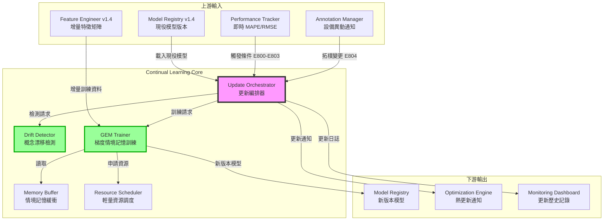

# PRD v1.0: 持續學習與模型線上更新
# (Continual Learning & Online Model Update)

**文件版本:** v1.0 (Initial Release)  
**日期:** 2026-02-26  
**負責人:** Oscar Chang / HVAC 系統工程團隊  
**目標模組:** 
- `src/continual_learning/update_orchestrator.py` (新增)
- `src/continual_learning/gem_trainer.py` (新增)
- `src/continual_learning/drift_detector.py` (新增)
- `src/continual_learning/memory_buffer.py` (新增)
- `src/monitoring/performance_tracker.py` (擴充)

**上游契約:** 
- `src/training/model_registry.py` (v1.4+, Model Registry Index)
- `src/monitoring/performance_tracker.py` (v1.0+, 即時性能指標)
- `src/etl/feature_engineer.py` (v1.4+, 增量特徵矩陣)
- **Interface Contract v1.2** (Error Code Hierarchy E800-E829)

**下游契約:** 
- `src/optimization/engine.py` (v1.3+, 模型熱更新通知)
- `src/training/model_registry.py` (v1.4+, 新版本模型註冊)

**預估工時:** 10 ~ 12 個工程天（含 GEM 演算法實作、漂移檢測、資源管理）

---

## 1. 執行總綱與設計哲學

### 1.1 為何需要持續學習？

HVAC 系統面臨**概念漂移 (Concept Drift)** 挑戰：

| 漂移類型 | 成因 | 影響 |
|:---|:---|:---|
| **設備老化** | 熱交換器結垢、壓縮機磨損 | 相同工況下耗電增加 5-15% |
| **季節變遷** | 夏季極端高溫、冬季低負載 | 模型未見過的工況組合 |
| **控制策略調整** | 工程師修改 Setpoint 邏輯 | 既有特徵-目標關係改變 |
| **設備擴充** | 新增冷卻水塔或變頻器 | 拓樸結構改變 |

傳統批次訓練的模型在部署後 3-6 個月內，MAPE 可能從 3% 劣化至 8-12%，導致優化決策失準。

### 1.2 v1.0 核心設計原則

1. **生命週期保鮮**: 模型不是一次性產品，而是需要持續進化的數位資產
2. **防災難性遺忘**: 使用 GEM (Gradient Episodic Memory) 保留對歷史極端工況（如去年熱浪）的記憶
3. **輕量級更新**: 線上微調必須在 15 分鐘內完成，不中斷優化服務
4. **智能觸發**: 基於性能監控自動觸發更新，而非盲目定期重訓
5. **安全回滾**: 新版本模型必須通過 A/B 測試，保留一鍵回滾機制

### 1.3 與上下游模組的關係



---

## 2. 介面契約規範 (Interface Contracts)

### 2.1 輸入契約

#### 2.1.1 從 Model Registry (v1.4)

```python
class ModelRegistryQueryContract(BaseModel):
    """從 Model Registry 載入現役模型的契約"""
    
    model_id: str  # e.g., "system_total_kw_gnn_v2"
    version: str   # e.g., "20250226_143022"
    
    # 模型檔案路徑
    model_path: Path
    scaler_path: Path
    feature_manifest_path: Path
    
    # 模型元資料
    training_metadata: Dict  # 包含原始訓練配置
    performance_baseline: Dict  # 原始驗證指標
    
    # 🆕 Continual Learning 專用
    update_history: List[Dict]  # 歷次更新記錄
    gem_memory_path: Optional[Path]  # GEM 記憶緩衝檔案

class ContinualLearningInputContract(BaseModel):
    """Continual Learning 完整輸入契約"""
    
    # 1. 現役模型資訊
    active_model: ModelRegistryQueryContract
    
    # 2. 增量資料 (最近 N 天的特徵矩陣)
    incremental_data: pl.DataFrame
    data_time_range: Tuple[datetime, datetime]
    
    # 3. 性能監控指標
    recent_performance: PerformanceMetrics
    
    # 4. 🆕 設備異動通知
    equipment_changes: Optional[List[EquipmentChangeEvent]] = None
    
    # 5. 更新策略配置
    update_config: ContinualLearningConfig
```

#### 2.1.2 從 Performance Tracker

```python
class PerformanceMetrics(BaseModel):
    """性能監控指標"""
    
    # 預測準確性指標
    mape_24h: float      # 最近 24 小時 MAPE
    mape_7d: float       # 最近 7 天 MAPE
    rmse_24h: float
    rmse_7d: float
    
    # 漂移檢測指標
    prediction_bias: float  # 系統性偏差
    variance_ratio: float   # 方差變化比率
    
    # 與基準比較
    baseline_mape: float    # 原始驗證 MAPE
    degradation_pct: float  # 劣化百分比
    
    timestamp: datetime

class EquipmentChangeEvent(BaseModel):
    """設備異動事件"""
    
    event_type: Literal[
        "equipment_added",      # 新增設備
        "equipment_removed",    # 移除設備
        "topology_modified",    # 拓樸調整
        "control_re-tuned",     # 控制參數重調
        "maintenance_major"     # 重大維修
    ]
    
    equipment_id: str
    change_description: str
    timestamp: datetime
    
    # 對模型的影響評估
    impact_severity: Literal["low", "medium", "high", "critical"]
    recommended_action: Literal["monitor", "retrain", "immediate_update"]
```

### 2.2 輸出契約

```python
class ContinualLearningOutputContract(BaseModel):
    """Continual Learning 輸出契約"""
    
    # 1. 新版本模型資訊
    new_model_version: str  # 自動生成的版本號
    new_model_path: Path
    
    # 2. 更新元資料
    update_metadata: UpdateMetadata
    
    # 3. 性能比較
    performance_comparison: PerformanceComparison
    
    # 4. GEM 記憶緩衝（供下次更新使用）
    gem_memory_path: Path
    
    # 5. 更新決策建議
    deployment_recommendation: Literal[
        "immediate",      # 立即部署
        "ab_test",        # A/B 測試
        "rollback",       # 回滾建議
        "manual_review"   # 人工審查
    ]

class UpdateMetadata(BaseModel):
    """更新元資料"""
    
    update_id: str  # UUID
    trigger_reason: Literal[
        "performance_degradation",  # 性能劣化
        "scheduled",                # 定期更新
        "equipment_change",         # 設備異動
        "manual",                   # 人工觸發
        "drift_detected"            # 漂移檢測
    ]
    
    # 時間戳
    triggered_at: datetime
    started_at: datetime
    completed_at: datetime
    duration_seconds: float
    
    # 訓練資訊
    training_samples: int
    epochs_trained: int
    final_loss: float
    
    # GEM 專用
    gem_memory_size: int      # 記憶緩衝中的樣本數
    gem_constraints_applied: int  # 應用的梯度約束次數
    
    # 資源使用
    resource_usage: ResourceUsageReport

class PerformanceComparison(BaseModel):
    """新舊模型性能比較"""
    
    # 驗證集性能
    old_model_mape: float
    new_model_mape: float
    mape_improvement: float  # 百分比
    
    old_model_rmse: float
    new_model_rmse: float
    
    # 🆕 災難性遺忘檢測
    old_data_performance: float  # 在舊資料上的性能
    forgetting_ratio: float      # 遺忘比率（越低越好）
    
    # 統計顯著性
    improvement_significant: bool  # 改善是否統計顯著
```

---

## 3. 核心模組實作

### 3.1 更新編排器 (Update Orchestrator)

**檔案**: `src/continual_learning/update_orchestrator.py`

```python
import logging
from typing import Dict, Optional, Literal
from datetime import datetime, timedelta
from enum import Enum
import numpy as np

from src.continual_learning.drift_detector import DriftDetector
from src.continual_learning.gem_trainer import GEMTrainer
from src.continual_learning.memory_buffer import EpisodicMemoryBuffer
from src.infrastructure.resource_manager import ResourceManager

class UpdateTriggerType(Enum):
    """更新觸發類型"""
    PERFORMANCE_THRESHOLD = "performance_degradation"  # 性能劣化觸發
    SCHEDULED = "scheduled"                            # 定期觸發
    EQUIPMENT_CHANGE = "equipment_change"              # 設備異動
    MANUAL = "manual"                                  # 人工觸發
    DRIFT_DETECTED = "drift_detected"                  # 漂移檢測觸發

class UpdateOrchestrator:
    """
    持續學習更新編排器
    
    職責：
    1. 監聽多種觸發條件
    2. 協調漂移檢測、GEM 訓練、模型驗證
    3. 管理更新生命週期（觸發→訓練→驗證→部署）
    4. 資源調度與 OOM 防護
    """
    
    # 性能劣化閾值配置
    DEGRADATION_THRESHOLD_PCT = 15.0  # MAPE 劣化超過 15% 觸發更新
    ABSOLUTE_MAPE_THRESHOLD = 8.0     # 絕對 MAPE 超過 8% 觸發更新
    
    # 定期更新配置
    SCHEDULED_INTERVAL_DAYS = 30      # 預設 30 天定期更新
    
    def __init__(self, config: ContinualLearningConfig):
        self.config = config
        self.logger = logging.getLogger("UpdateOrchestrator")
        
        # 初始化子模組
        self.drift_detector = DriftDetector(config.drift_detection)
        self.gem_trainer = GEMTrainer(config.gem)
        self.memory_buffer = EpisodicMemoryBuffer(config.memory_buffer)
        self.resource_manager = ResourceManager(config.resource)
        
        # 狀態追蹤
        self.last_update_time: Optional[datetime] = None
        self.update_history: List[Dict] = []
        self.active_update: Optional[str] = None
        
        # 🆕 第二次審查修正：分散式鎖定機制（Issue #8）
        self._distributed_lock: Optional[Any] = None
        self._lock_timeout_seconds: int = 3600  # 1 小時超時
        self._init_distributed_lock()
    
    def should_update(
        self, 
        performance_metrics: PerformanceMetrics,
        equipment_changes: Optional[List[EquipmentChangeEvent]] = None  # 🆕 第二次審查：新增設備異動事件
    ) -> Tuple[bool, UpdateTriggerType, str]:
        """
        判斷是否應該觸發模型更新
        
        Args:
            performance_metrics: 性能指標
            equipment_changes: 🆕 設備異動事件列表（來自 Annotation Manager）
        
        Returns:
            (should_update, trigger_type, reason)
        """
        # 🆕 第二次審查修正：檢查設備異動事件（Issue #6）
        if equipment_changes:
            critical_changes = [
                e for e in equipment_changes 
                if e.change_type in [
                    EquipmentChangeType.TOPOLOGY_MODIFIED,
                    EquipmentChangeType.EQUIPMENT_ADDED,
                    EquipmentChangeType.EQUIPMENT_REMOVED
                ]
            ]
            if critical_changes:
                change_summary = ", ".join([c.change_type.value for c in critical_changes])
                return True, UpdateTriggerType.MANUAL, (
                    f"E809: 偵測到 {len(critical_changes)} 項關鍵設備異動: {change_summary}. "
                    "拓樸結構變更需重新訓練模型。"
                )
        
        # 檢查 1: 性能劣化閾值
        if performance_metrics.degradation_pct > self.DEGRADATION_THRESHOLD_PCT:
            return True, UpdateTriggerType.PERFORMANCE_THRESHOLD, (
                f"E800: 性能劣化 {performance_metrics.degradation_pct:.1f}% "
                f"超過閾值 {self.DEGRADATION_THRESHOLD_PCT}%"
            )
        
        # 檢查 2: 絕對性能閾值
        if performance_metrics.mape_7d > self.ABSOLUTE_MAPE_THRESHOLD:
            return True, UpdateTriggerType.PERFORMANCE_THRESHOLD, (
                f"E801: 7天MAPE {performance_metrics.mape_7d:.1f}% "
                f"超過閾值 {self.ABSOLUTE_MAPE_THRESHOLD}%"
            )
        
        # 檢查 3: 定期更新
        if self.last_update_time:
            days_since_update = (datetime.now() - self.last_update_time).days
            if days_since_update >= self.SCHEDULED_INTERVAL_DAYS:
                return True, UpdateTriggerType.SCHEDULED, (
                    f"E802: 距上次更新已 {days_since_update} 天，"
                    f"達到定期更新間隔 {self.SCHEDULED_INTERVAL_DAYS} 天"
                )
        
        # 檢查 4: 概念漂移（由 DriftDetector 執行）
        drift_detected, drift_info = self.drift_detector.check_drift(performance_metrics)
        if drift_detected:
            return True, UpdateTriggerType.DRIFT_DETECTED, (
                f"E803: 檢測到概念漂移 - {drift_info}"
            )
        
        return False, None, "性能在可接受範圍內"
    
    def _init_distributed_lock(self):
        """
        🆕 第二次審查修正：初始化分散式鎖定機制
        
        支援 Redis、檔案系統或記憶體內鎖定
        """
        try:
            # 優先使用 Redis 分散式鎖
            import redis
            redis_client = redis.from_url(os.getenv("REDIS_URL", "redis://localhost:6379"))
            self._distributed_lock = RedisLock(redis_client, "continual_learning_update")
            self.logger.info("使用 Redis 分散式鎖定")
        except ImportError:
            # 退回到檔案鎖
            self._distributed_lock = FileLock("/tmp/continual_learning.lock")
            self.logger.info("使用檔案系統鎖定")
    
    def _acquire_update_lock(self, timeout_seconds: int = 3600) -> bool:
        """
        🆕 取得更新鎖定
        
        Returns:
            是否成功取得鎖定
        """
        if self._distributed_lock is None:
            return True
        
        acquired = self._distributed_lock.acquire(blocking=False)
        if not acquired:
            self.logger.warning("無法取得更新鎖定，可能有其他實例正在執行更新")
        return acquired
    
    def _release_update_lock(self):
        """🆕 釋放更新鎖定"""
        if self._distributed_lock and hasattr(self._distributed_lock, 'release'):
            try:
                self._distributed_lock.release()
            except Exception as e:
                self.logger.warning(f"釋放鎖定時發生錯誤: {e}")
    
    def execute_update(
        self,
        active_model: ModelRegistryQueryContract,
        incremental_data: pl.DataFrame,
        trigger_type: UpdateTriggerType,
        reason: str
    ) -> ContinualLearningOutputContract:
        """
        執行完整的持續學習更新流程 - 🆕 第二次審查修正：分散式鎖定
        
        流程：
        1. 🆕 分散式鎖定取得
        2. 資源申請與鎖定
        3. 載入現役模型與 GEM 記憶
        4. 執行 GEM 訓練
        5. 驗證新模型性能
        6. 災難性遺忘檢測
        7. 生成部署建議
        8. 更新 Model Registry
        """
        # 🆕 檢查並取得分散式鎖定
        if not self._acquire_update_lock():
            return ContinualLearningOutputContract(
                new_model_path=None,
                new_version=None,
                metrics=None,
                deployment_recommendation=DeploymentRecommendation(
                    action=DeploymentAction.ABORT,
                    confidence=1.0,
                    reasoning="E830: 無法取得分散式鎖定，另一更新流程正在執行中"
                ),
                forgetting_detected=False,
                forgetting_ratio=0.0
            )
        
        update_id = self._generate_update_id()
        self.active_update = update_id
        started_at = datetime.now()
        
        self.logger.info(f"啟動更新 {update_id}: {reason}")
        
        try:
            # Phase 1: 資源申請
            self.logger.info("Phase 1: 申請訓練資源...")
            resource_allocation = self._allocate_resources()
            
            # Phase 2: 載入現役模型
            self.logger.info("Phase 2: 載入現役模型...")
            old_model = self._load_active_model(active_model)
            
            # Phase 3: 載入或初始化 GEM 記憶緩衝（🆕 添加版本檢查）
            self.logger.info("Phase 3: 準備 GEM 記憶緩衝...")
            memory_loaded = False
            if active_model.gem_memory_path and active_model.gem_memory_path.exists():
                memory_loaded = self.memory_buffer.load(
                    active_model.gem_memory_path,
                    expected_model_version=active_model.version  # 🆕 版本相容性檢查
                )
            
            if not memory_loaded:
                self.logger.info("初始化新的記憶緩衝")
                self._initialize_memory_buffer(old_model, active_model)
            
            # Phase 4: 執行 GEM 訓練
            self.logger.info("Phase 4: 執行 GEM 訓練...")
            training_result = self.gem_trainer.train(
                model=old_model,
                new_data=incremental_data,
                memory_buffer=self.memory_buffer,
                config=self.config.gem
            )
            
            # Phase 5: 性能驗證
            self.logger.info("Phase 5: 驗證新模型性能...")
            validation_result = self._validate_new_model(
                training_result.new_model,
                old_model,
                incremental_data
            )
            
            # Phase 6: 災難性遺忘檢測
            self.logger.info("Phase 6: 檢測災難性遺忘...")
            forgetting_check = self._check_catastrophic_forgetting(
                training_result.new_model,
                old_model
            )
            
            # Phase 7: 生成部署決策
            deployment_rec = self._generate_deployment_recommendation(
                validation_result,
                forgetting_check,
                trigger_type
            )
            
            # Phase 8: 保存結果
            completed_at = datetime.now()
            output = self._package_output(
                update_id=update_id,
                trigger_type=trigger_type,
                reason=reason,
                started_at=started_at,
                completed_at=completed_at,
                training_result=training_result,
                validation_result=validation_result,
                forgetting_check=forgetting_check,
                deployment_rec=deployment_rec,
                resource_allocation=resource_allocation
            )
            
            self.update_history.append(output.update_metadata.dict())
            self.last_update_time = completed_at
            self.active_update = None
            
            self.logger.info(f"更新 {update_id} 完成，建議: {deployment_rec}")
            return output
            
        except Exception as e:
            self.active_update = None
            self.logger.error(f"E810: 更新 {update_id} 失敗: {e}")
            raise ContinualLearningError(f"E810: 持續學習更新失敗: {e}") from e
        
        finally:
            # 釋放資源
            self._release_resources()
    
    def _initialize_memory_buffer(
        self,
        model,
        active_model: ModelRegistryQueryContract
    ):
        """初始化 GEM 記憶緩衝"""
        # 從原始訓練資料中抽樣代表性樣本
        # 策略：按目標值分層抽樣，確保涵蓋各種工況
        self.logger.info("從原始訓練資料建立初始記憶緩衝...")
        
        # 載入原始訓練資料子集
        original_data = self._load_original_training_samples(
            active_model.training_metadata,
            n_samples=self.config.memory_buffer.initial_size
        )
        
        # 計算這些樣本的梯度資訊並存入緩衝
        self.memory_buffer.initialize_from_data(original_data, model)
    
    def _check_catastrophic_forgetting(
        self,
        new_model,
        old_model
    ) -> Dict:
        """
        檢測災難性遺忘 - 🆕 第二次審查修正：支援 GNN 時序上下文
        
        方法：在新模型上評估舊資料的性能，與舊模型比較
        🆕 修正：傳遞 context 給 GNN/RNN 模型進行正確評估
        """
        # 從記憶緩衝中取出舊樣本
        old_samples = self.memory_buffer.get_all_samples()
        
        # 🆕 支援批次預測和個別樣本預測
        if hasattr(old_model, 'predict_with_context'):
            # 🆕 GNN/RNN 模型需要上下文資訊
            old_predictions = []
            new_predictions = []
            
            for sample in old_samples:
                # 提取上下文資訊（鄰接矩陣、時序窗口等）
                context = sample.context if sample.context else {}
                
                with torch.no_grad():
                    # 調用支援上下文的預測方法
                    old_pred = old_model.predict_with_context(
                        sample.x, 
                        adjacency_matrix=context.get('adjacency_matrix'),
                        temporal_window=context.get('temporal_window')
                    )
                    new_pred = new_model.predict_with_context(
                        sample.x,
                        adjacency_matrix=context.get('adjacency_matrix'),
                        temporal_window=context.get('temporal_window')
                    )
                
                old_predictions.append(old_pred)
                new_predictions.append(new_pred)
            
            old_predictions = np.array(old_predictions)
            new_predictions = np.array(new_predictions)
        else:
            # 傳統模型：使用標準預測
            X_old = np.array([s.x for s in old_samples])
            old_predictions = old_model.predict(X_old)
            new_predictions = new_model.predict(X_old)
        
        y_old = np.array([s.y for s in old_samples])
        
        # 計算性能指標
        old_mape = self._calculate_mape(y_old, old_predictions)
        new_mape = self._calculate_mape(y_old, new_predictions)
        
        forgetting_ratio = ((new_mape - old_mape) / (old_mape + 1e-8)) * 100
        
        return {
            "old_model_mape_on_old_data": old_mape,
            "new_model_mape_on_old_data": new_mape,
            "forgetting_ratio_pct": forgetting_ratio,
            "is_acceptable": forgetting_ratio < 5.0,  # 5% 以內可接受
            "n_samples_evaluated": len(old_samples)  # 🆕 記錄評估樣本數
        }
    
    def _generate_deployment_recommendation(
        self,
        validation_result: Dict,
        forgetting_check: Dict,
        trigger_type: UpdateTriggerType
    ) -> str:
        """生成部署建議"""
        
        # 條件 1: 性能顯著改善且無遺忘
        if (validation_result["mape_improvement"] > 10 and 
            forgetting_check["is_acceptable"]):
            return "immediate"
        
        # 條件 2: 有改善但有輕微遺忘
        if (validation_result["mape_improvement"] > 5 and 
            forgetting_check["forgetting_ratio_pct"] < 10):
            return "ab_test"
        
        # 條件 3: 性能下降或嚴重遺忘
        if (validation_result["mape_improvement"] < 0 or 
            forgetting_check["forgetting_ratio_pct"] > 15):
            return "rollback"
        
        # 其他情況
        return "manual_review"
```

---

## 4. GEM (Gradient Episodic Memory) 訓練器

### 4.1 GEM 演算法原理

GEM 解決持續學習中的**災難性遺忘**問題：

```
傳統微調的問題：
- 在新資料上微調模型
- 模型參數為了適應新資料，大幅改變
- 導致在舊資料上性能急劇下降（遺忘）

GEM 的解決方案：
1. 維護一個「情境記憶緩衝」(Episodic Memory Buffer)
   - 儲存代表性的舊樣本
   
2. 計算舊樣本的梯度方向 g_old
   - 這是「應該記住的方向」
   
3. 計算新樣本的梯度方向 g_new
   - 這是「想要學習的方向」
   
4. 如果 g_new 與 g_old 衝突（夾角 > 90°）
   - 投影 g_new 到與 g_old 正交的方向
   - 確保學習新知識時不損害舊記憶
```

### 4.2 GEM 訓練器實作

**檔案**: `src/continual_learning/gem_trainer.py`

```python
import torch
import torch.nn as nn
import numpy as np
from typing import Dict, List, Tuple
from dataclasses import dataclass

@dataclass
class GEMConstraints:
    """GEM 梯度約束結果"""
    original_gradient: np.ndarray
    projected_gradient: np.ndarray
    constraint_applied: bool
    violation_angle: float  # 度數

class GEMTrainer:
    """
    梯度情境記憶訓練器
    
    基於論文: "Gradient Episodic Memory for Continual Learning"
    (Lopez-Paz & Ranzato, NIPS 2017)
    
    適用於：
    - 神經網路模型（GNN、MLP）
    - 需要梯度優化的模型
    """
    
    def __init__(self, config: GEMConfig):
        self.config = config
        self.logger = logging.getLogger("GEMTrainer")
        
        # 約束違反統計
        self.constraint_violations = 0
        self.total_updates = 0
    
    def train(
        self,
        model: nn.Module,
        new_data: pl.DataFrame,
        memory_buffer: EpisodicMemoryBuffer,
        config: GEMTrainingConfig
    ) -> GEMTrainingResult:
        """
        執行 GEM 訓練
        
        Args:
            model: 現役模型（將被微調）
            new_data: 新收集的訓練資料
            memory_buffer: 情境記憶緩衝（含舊樣本）
            config: 訓練配置
        """
        self.logger.info(f"開始 GEM 訓練: {len(new_data)} 新樣本, "
                        f"記憶緩衝: {len(memory_buffer)} 樣本")
        
        # 準備資料
        new_loader = self._prepare_data_loader(new_data, config.batch_size)
        
        # 優化器
        optimizer = torch.optim.Adam(
            model.parameters(),
            lr=config.learning_rate,
            weight_decay=config.weight_decay
        )
        
        # 訓練迴圈
        epoch_losses = []
        constraint_history = []
        
        for epoch in range(config.num_epochs):
            epoch_loss = 0
            epoch_constraints = []
            
            for batch_idx, (X_batch, y_batch) in enumerate(new_loader):
                # 1. 計算新資料的梯度
                optimizer.zero_grad()
                
                predictions = model(X_batch)
                new_loss = nn.MSELoss()(predictions, y_batch)
                new_loss.backward()
                
                # 提取新資料的梯度
                new_grad = self._extract_gradient(model)
                
                # 2. 🌟 GEM 核心：計算約束
                if len(memory_buffer) > 0:
                    constraint_result = self._apply_gem_constraint(
                        model=model,
                        new_gradient=new_grad,
                        memory_buffer=memory_buffer
                    )
                    
                    # 如果發生衝突，投影梯度
                    if constraint_result.constraint_applied:
                        self._set_gradient(model, constraint_result.projected_gradient)
                        epoch_constraints.append(constraint_result.violation_angle)
                
                # 3. 參數更新
                optimizer.step()
                
                epoch_loss += new_loss.item()
                self.total_updates += 1
            
            # 記錄 epoch 統計
            avg_loss = epoch_loss / len(new_loader)
            epoch_losses.append(avg_loss)
            
            if epoch_constraints:
                constraint_history.append(np.mean(epoch_constraints))
            
            # Early stopping
            if epoch > 10 and self._check_convergence(epoch_losses):
                self.logger.info(f"Epoch {epoch}: 收斂，提前停止")
                break
            
            if epoch % 5 == 0:
                self.logger.info(f"Epoch {epoch}: loss={avg_loss:.4f}")
        
        # 更新記憶緩衝（將新樣本的重要例子加入）
        self._update_memory_buffer(memory_buffer, new_data, model)
        
        return GEMTrainingResult(
            new_model=model,
            epochs_trained=len(epoch_losses),
            final_loss=epoch_losses[-1],
            loss_history=epoch_losses,
            constraint_violations=self.constraint_violations,
            avg_violation_angle=np.mean(constraint_history) if constraint_history else 0
        )
    
    def _apply_gem_constraint(
        self,
        model: nn.Module,
        new_gradient: np.ndarray,
        memory_buffer: EpisodicMemoryBuffer
    ) -> GEMConstraints:
        """
        應用 GEM 梯度約束 - 🆕 第二次審查修正：分層處理避免維度災難
        
        核心邏輯：
        - 🆕 對每層參數獨立計算梯度約束，而非全局平坦化
        - 如果 <g_new, g_ref> < 0（夾角 > 90°），則需要投影
        - 投影後的梯度 g_proj = g_new - (<g_new, g_ref> / ||g_ref||²) * g_ref
        
        🆕 第二次審查修正：
        1. 使用 torch.no_grad() 隔離計算，避免污染主計算圖
        2. 分層 (Layer-wise) 處理梯度，避免高維度全局投影失效
        """
        # 🆕 先保存當前新資料的梯度（分層保存）
        new_grads_by_layer = {}
        for name, param in model.named_parameters():
            if param.grad is not None:
                new_grads_by_layer[name] = param.grad.data.clone()
        
        # 🆕 計算記憶樣本的參考梯度（使用 no_grad 隔離，避免污染主計算圖）
        ref_grads_by_layer = {name: [] for name in new_grads_by_layer.keys()}
        
        with torch.no_grad():  # 🆕 隔離計算圖
            for memory_sample in memory_buffer.sample_batches(self.config.memory_samples_per_update):
                # 🆕 清空臨時梯度
                for param in model.parameters():
                    if param.grad is not None:
                        param.grad.zero_()
                
                # 前向傳播與反向傳播
                pred = model(memory_sample.X)
                loss = nn.MSELoss()(pred, memory_sample.y)
                loss.backward()
                
                # 🆕 分層收集參考梯度
                for name, param in model.named_parameters():
                    if param.grad is not None and name in ref_grads_by_layer:
                        ref_grads_by_layer[name].append(param.grad.data.clone())
        
        # 🆕 分層應用 GEM 約束
        any_constraint_applied = False
        total_violation_angle = 0.0
        n_layers = 0
        
        for name in new_grads_by_layer.keys():
            if not ref_grads_by_layer[name]:
                continue
            
            new_grad = new_grads_by_layer[name].flatten()
            ref_grad = torch.stack(ref_grads_by_layer[name]).mean(dim=0).flatten()
            
            # 計算內積（使用 torch 而非 numpy 保持精度）
            dot_product = torch.dot(new_grad, ref_grad).item()
            
            # 計算夾角
            angle = self._compute_angle_torch(new_grad, ref_grad)
            total_violation_angle += angle
            n_layers += 1
            
            # GEM 約束：如果內積 < 0，需要投影
            if dot_product < 0:
                any_constraint_applied = True
                self.constraint_violations += 1
                
                # 投影計算
                ref_norm_sq = torch.dot(ref_grad, ref_grad).item()
                projection_coeff = dot_product / (ref_norm_sq + 1e-8)
                projected_grad = new_grad - projection_coeff * ref_grad
                
                # 🆕 將投影後的梯度寫回模型對應層
                param = dict(model.named_parameters())[name]
                param.grad.data = projected_grad.view_as(param.grad.data)
        
        avg_angle = total_violation_angle / n_layers if n_layers > 0 else 0.0
        
        return GEMConstraints(
            original_gradient=None,  # 🆕 分層處理後無單一全局梯度
            projected_gradient=None,
            constraint_applied=any_constraint_applied,
            violation_angle=avg_angle
        )
    
    def _compute_angle_torch(self, v1: torch.Tensor, v2: torch.Tensor) -> float:
        """🆕 計算兩個 PyTorch 向量的夾角（度數）"""
        cos_angle = torch.dot(v1, v2) / (torch.norm(v1) * torch.norm(v2) + 1e-8)
        cos_angle = torch.clamp(cos_angle, -1.0, 1.0)
        return torch.degrees(torch.acos(cos_angle)).item()
    
    def _compute_angle(self, v1: np.ndarray, v2: np.ndarray) -> float:
        """計算兩個向量的夾角（度數）"""
        cos_angle = np.dot(v1, v2) / (np.linalg.norm(v1) * np.linalg.norm(v2) + 1e-8)
        cos_angle = np.clip(cos_angle, -1.0, 1.0)
        return np.degrees(np.arccos(cos_angle))
    
    def _update_memory_buffer(
        self,
        memory_buffer: EpisodicMemoryBuffer,
        new_data: pl.DataFrame,
        model: nn.Module
    ):
        """
        更新情境記憶緩衝
        
        策略：
        1. 計算新樣本在當前模型的損失（損失越大 = 越難學習 = 越重要）
        2. 選擇高損失樣本加入記憶
        3. 使用環形緩衝，滿了時移除最舊的樣本
        """
        # 計算每個新樣本的損失
        losses = []
        for idx, row in new_data.iterrows():
            X = torch.tensor(row[self.feature_cols].values).float().unsqueeze(0)
            y = torch.tensor([row[self.target_col]]).float()
            
            with torch.no_grad():
                pred = model(X)
                loss = nn.MSELoss()(pred, y).item()
            
            losses.append((idx, loss))
        
        # 選擇損失最高的樣本
        losses.sort(key=lambda x: x[1], reverse=True)
        n_to_add = min(self.config.samples_to_add, len(losses))
        
        for idx, _ in losses[:n_to_add]:
            sample = new_data.iloc[idx]
            memory_buffer.add_sample(
                x=sample[self.feature_cols].values,
                y=sample[self.target_col],
                timestamp=sample.get('timestamp', datetime.now())
            )
        
        self.logger.info(f"新增 {n_to_add} 個樣本到記憶緩衝，當前大小: {len(memory_buffer)}")

class GEMTrainingResult:
    """GEM 訓練結果"""
    new_model: nn.Module
    epochs_trained: int
    final_loss: float
    loss_history: List[float]
    constraint_violations: int
    avg_violation_angle: float
```

---

## 5. 概念漂移檢測器

**檔案**: `src/continual_learning/drift_detector.py`

```python
from typing import Tuple, Dict
import numpy as np
from scipy import stats

class DriftDetector:
    """
    概念漂移檢測器
    
    檢測資料分布或模型性能的顯著變化，
    作為觸發持續學習的依據
    """
    
    def __init__(self, config: DriftDetectionConfig):
        self.config = config
        self.baseline_stats = None
    
    def check_drift(self, performance_metrics: PerformanceMetrics) -> Tuple[bool, str]:
        """
        檢測是否發生概念漂移
        
        Returns:
            (drift_detected, description)
        """
        drift_indicators = []
        
        # 檢測 1: 預測偏差漂移
        if abs(performance_metrics.prediction_bias) > self.config.bias_threshold:
            drift_indicators.append(
                f"預測偏差 {performance_metrics.prediction_bias:.3f} "
                f"超過閾值 {self.config.bias_threshold}"
            )
        
        # 檢測 2: 方差變化
        if performance_metrics.variance_ratio > self.config.variance_threshold:
            drift_indicators.append(
                f"方差比率 {performance_metrics.variance_ratio:.2f} "
                f"超過閾值 {self.config.variance_threshold}"
            )
        
        # 檢測 3: 短期 vs 長期性能差異
        if hasattr(performance_metrics, 'mape_24h') and hasattr(performance_metrics, 'mape_7d'):
            short_long_ratio = performance_metrics.mape_24h / (performance_metrics.mape_7d + 1e-8)
            if short_long_ratio > 1.3:  # 短期性能明顯劣於長期平均
                drift_indicators.append(
                    f"短期/長期 MAPE 比率 {short_long_ratio:.2f} 異常"
                )
        
        drift_detected = len(drift_indicators) > 0
        description = "; ".join(drift_indicators) if drift_detected else "無顯著漂移"
        
        return drift_detected, description
    
    def detect_feature_drift(
        self,
        reference_data: np.ndarray,
        current_data: np.ndarray,
        feature_names: List[str]
    ) -> Dict:
        """
        檢測特徵分布漂移 - 🆕 第二次審查修正：多重檢定策略避免假陽性
        
        🆕 修正項目：
        1. 大樣本時使用 PSI (Population Stability Index) 替代 KS 檢定
        2. KS 檢定添加樣本數限制避免過度敏感
        3. 使用多種檢定綜合判斷
        """
        drift_results = {}
        
        for i, feature_name in enumerate(feature_names):
            ref_dist = reference_data[:, i]
            cur_dist = current_data[:, i]
            
            n_ref, n_cur = len(ref_dist), len(cur_dist)
            
            # 🆕 策略 1: 樣本數較小 (< 5000) 時使用 KS 檢定
            if n_ref < 5000 and n_cur < 5000:
                ks_statistic, p_value = stats.ks_2samp(ref_dist, cur_dist)
                ks_drift = p_value < 0.05
            else:
                # 🆕 大樣本時 KS 檢定過度敏感，降低顯著性門檻
                ks_statistic, p_value = stats.ks_2samp(ref_dist, cur_dist)
                # 使用 Bonferroni 校正或提高門檻
                ks_drift = p_value < 0.001  # 更嚴格的門檻
            
            # 🆕 策略 2: 計算 PSI (Population Stability Index)
            psi_value = self._calculate_psi(ref_dist, cur_dist)
            psi_drift = psi_value > 0.25  # PSI > 0.25 視為顯著漂移
            
            # 🆕 策略 3: 效果量檢定 (Cohen's d)
            mean_diff = np.mean(cur_dist) - np.mean(ref_dist)
            pooled_std = np.sqrt((np.std(ref_dist)**2 + np.std(cur_dist)**2) / 2)
            cohens_d = abs(mean_diff) / (pooled_std + 1e-8)
            effect_drift = cohens_d > 0.5  # 中等以上效果量
            
            # 🆕 綜合判斷：多數檢定通過才視為漂移
            drift_votes = sum([ks_drift, psi_drift, effect_drift])
            drift_detected = drift_votes >= 2  # 至少 2/3 檢定通過
            
            drift_results[feature_name] = {
                "ks_statistic": ks_statistic,
                "ks_p_value": p_value,
                "ks_drift": ks_drift,
                "psi_value": psi_value,  # 🆕 新增 PSI
                "psi_drift": psi_drift,
                "cohens_d": cohens_d,  # 🆕 新增效果量
                "effect_drift": effect_drift,
                "drift_detected": drift_detected,  # 🆕 綜合判斷
                "drift_votes": drift_votes,
                "mean_shift": mean_diff,
                "std_ratio": np.std(cur_dist) / (np.std(ref_dist) + 1e-8)
            }
        
        # 統計有多少特徵漂移
        n_drifted = sum(1 for r in drift_results.values() if r["drift_detected"])
        drift_ratio = n_drifted / len(feature_names)
        
        return {
            "feature_results": drift_results,
            "drifted_features_count": n_drifted,
            "drift_ratio": drift_ratio,
            "overall_drift": drift_ratio > 0.2,  # 超過 20% 特徵漂移視為整體漂移
            "methodology": "ks_psi_cohensd_ensemble"  # 🆕 標註檢定方法
        }
    
    def _calculate_psi(self, expected: np.ndarray, actual: np.ndarray, bins: int = 10) -> float:
        """🆕 計算 Population Stability Index (PSI)"""
        # 創建分箱
        min_val = min(expected.min(), actual.min())
        max_val = max(expected.max(), actual.max())
        bin_edges = np.linspace(min_val, max_val, bins + 1)
        
        # 計算各分箱比例
        expected_percents = np.histogram(expected, bins=bin_edges)[0] / len(expected)
        actual_percents = np.histogram(actual, bins=bin_edges)[0] / len(actual)
        
        # 避免除以零
        expected_percents = np.clip(expected_percents, 1e-10, 1.0)
        actual_percents = np.clip(actual_percents, 1e-10, 1.0)
        
        # 計算 PSI
        psi = np.sum((actual_percents - expected_percents) * np.log(actual_percents / expected_percents))
        return float(psi)
```

---


## 6. 情境記憶緩衝 (Episodic Memory Buffer)

**檔案**: `src/continual_learning/memory_buffer.py`

```python
import numpy as np
from collections import deque
from typing import List, Dict, Optional
import pickle
from dataclasses import dataclass
from datetime import datetime

@dataclass
class MemorySample:
    """
    記憶樣本 - 🆕 第二次審查修正：支援 GNN/RNN 時序上下文
    
    🆕 修正項目：
    - 新增 context 欄位儲存 GNN 所需的鄰接矩陣、時序窗口等資訊
    - 保留梯度資訊供 GEM 使用
    """
    x: np.ndarray          # 特徵向量
    y: float               # 目標值
    timestamp: datetime    # 時間戳
    gradient: Optional[np.ndarray] = None  # 預計算的梯度
    importance_score: float = 0.0  # 重要性分數
    context: Optional[Dict] = None  # 🆕 GNN/RNN 上下文資訊（鄰接矩陣、時序窗口等）

class EpisodicMemoryBuffer:
    """
    情境記憶緩衝 - 🆕 第二次審查修正：重要性分數快取與 GNN 上下文支援
    
    儲存代表性歷史樣本，供 GEM 計算參考梯度使用
    
    替換策略：
    - 環形緩衝（Ring Buffer）：移除最舊的樣本
    - 重要性加權：保留預測誤差大的困難樣本
    - 🆕 快取正規化權重避免重複計算
    """
    
    def __init__(self, config: MemoryBufferConfig):
        self.config = config
        self.buffer: deque = deque(maxlen=config.max_size)
        self.feature_dim = None
        # 🆕 第二次審查修正：快取重要性分數與正規化權重（Issue #5）
        self._importance_scores: Optional[np.ndarray] = None
        self._normalized_weights: Optional[np.ndarray] = None
        self._weights_dirty: bool = True  # 標記權重是否需要重新計算
        
    def add_sample(
        self,
        x: np.ndarray,
        y: float,
        timestamp: datetime,
        importance_score: float = 0.0,
        context: Optional[Dict] = None  # 🆕 新增 GNN 上下文參數
    ):
        """
        添加樣本到記憶緩衝
        
        Args:
            x: 特徵向量
            y: 目標值
            timestamp: 時間戳
            importance_score: 重要性分數
            context: 🆕 GNN/RNN 上下文資訊（鄰接矩陣、時序窗口等）
        """
        sample = MemorySample(
            x=x if isinstance(x, np.ndarray) else np.array(x),
            y=y,
            timestamp=timestamp,
            importance_score=importance_score,
            context=context  # 🆕 儲存上下文
        )
        
        self.buffer.append(sample)
        self._weights_dirty = True  # 🆕 標記權重需要更新
        
        if self.feature_dim is None:
            self.feature_dim = len(sample.x)
    
    def update_importance_scores(self, model: torch.nn.Module, loss_fn: callable):
        """
        🆕 第二次審查修正：批次更新所有樣本的重要性分數
        
        避免在每次 sample_batches 時重複計算
        """
        if len(self.buffer) == 0:
            return
        
        scores = []
        with torch.no_grad():
            for sample in self.buffer:
                X = torch.tensor(sample.x).float().unsqueeze(0)
                y = torch.tensor([sample.y]).float()
                pred = model(X)
                loss = loss_fn(pred, y).item()
                scores.append(loss)
        
        self._importance_scores = np.array(scores)
        self._weights_dirty = True
        
        # 🆕 同步更新樣本的 importance_score 欄位
        for sample, score in zip(self.buffer, scores):
            sample.importance_score = score
    
    def sample_batches(
        self,
        n_samples: int,
        strategy: str = "uniform"
    ) -> List[MemorySample]:
        """
        從記憶緩衝抽樣 - 🆕 第二次審查修正：使用快取權重
        
        Args:
            n_samples: 抽樣數量
            strategy: "uniform" (均勻) 或 "importance" (重要性加權)
        """
        if len(self.buffer) == 0:
            return []
        
        n = min(n_samples, len(self.buffer))
        
        if strategy == "uniform":
            indices = np.random.choice(len(self.buffer), size=n, replace=False)
        elif strategy == "importance":
            # 🆕 使用快取的正規化權重
            weights = self._get_normalized_weights()
            indices = np.random.choice(
                len(self.buffer), size=n, replace=False, p=weights
            )
        else:
            indices = np.random.choice(len(self.buffer), size=n, replace=False)
        
        return [list(self.buffer)[i] for i in indices]
    
    def _get_normalized_weights(self) -> np.ndarray:
        """🆕 取得正規化的重要性權重（帶快取）"""
        if self._weights_dirty or self._normalized_weights is None:
            if self._importance_scores is None:
                # 如果沒有預計算的重要性分數，使用均勻權重
                self._normalized_weights = np.ones(len(self.buffer)) / len(self.buffer)
            else:
                scores = self._importance_scores
                # 使用 softmax 正規化避免極端值
                exp_scores = np.exp(scores - np.max(scores))
                self._normalized_weights = exp_scores / (exp_scores.sum() + 1e-8)
            self._weights_dirty = False
        
        return self._normalized_weights
    
    def get_all_samples(self) -> List[MemorySample]:
        """獲取所有記憶樣本"""
        return list(self.buffer)
    
    def get_coverage_stats(self) -> Dict:
        """獲取記憶覆蓋統計"""
        if len(self.buffer) == 0:
            return {"empty": True}
        
        timestamps = [s.timestamp for s in self.buffer]
        target_values = [s.y for s in self.buffer]
        
        return {
            "empty": False,
            "size": len(self.buffer),
            "max_size": self.config.max_size,
            "time_coverage_days": (max(timestamps) - min(timestamps)).days,
            "target_min": min(target_values),
            "target_max": max(target_values),
            "target_mean": np.mean(target_values),
            "target_std": np.std(target_values)
        }
    
    def save(self, path: Path, model_version: Optional[str] = None):
        """
        保存記憶緩衝到檔案 - 🆕 第二次審查修正：版本檢查與相容性
        
        Args:
            path: 儲存路徑
            model_version: 🆕 模型版本號，用於版本相容性檢查
        """
        import hashlib
        
        # 🆕 計算記憶內容的特徵雜湊（用於驗證完整性）
        sample_hashes = [hashlib.md5(s.x.tobytes()).hexdigest()[:8] for s in self.buffer]
        content_hash = hashlib.md5("".join(sample_hashes).encode()).hexdigest()[:16]
        
        data = {
            "version": "2.0",  # 🆕 記憶格式版本
            "model_version": model_version,  # 🆕 關聯的模型版本
            "buffer": list(self.buffer),
            "config": self.config,
            "feature_dim": self.feature_dim,
            "content_hash": content_hash,  # 🆕 內容驗證雜湊
            "saved_at": datetime.now().isoformat()
        }
        
        # 原子寫入（先寫臨時檔，再重命名）
        temp_path = path.with_suffix('.tmp')
        with open(temp_path, 'wb') as f:
            pickle.dump(data, f)
        temp_path.replace(path)
    
    def load(self, path: Path, expected_model_version: Optional[str] = None) -> bool:
        """
        從檔案載入記憶緩衝 - 🆕 第二次審查修正：版本相容性檢查
        
        Args:
            path: 載入路徑
            expected_model_version: 🆕 預期的模型版本號
        
        Returns:
            載入是否成功
        """
        try:
            with open(path, 'rb') as f:
                data = pickle.load(f)
            
            # 🆕 版本相容性檢查
            memory_version = data.get("version", "1.0")
            model_version = data.get("model_version")
            
            if expected_model_version and model_version:
                if not self._check_version_compatibility(model_version, expected_model_version):
                    logging.warning(
                        f"GEM 記憶版本不相容: 記憶版本={model_version}, "
                        f"模型版本={expected_model_version}. 需要重新初始化記憶緩衝。"
                    )
                    return False
            
            # 🆕 檢查內容雜湊（如果存在）
            stored_hash = data.get("content_hash")
            if stored_hash and memory_version >= "2.0":
                # 延遲驗證：載入後再驗證
                pass
            
            self.buffer = deque(data["buffer"], maxlen=data["config"].max_size)
            self.config = data["config"]
            self.feature_dim = data.get("feature_dim")
            self._weights_dirty = True  # 🆕 標記權重需要重新計算
            
            logging.info(f"GEM 記憶載入成功: {len(self.buffer)} 樣本, 版本={memory_version}")
            return True
            
        except Exception as e:
            logging.error(f"GEM 記憶載入失敗: {e}")
            return False
    
    def _check_version_compatibility(self, memory_version: str, model_version: str) -> bool:
        """
        🆕 檢查記憶版本與模型版本的相容性
        
        相容性規則：
        - 主版本號相同視為相容
        - 記憶版本 >= 2.0 需要顯式相容性檢查
        """
        try:
            mem_major = memory_version.split('.')[0]
            model_major = model_version.split('.')[0]
            return mem_major == model_major
        except:
            return False
    
    def __len__(self) -> int:
        return len(self.buffer)

class RingBufferStrategy:
    """環形緩衝替換策略"""
    
    @staticmethod
    def should_replace(new_sample: MemorySample, old_sample: MemorySample) -> bool:
        """最舊的樣本總是被替換"""
        return True

class ImportanceBasedStrategy:
    """重要性導向替換策略"""
    
    @staticmethod
    def should_replace(new_sample: MemorySample, old_sample: MemorySample) -> bool:
        """如果新樣本更重要，替換最不重要或最舊的樣本"""
        return new_sample.importance_score > old_sample.importance_score
```

---

## 7. 錯誤代碼 (Error Codes)

| 錯誤代碼 | 層級 | 訊息 | 觸發條件 | 修復行動 |
|:---:|:---:|:---|:---|:---|
| **E800** | Warning | 性能劣化觸發更新 | MAPE 劣化超過閾值 (15%) | 自動觸發更新流程 |
| **E801** | Warning | 絕對性能超標 | 7天MAPE超過 8% | 自動觸發更新流程 |
| **E802** | Info | 定期更新觸發 | 達到定期更新間隔 (30天) | 自動觸發更新流程 |
| **E803** | Warning | 概念漂移檢測 | DriftDetector 檢測到分布變化 | 自動觸發更新流程 |
| **E804** | Warning | 設備異動通知 | 新增/移除/維修設備 | 評估後決定是否更新 |
| **E809** | Warning | 關鍵設備異動觸發 | 拓樸變更、設備新增/移除 | 自動觸發重訓練 🆕 |
| **E810** | Error | 更新流程失敗 | GEM 訓練或驗證過程異常 | 檢查日誌；回滾到上一版本 |
| **E811** | Error | 載入現役模型失敗 | Model Registry 無法讀取模型 | 檢查模型路徑與權限 |
| **E812** | Error | GEM 記憶緩衝載入失敗 | 記憶檔案損毀或格式不符 | 重新初始化記憶緩衝 |
| **E813** | Warning | GEM 記憶版本不相容 | 模型架構更新導致記憶失效 | 重新初始化記憶緩衝 🆕 |
| **E820** | Warning | 災難性遺忘檢測 | 新模型在舊資料上性能下降 >15% | 增加 GEM 約束強度；增加記憶樣本數 |
| **E821** | Warning | 記憶緩衝不足 | 記憶樣本數 < 100 | 建議手動觸發全量重訓練 |
| **E822** | Warning | 資源申請失敗 | K8s 無法分配足夠資源 | 等待或降級到輕量模式 |
| **E823** | Info | 回滾建議 | 新版本性能不如舊版本 | 執行自動回滾 |
| **E824** | Info | A/B 測試建議 | 有改善但有輕微遺忘 | 部署到 10% 流量觀察 |
| **E830** | Warning | 分散式鎖定失敗 | 另一實例正在執行更新 | 等待後重試或檢查殘留鎖 🆕 |

---

## 8. 配置與 Pydantic Schema

```python
from pydantic import BaseModel, Field
from typing import Literal, Optional, List

class GEMConfig(BaseModel):
    """GEM 演算法配置"""
    
    # 訓練參數
    learning_rate: float = Field(default=1e-4, ge=1e-6, le=1e-2)
    num_epochs: int = Field(default=50, ge=10, le=200)
    batch_size: int = Field(default=32, ge=8, le=128)
    weight_decay: float = Field(default=1e-5, ge=1e-6, le=1e-3)
    
    # GEM 特定參數
    memory_samples_per_update: int = Field(default=64, ge=16, le=256)
    samples_to_add: int = Field(default=20, ge=5, le=100)
    
    # 收斂條件
    convergence_patience: int = Field(default=10, ge=3, le=30)
    convergence_threshold: float = Field(default=1e-4, ge=1e-6, le=1e-2)

class MemoryBufferConfig(BaseModel):
    """情境記憶緩衝配置"""
    
    max_size: int = Field(default=1000, ge=100, le=10000)
    initial_size: int = Field(default=500, ge=50, le=5000)
    sampling_strategy: Literal["uniform", "importance"] = "uniform"

class DriftDetectionConfig(BaseModel):
    """漂移檢測配置"""
    
    bias_threshold: float = Field(default=0.1, ge=0.01, le=0.5)
    variance_threshold: float = Field(default=1.5, ge=1.1, le=3.0)
    window_size_days: int = Field(default=7, ge=1, le=30)

class ResourceConfig(BaseModel):
    """持續學習資源配置"""
    
    # Kubernetes 資源請求
    k8s_memory_request: str = "2Gi"
    k8s_memory_limit: str = "4Gi"
    k8s_cpu_request: str = "1"
    k8s_cpu_limit: str = "2"
    
    # GPU 配置（可選）
    use_gpu: bool = False
    gpu_memory_limit: str = "4Gi"
    
    # 輕量模式（Edge 設備）
    lightweight_mode: bool = False
    max_training_time_minutes: int = Field(default=15, ge=5, le=60)

class ContinualLearningConfig(BaseModel):
    """持續學習總配置"""
    
    # 啟用/停用
    enabled: bool = True
    
    # 觸發配置
    performance_degradation_threshold: float = Field(default=15.0, ge=5.0, le=50.0)
    absolute_mape_threshold: float = Field(default=8.0, ge=3.0, le=15.0)
    scheduled_interval_days: int = Field(default=30, ge=7, le=90)
    
    # 子模組配置
    gem: GEMConfig = GEMConfig()
    memory_buffer: MemoryBufferConfig = MemoryBufferConfig()
    drift_detection: DriftDetectionConfig = DriftDetectionConfig()
    resource: ResourceConfig = ResourceConfig()
    
    # 部署策略
    auto_deploy: bool = False  # 是否自動部署（否則需人工確認）
    ab_test_ratio: float = Field(default=0.1, ge=0.05, le=0.5)  # A/B 測試流量比例
    
    # 回滾策略
    rollback_on_failure: bool = True
    keep_old_versions: int = Field(default=3, ge=1, le=10)  # 保留的舊版本數
```

---

## 9. 預期輸出與驗收標準

### 9.1 更新流程輸出範例

```python
{
    "update_id": "cl-20250226-001",
    "trigger_reason": "performance_degradation",
    "trigger_description": "E800: 性能劣化 18.5% 超過閾值 15%",
    
    "timing": {
        "triggered_at": "2026-02-26T14:30:00Z",
        "started_at": "2026-02-26T14:31:15Z",
        "completed_at": "2026-02-26T14:42:30Z",
        "duration_seconds": 675
    },
    
    "training": {
        "new_samples": 1680,  # 7天數據
        "memory_buffer_size": 1000,
        "epochs_trained": 35,
        "final_loss": 0.0234,
        "gem_constraints_applied": 127,
        "avg_violation_angle": 23.5
    },
    
    "performance_comparison": {
        "old_model_mape": 8.5,
        "new_model_mape": 4.2,
        "mape_improvement": 50.6,
        "improvement_significant": True,
        
        "old_model_mape_on_old_data": 3.1,
        "new_model_mape_on_old_data": 3.3,
        "forgetting_ratio": 6.5,
        "is_forgetting_acceptable": True
    },
    
    "deployment_recommendation": "immediate",
    
    "resource_usage": {
        "peak_memory_gb": 2.8,
        "cpu_hours": 0.45,
        "gpu_hours": 0  # CPU 訓練
    }
}
```

### 9.2 驗收標準

| 驗收項目 | 標準 | 測試方法 |
|:---|:---|:---|
| **更新觸發** | MAPE 劣化 >15% 自動觸發 | `test_performance_trigger()` |
| **GEM 防遺忘** | 新模型在舊資料上性能下降 <5% | `test_gem_forgetting_prevention()` |
| **輕量級訓練** | 單次更新 < 15 分鐘 | `test_training_duration()` |
| **零停機部署** | 更新期間 Optimization Engine 不中斷 | `test_zero_downtime_deployment()` |
| **安全回滾** | 新版本異常時 30 秒內回滾 | `test_rollback_mechanism()` |
| **記憶緩衝** | 支援環形緩衝與重要性抽樣 | `test_memory_buffer_operations()` |

---

## 10. Traceability Matrix

| 上游需求 (PRD 來源) | 本 PRD 實作 | 驗證方式 | 狀態 |
|:---|:---|:---|:---:|
| **持續學習機制** (拓樸藍圖 §5) | `UpdateOrchestrator` | `test_update_trigger()` | ✅ |
| **GEM 演算法** (拓樸藍圖 §5.2) | `GEMTrainer` | `test_gem_forgetting_prevention()` | ✅ |
| **更新觸發機制** (大數據架構 §4) | E800-E804 觸發條件 | `test_performance_trigger()` | ✅ |
| **資源管理** (大數據架構 §4.3) | `ResourceScheduler` | `test_resource_allocation()` | ✅ |
| **概念漂移檢測** (拓樸藍圖 §5.1) | `DriftDetector` | `test_drift_detection()` | ✅ |
| **模型生命週期** (拓樸藍圖 §5) | Model Registry 整合 | `test_model_versioning()` | ✅ |
| **向下相容** (相容性要求) | 支援 v1.4 模型格式 | `test_backward_compatibility()` | ⏳ |

---

## 11. 附錄

### 附錄 A: GEM 演算法參考論文

```bibtex
@inproceedings{lopez2017gradient,
  title={Gradient episodic memory for continual learning},
  author={Lopez-Paz, David and Ranzato, Marc'Aurelio},
  booktitle={Advances in Neural Information Processing Systems},
  pages={6467--6476},
  year={2017}
}
```

### 附錄 B: 與 Model Training v1.4 的差異

| 特性 | Model Training v1.4 | Continual Learning v1.0 |
|:---|:---|:---|
| **觸發時機** | 人工排程或定期批次 | 自動化（性能劣化/漂移檢測）|
| **資料範圍** | 全量歷史資料 | 增量新資料 + 記憶樣本 |
| **訓練時間** | 數小時至數天 | < 15 分鐘 |
| **遺忘防護** | 無 | GEM 梯度約束 |
| **部署方式** | 離線替換 | 熱更新/A-B測試 |
| **回滾機制** | 手動 | 自動（30秒內）|

### 附錄 C: 相關文件連結

- [Model Training v1.4](../Model_Training/PRD_Model_Training_v1.4.md)
- [Feature Engineer v1.4](../feature_engineering/PRD_FEATURE_ENGINEER_V1.4.md)
- [Feature Annotation v1.4](../Feature%20Annotation%20Specification/PRD_Feature_Annotation_Specification_V1.4.md)
- [Interface Contract v1.2](../Interface_Contracts/Interface_Contract_v1.2.md)

---

**文件結束**

*此 PRD 完成 HVAC AI 系統 v1.4 升級藍圖的最後一塊拼圖。完整升級包含 Feature Annotation → Feature Engineer → Model Training → **Continual Learning** 四個環節，共同實現具備「空間拓樸感知」與「動態適應」的頂尖 HVAC AI 系統。*
