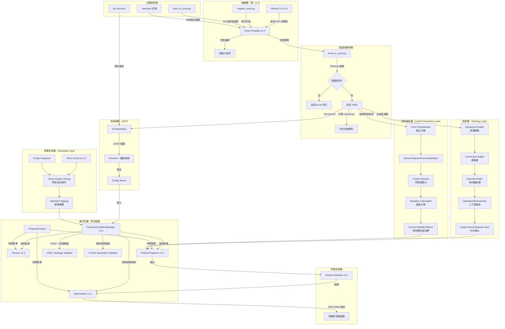

# PRD v1.4.3: 特徵標註系統規範 (HVAC 拓樸感知與控制語意版)

**文件版本:** v1.4.3-Final-SignedOff (Aligned with Interface Contract v1.2)  
**日期:** 2026-02-26  
**負責人:** Oscar Chang / HVAC 系統工程團隊  
**目標:** 建立 HVAC 冰水主機房的統一特徵標註規範，導入空間拓樸感知（Topology Awareness）與控制語意（Control Semantics），強化單向流程管控、設備邏輯一致性、時間基準防護、特徵對齊機制與國際標準對接  
**相依文件:** 
- Interface Contract v1.2 (PRD_Interface_Contract_v1.2.md)
- Cleaner v2.3+, Feature Engineer v1.4+, Optimization v1.2+
- Parser v2.2+ (含 Header Standardization)
- Brick Schema v1.3+ / Project Haystack

**修訂紀錄:**
- **v1.4.3 (2026-02-26)**: 四次審查最終優化，防呆極限測試，已封卷（Sign-off）
  - 修正 datetime timezone naive vs aware 比較崩潰風險（新增 `_ensure_aware()`）
  - 修正 `parse_excel_boolean` 空白字元風險（加入 `.strip()`）
  - 強化 Excel Hidden Sheet 安全性（`hidden` → `veryHidden`）
  - 優化 Graph Cache（mtime 快取鍵 + pickle fallback 機制）
- **v1.4.2 (2026-02-26)**: 三次審查優化，完善拓樸時效性驗證與效能優化
  - 新增 Temporal-Topology Runtime Validation（E417），防止歷史資料使用未來拓樸
  - 新增 Excel Data Validation 255 字元限制迴避方案（Hidden Sheet 方法）
  - 修正 Levenshtein 模糊匹配大小寫敏感問題
  - 新增 brickschema 本體驗證優化建議（章節 4.4.3）
  - 新增 Graph Serialization Cache 效能優化建議（章節 9.5）
- **v1.4.0 (2026-02-26)**: 重大版本升級，新增拓樸感知（Topology Awareness）與控制語意（Control Semantics）支援
  - 新增 `upstream_equipment_id`、`point_class`、`control_domain` 等核心欄位
  - 新增設備連接圖（Equipment Connection Graph）規範
  - 新增 Brick Schema 與 Project Haystack 國際標準對接
  - 新增拓樸驗證錯誤碼 E410-E419、控制語意錯誤碼 E420-E429
  - 新增控制偏差特徵（Control Deviation Features）計算規範
  - 新增拓樸聚合特徵（Topology Aggregation）群組策略
- **v1.3.1 (2026-02-24)**: 新增 Excel to YAML 轉換規則（章節 7.3），明確定義 `site_id` 從檔名提取的規則，支援多種檔案命名格式

---

## 1. 執行總綱與設計哲學

### 1.1 核心目標聲明

本規範旨在建立**工業級 HVAC 資料治理基礎設施**，並在此基礎上導入**空間拓樸感知**與**控制語意理解**，解決以下關鍵痛點：

1. **設備語意一致性**: 統一冰水主機、水泵、冷卻水塔、空調箱等設備的命名與分類邏輯
2. **物理邏輯防呆**: 透過設備互鎖檢查（Interlock Validation）防止「主機開啟但水泵未運轉」等物理不可能情境
3. **單向流程管控**: 杜絕「Excel ↔ YAML 雙向修改」導致的競態條件與設定遺失
4. **時間一致性防護**: 建立全域時間基準（Temporal Baseline），防止長時間執行流程中的時間漂移導致未來資料誤判
5. **特徵對齊保證**: 確保 Training 與 Optimization 階段的特徵向量、縮放參數、設備限制完全一致，防止 Silent Failure
6. **🆕 空間拓樸感知**: 建立設備間的實體連接關係（有向圖），支援圖神經網路（GNN）與拓樸聚合特徵計算
7. **🆕 控制語意理解**: 區分感測器（Sensor）、設定值（Setpoint）、控制指令（Command）與警報（Alarm），支援控制偏差分析
8. **🆕 國際標準對接**: 對接 Brick Schema 與 Project Haystack 標準命名空間，確保跨系統互操作性

### 1.2 拓樸感知與控制語意架構（v1.4 核心擴充）



**關鍵約束（強制執行）**:
- 🔴 **禁止直接修改 YAML**: 任何對 `config/features/sites/*.yaml` 的手動修改將被 Import Guard 攔截（E501 錯誤）
- 🔴 **Wizard 僅寫 Excel**: Wizard CLI 禁止直接寫入 YAML，僅允許更新 `.xlsx` 檔案
- 🔴 **時間基準強制**: 所有模組必須透過 `TemporalContext` 取得 `pipeline_origin_timestamp`，禁止直接使用 `datetime.now()`
- 🔴 **拓樸循環禁止**: 設備連接圖不可存在循環（E410 錯誤），例如 A→B→C→A
- 🔴 **控制對完整性**: Sensor 必須有對應的 Setpoint 才能計算控制偏差（E420 警告）
- 🟢 **Git 為最終 SSOT**: 所有 YAML 必須進 Git，Excel 檔案必須在 `.gitignore` 中排除
- 🟡 **逆向同步僅限災難恢復**: `yaml_to_excel --mode recovery` 僅在 Git 回退或檔案損毀時使用
- 🟡 **國際標記可選但建議**: Brick Schema 與 Project Haystack 標記為選填，但建議新案場採用

---

## 2. 文件架構與版本控制（詳細規格）

### 2.1 目錄結構（v1.4 完整版）

```
config/features/                    # SSOT 目錄（唯讀，Git 管控）
├── schema.json                     # JSON Schema v1.4（含拓樸與控制語意擴充）
├── base.yaml                       # 基礎繼承定義
├── physical_types.yaml             # 物理類型完整定義（20+ 類型，含控制語意類型）
├── equipment_taxonomy.yaml         # 設備分類法（HVAC 專用，含拓樸類型）
├── header_standardization_rules.yaml # 標頭正規化規則（對齊 Interface Contract 第10章）
├── 🆕 brick_schema_mapping.yaml    # Brick Schema 標準對應表
├── 🆕 haystack_tags.yaml           # Project Haystack 標籤對應表
├── 🆕 topology_templates/          # 拓樸範本庫
│   ├── chiller_plant_topology.yaml # 冰水主機房標準拓樸
│   ├── ahu_topology.yaml           # 空調箱標準拓樸
│   └── cooling_tower_loop.yaml     # 冷卻水塔迴路拓樸
└── sites/                          # 案場定義（僅由 Excel 生成）
    ├── cgmh_ty.yaml
    ├── kmuh.yaml
    └── template_factory.yaml       # 工廠範本

tools/features/                     # 編輯工具鏈
├── templates/                      
│   ├── Feature_Template_v1.4.xlsx  # 🆕 當前版本（含拓樸與控制語意欄位）
│   ├── Feature_Template_v1.3.xlsx  # 舊版（供遷移）
│   └── Feature_Template_v1.2.xlsx  # 舊版（供遷移）
├── wizard.py                       # Wizard CLI v1.4（拓樸語意推測）
├── excel_to_yaml.py                # 轉換器（含拓樸驗證與控制語意檢查）
├── yaml_to_excel.py                # 逆向轉換（init/recovery 模式）
├── migrate_excel.py                # 🆕 範本升級工具（v1.3→v1.4）
├── 🆕 topology_builder.py          # 設備拓樸圖建構器
├── 🆕 control_semantics_analyzer.py # 控制語意分析器
└── validators/
    ├── hvac_validator.py           # HVAC 專用驗證器
    ├── 🆕 topology_validator.py    # 拓樸驗證器（循環檢測、連通性檢查）
    ├── 🆕 control_semantics_validator.py # 控制語意驗證器
    ├── sync_checker.py             # Excel/YAML 同步檢查（含 Checksum 計算）
    └── header_standardizer.py      # 標頭正規化實作（對齊 Interface Contract）

src/features/                       # Python API（Runtime）
├── __init__.py                     # 安裝 YAML Write Guard 與 TemporalContext
├── annotation_manager.py           # FeatureAnnotationManager v1.4（唯讀，含拓樸查詢）
├── 🆕 topology_manager.py          # 設備拓樸圖管理器（NetworkX 整合）
├── 🆕 control_semantics_manager.py # 控制語意管理器
├── yaml_write_guard.py             # Import Hook 防護（E501）
├── backup_manager.py               # 備份策略管理
├── models.py                       # Pydantic 模型（ColumnAnnotation v1.4, EquipmentConstraint）
├── temporal_context.py             # 全域時間基準單例
└── feature_manifest.py             # Feature Manifest 生成與驗證 v2.1

src/etl/                            # ETL 整合層
├── config_models.py                # SSOT 常數定義（VALID_QUALITY_FLAGS, HEADER_STANDARDIZATION_RULES）
└── header_standardizer.py          # CSV 標頭正規化實作（Parser 使用）
```

### 2.2 Git 管理策略（強制規範）

**.gitignore 範例**（必須放置於專案根目錄）：
```gitignore
# 特徵標註工作檔案（禁止進 Git）
data/features/**/*.xlsx
data/features/**/*.xlsx.backup.*
data/features/**/.backups/
*.xlsx~*.tmp

# 臨時 YAML（生成過程）
*.yaml.tmp
__pycache__/

# 拓樸圖暫存（可由程式生成）
*.topology.cache.json
```

**分支策略**:
- `main`: 僅包含通過 HVAC + 拓樸驗證的 YAML，代表生產環境配置
- `feature/hvac-{site_id}`: 新增案場或修改 HVAC 邏輯時的工作分支
- `feature/topology-{site_id}`: 新增拓樸關係修改的專屬分支
- **Pre-commit Hook 檢查**: 禁止提交 `.xlsx` 二進位檔案，驗證 YAML Schema 版本，驗證拓樸循環

---

## 3. Excel 範本結構（v1.4 拓樸感知版）

### 3.1 Sheet 1: Instructions（填寫說明，v1.4 更新）

為降低使用者的學習門檻並確保標註品質，Excel 範本預設包含此說明頁作為第一分頁：
- 詳列必填欄位定義（如 `physical_type`、`is_target`、`equipment_id`）
- 🆕 **新增 v1.4 欄位說明**：
  - `upstream_equipment_id`: 上游設備 ID，用於建立設備連接關係
  - `point_class`: 點位型態（Sensor/Setpoint/Command/Alarm/Status）
  - `control_domain`: 控制域劃分（冰水側/冷卻水側/空氣側）
  - `setpoint_pair_id`: 配對的設定值欄位 ID
  - `brick_schema_tag`: Brick Schema 標準標籤
  - `haystack_tag`: Project Haystack 標籤
- 提供常見 `physical_type` 的設定範例與適用情境
- 🆕 提供拓樸連接範例圖（冰水主機房標準拓樸）

### 3.2 Sheet 2: Columns（主要編輯區，v1.4 大幅擴充）

**欄位定義（拓樸感知強化版）**:

| 欄位名稱 (A) | 物理類型 (B) | 單位 (C) | 設備角色 (D) | 是否目標 (E) | 啟用 Lag (F) | Lag 間隔 (G) | 忽略警告 (H) | 設備 ID (I) | 🆕 上游設備 ID (J) | 🆕 點位型態 (K) | 🆕 控制域 (L) | 🆕 配對設定值 ID (M) | 描述 (N) | 狀態 (O) | 🆕 Brick Schema (P) | 🆕 Haystack (Q) |
|:---:|:---:|:---:|:---:|:---:|:---:|:---:|:---:|:---:|:---:|:---:|:---:|:---:|:---:|:---:|:---:|:---:|
| chiller_01_chwst | temperature | °C | primary | FALSE | TRUE | 1,4,96 | - | CH-01 | - | Sensor | Chilled Water | chiller_01_chwsp | 一號機冰水出水溫度 | confirmed | https://brickschema.org/schema/Brick#Chilled_Water_Supply_Temperature_Sensor | temp,sensor,chilled | 
| chiller_01_chwsp | temperature | °C | primary | FALSE | FALSE | - | - | CH-01 | - | Setpoint | Chilled Water | - | 一號機冰水出水設定溫度 | confirmed | https://brickschema.org/schema/Brick#Chilled_Water_Supply_Temperature_Setpoint | temp,sp,chilled |
| chiller_01_kw | power | kW | primary | TRUE | FALSE | - | - | CH-01 | - | Sensor | Electrical | - | 一號機功率（目標變數） | confirmed | https://brickschema.org/schema/Brick#Electric_Power_Sensor | power,sensor,electric |
| chiller_01_status | status | - | primary | FALSE | FALSE | - | - | CH-01 | - | Command | Control | - | 一號機啟停指令 | confirmed | https://brickschema.org/schema/Brick#On_Off_Command | cmd,onoff |
| chiller_01_alarm | status | - | primary | FALSE | FALSE | - | - | CH-01 | - | Alarm | Control | - | 一號機故障警報 | confirmed | https://brickschema.org/schema/Brick#Alarm | alarm |
| ct_01_cwst | temperature | °C | primary | FALSE | TRUE | 1,4 | - | CT-01 | CH-01 | Sensor | Condenser Water | - | 一號塔冷卻水出水溫度 | confirmed | https://brickschema.org/schema/Brick#Condenser_Water_Supply_Temperature_Sensor | temp,sensor,condenser |

**欄位規格詳細說明（v1.4 新增與更新）**:

#### 🆕 Excel 範本防呆設計（Data Validation）

為降低人為輸入錯誤，Excel 範本必須在以下欄位實作資料驗證（Data Validation）：

| 欄位 | 驗證類型 | 驗證規則 | 錯誤提示 | 預防錯誤碼 |
|:---|:---:|:---|:---|:---:|
| **B. physical_type** | 下拉選單 | 從 `physical_types.yaml` 動態載入 | "請選擇有效的物理類型" | E403 |
| **D. device_role** | 下拉選單 | `primary` / `backup` / `seasonal` | "請選擇有效的設備角色" | - |
| **E. is_target** | 下拉選單 | `TRUE` / `FALSE` | "請選擇 TRUE 或 FALSE" | E405 |
| **K. point_class** | 下拉選單 | `Sensor` / `Setpoint` / `Command` / `Alarm` / `Status` | "請選擇有效的點位型態" | E428 |
| **L. control_domain** | 下拉選單 | 8 個控制域選項（見下方） | "請選擇有效的控制域" | E429, E414 |
| **M. setpoint_pair_id** | 動態下拉 | 同設備且 `point_class=Setpoint` 的欄位 | "請選擇有效的配對設定值" | E424-E427 |
| **J. upstream_equipment_id** | 動態下拉 | 同案場存在的 `equipment_id` 列表 | "請選擇已存在的設備 ID" | E411 |
| **P. brick_schema_tag** | 下拉選單（可編輯） | 常用 Brick Schema 標籤列表 | "標籤不符合 Brick Schema 規範" | E430 |
| **Q. haystack_tag** | 下拉選單（可編輯） | 常用 Haystack 標籤組合 | "包含未定義的 Haystack 標籤" | E431 |

**Control Domain 下拉選單選項**：
```
Chilled Water
Condenser Water
Air Handling
Electrical
Control
Refrigerant
Heat Recovery
Other
```

**🆕 實作範例（Python openpyxl）- 避免 255 字元限制**：

Excel 的 Data Validation 若使用逗號分隔的字串常數，有硬性 **255 字元長度限制**。為避免未來擴充選項時超過限制，**所有靜態清單必須使用 Hidden Sheet 範圍索引**。

```python
from openpyxl.worksheet.datavalidation import DataValidation
from openpyxl import Workbook

# 建立工作簿
wb = Workbook()
ws_columns = wb['Columns']

# 🆕 建立 Hidden Sheet: ValidValues（存放所有下拉選單選項）
ws_valid = wb.create_sheet('ValidValues')
# 🆕 四次審查優化：使用 'veryHidden' 而非 'hidden'
# 'hidden' 可透過 Excel 右鍵輕易取消隱藏，'veryHidden' 必須透過 VBA 才能解開
ws_valid.sheet_state = 'veryHidden'
# 可選：加上工作表保護（需密碼才能解除）
# ws_valid.protection.sheet = True  # 若需要密碼保護可取消註解

# 寫入靜態選項到 ValidValues Sheet（避免 255 字元限制）
# Control Domain 選項（B 欄）
control_domains = ['Chilled Water', 'Condenser Water', 'Air Handling', 
                   'Electrical', 'Control', 'Refrigerant', 'Heat Recovery', 'Other']
for idx, value in enumerate(control_domains, start=1):
    ws_valid.cell(row=idx, column=2, value=value)  # B1:B8

# Point Class 選項（C 欄）
point_classes = ['Sensor', 'Setpoint', 'Command', 'Alarm', 'Status']
for idx, value in enumerate(point_classes, start=1):
    ws_valid.cell(row=idx, column=3, value=value)  # C1:C5

# Device Role 選項（D 欄）
device_roles = ['primary', 'backup', 'seasonal']
for idx, value in enumerate(device_roles, start=1):
    ws_valid.cell(row=idx, column=4, value=value)  # D1:D3

# 動態設備 ID 列表（A 欄）- 由 Wizard 根據實際設備填入
equipment_ids = ['CH-01', 'CH-02', 'CT-01', 'CT-02', 'CHWP-01']  # 範例
for idx, value in enumerate(equipment_ids, start=1):
    ws_valid.cell(row=idx, column=1, value=value)  # A1:A{N}

# 🆕 建立下拉選單 - 使用範圍索引（避開 255 字元限制）
# Control Domain 下拉選單（L 欄）
dv_control_domain = DataValidation(
    type="list",
    formula1='=ValidValues!$B$1:$B$8',  # 指向 Hidden Sheet 範圍
    allow_blank=True
)
dv_control_domain.error = '請選擇有效的控制域'
dv_control_domain.errorTitle = '輸入錯誤'
dv_control_domain.prompt = '選擇控制域以確保拓樸分析正確性'
dv_control_domain.promptTitle = 'Control Domain'
ws_columns.add_data_validation(dv_control_domain)
dv_control_domain.add('L2:L1000')

# Point Class 下拉選單（K 欄）
dv_point_class = DataValidation(
    type="list",
    formula1='=ValidValues!$C$1:$C$5',
    allow_blank=True
)
ws_columns.add_data_validation(dv_point_class)
dv_point_class.add('K2:K1000')

# Device Role 下拉選單（D 欄）
dv_device_role = DataValidation(
    type="list",
    formula1='=ValidValues!$D$1:$D$3',
    allow_blank=True
)
ws_columns.add_data_validation(dv_device_role)
dv_device_role.add('D2:D1000')

# 動態設備 ID 下拉選單（I 欄和 J 欄）
dv_equipment = DataValidation(
    type="list",
    formula1='=ValidValues!$A$1:$A$100',  # 預留 100 個設備位置
    allow_blank=True
)
ws_columns.add_data_validation(dv_equipment)
dv_equipment.add('I2:I1000')  # equipment_id
ws_columns.add_data_validation(dv_equipment)
dv_equipment.add('J2:J1000')  # upstream_equipment_id
```

**Hidden Sheet: ValidValues 結構**：
| 欄位 | 內容 | 列數 |
|:---:|:---|:---:|
| A | 動態設備 ID 列表 | 動態 |
| B | Control Domain 選項 | 8 |
| C | Point Class 選項 | 5 |
| D | Device Role 選項 | 3 |
| E+ | 預留擴充 | - |

- 此工作表由 Wizard 自動生成並隱藏
- 使用範圍索引徹底避開 255 字元限制
- 未來擴充選項只需增加列數，無需修改公式

#### A-I 欄位（保留自 v1.3，詳見 v1.3 文件）
- A. 欄位名稱 (Column Name)
- B. 物理類型 (Physical Type)
- C. 單位 (Unit)
- D. 設備角色 (Device Role)
- E. 是否目標 (Is Target)
- F. 啟用 Lag (Enable Lag)
- G. Lag 間隔 (Lag Intervals)
- H. 忽略警告 (Ignore Warnings)
- I. 設備 ID (Equipment ID)

#### 🆕 J. 上游設備 ID (Upstream Equipment ID)
- **用途**: 建立設備間的實體連接關係，構成有向圖的邊（Edge）
- **格式**: 單一設備 ID 或逗號分隔的多個設備 ID
  - 單一上游: `CT-01`
  - 多個上游: `CT-01,CT-02`（並聯連接）
- **拓樸意義**: 
  - 若欄位 A 屬於設備 X，且 J 欄填寫設備 Y，表示「設備 Y 的輸出是設備 X 的輸入」
  - 例：`chiller_01` 的 `upstream_equipment_id` = `CT-01` 表示冷卻水塔供水給冰水主機
- **驗證規則**:
  - 引用的設備 ID 必須存在於同案場的其他欄位 I 中（E411 錯誤）
  - 不可形成循環依賴（E410 錯誤）
  - 特定設備類型有強制上游要求（E412 警告）
    - 冰水主機必須有冷卻水塔作為上游
    - 冰水泵必須有冰水主機或分集水器作為上游
- **HVAC 標準拓樸**:
  ```
  冷卻水塔 (CT) → 冷卻水泵 (CWP) → 冰水主機 (CH) → 冰水泵 (CHWP) → 空調箱 (AHU)
                    ↓                                    ↓
                  冷卻水迴路                          冰水迴路
  ```

#### 🆕 K. 點位型態 (Point Class)
- **用途**: 區分資料點的控制語意角色
- **輸入**: 靜態下拉選單（5 個選項）
- **選項清單**:
  | 選項 | 說明 | 典型 Physical Type | 控制偏差計算 |
  |-----|------|-------------------|-------------|
  | `Sensor` | 感測器回饋值（實際量測） | temperature, pressure, flow_rate, power | 可與配對 Setpoint 計算偏差 |
  | `Setpoint` | 設定值（期望值） | temperature, pressure, valve_position | 基準值 |
  | `Command` | 控制指令（寫入設備） | status, valve_position, frequency | 不可計算偏差 |
  | `Alarm` | 警報狀態（布林或枚舉） | status | 不可計算偏差 |
  | `Status` | 設備運轉狀態（回饋） | operating_status, rotational_speed | 不可計算偏差 |
- **驗證規則**:
  - `Sensor` 與 `Setpoint` 必須成對出現於同一設備與控制域（E420 警告）
  - `Command` 類型禁止設為 `is_target=TRUE`（E421 錯誤）
  - `Alarm` 類型強制 `is_target=FALSE`（E422 錯誤）
- **控制偏差特徵計算**:
  - 當 `point_class=Sensor` 且 `setpoint_pair_id` 有值時，Feature Engineer 自動計算 `delta_{column_name}` = Sensor - Setpoint

#### 🆕 L. 控制域 (Control Domain)
- **用途**: 劃分 HVAC 系統的控制邊界，用於控制偏差計算與拓樸分析
- **輸入**: 靜態下拉選單（8 個選項）
- **選項清單**:
  | 選項 | 說明 | 包含設備 |
  |-----|------|---------|
  | `Chilled Water` | 冰水側 | 冰水主機蒸發器、冰水泵、空調箱冰水閥 |
  | `Condenser Water` | 冷卻水側 | 冰水主機冷凝器、冷卻水泵、冷卻水塔 |
  | `Air Handling` | 空氣處理側 | 空調箱風機、過濾器、加熱/加濕器 |
  | `Electrical` | 電力系統 | 電表、變頻器、配電盤 |
  | `Control` | 控制系統 | DDC 控制器、感測器訊號 |
  | `Refrigerant` | 冷媒側 | 壓縮機、膨脹閥（若有監測） |
  | `Heat Recovery` | 熱回收系統 | 熱回收泵、熱交換器 |
  | `Other` | 其他 | 輔助設備 |
- **驗證規則**:
  - 同一設備 ID 的 Sensor 與 Setpoint 必須屬於相同 Control Domain（E423 錯誤）
  - 特定 Physical Type 有預設 Control Domain（Wizard 自動推測）

#### 🆕 M. 配對設定值 ID (Setpoint Pair ID)
- **用途**: 建立 Sensor 與其對應 Setpoint 的關聯，用於控制偏差計算
- **格式**: 欄位名稱（Column Name）
- **適用條件**: 僅當 `point_class=Sensor` 時有效
- **關聯型態**: **支援多對一關係（N:1）**
  - 多個 Sensor 可以共用同一個 Setpoint
  - 使用場景：同一設備有多個溫度感測器，但共用一個溫度設定值
  - 範例：
    - `chiller_01_chwst`（主溫度感測）→ `chiller_01_chwsp`
    - `chiller_01_chwst_backup`（備用溫度感測）→ `chiller_01_chwsp`
  - API 支援：使用 `get_sensors_for_setpoint(setpoint_column)` 可反查所有關聯 Sensor
- **驗證規則**:
  - 引用的欄位必須存在且 `point_class=Setpoint`（E424 錯誤）
  - 兩者必須屬於相同 `equipment_id`（E425 錯誤）
  - 兩者**建議**屬於相同 `control_domain`，跨域配對將觸發 **E426 警告**（可透過 `ignore_warnings` 忽略，適用於 Cascade Control 進階控制策略）
  - Physical Type 必須一致（E427 錯誤）
- **自動推薦**: Wizard 會根據命名規則自動推薦配對
  - `chiller_01_chwst` ↔ `chiller_01_chwsp`
  - `ahu_01_sat` ↔ `ahu_01_sasp`

#### N-O 欄位（保留自 v1.3）
- N. 描述 (Description)
- O. 狀態 (Status)

#### 🆕 P. Brick Schema 標籤 (Brick Schema Tag)
- **用途**: 對接 Brick Schema 國際標準，實現跨系統語意互操作
- **格式**: 完整 URI 或簡短標籤名稱
- **範例**:
  - `https://brickschema.org/schema/Brick#Chilled_Water_Supply_Temperature_Sensor`
  - `brick:Chilled_Water_Supply_Temperature_Sensor`（簡短格式）
- **下拉選單**: 提供常用 HVAC 點位對應表（見第 4.4 章）
- **驗證**: 若提供，必須符合 Brick Schema v1.3 規範（E430 警告）

#### 🆕 Q. Project Haystack 標籤 (Haystack Tag)
- **用途**: 對接 Project Haystack 標籤系統
- **格式**: 逗號分隔的標籤組合
- **範例**: `temp,sensor,chilled,water`
- **下拉選單**: 提供常用標籤組合（見第 4.4 章）
- **驗證**: 若提供，標籤必須存在於 Haystack 定義庫（E431 警告）

### 3.3 Sheet 3: Group Policies（群組策略，v1.4 擴充）

簡化語法，無需 Regex，支援 HVAC 設備類型自動匹配：

| 策略名稱 | 匹配類型 | 匹配值 | 物理類型 | 預設樣板 | 自定義 Lag | 設備類別 | 🆕 拓樸策略 | 🆕 控制語意 |
|:---:|:---:|:---:|:---:|:---:|:---:|:---:|:---:|:---:|
| chillers_temp | prefix | chiller_ | temperature | Standard_Chiller | - | 冰水主機 | - | Sensor+Setpoint |
| chillers_power | prefix | chiller_ | power | Power_High_Freq | - | 冰水主機 | - | Sensor |
| chillers_eff | prefix | chiller_ | efficiency | Efficiency_Smooth | - | 冰水主機 | - | Sensor |
| 🆕 chillers_control_dev | point_class | Sensor | temperature | Control_Deviation | - | 冰水主機 | Upstream Aggregation | Deviation |
| pumps_vfd | prefix | pump_ | frequency | VFD_Control | 1,4 | 水泵 | - | Command |
| pumps_elec | prefix | pump_ | current | Electrical_Monitor | 1,4 | 水泵 | - | Sensor |
| cooling_towers | prefix | ct_ | frequency | CT_Fan_Control | 1,4 | 冷卻水塔 | Downstream to CH | Sensor |
| 🆕 ct_topology_agg | equipment_type | cooling_tower | temperature | Topology_Avg | 1,4 | 冷卻水塔 | Aggregate to CH | Sensor |
| ahu_valves | prefix | ahu_ | valve_position | Valve_Position | 1,96 | 空調箱 | - | Command |
| ahu_filters | prefix | ahu_ | pressure_differential | Filter_DP | 1 | 空調箱 | - | Sensor |
| 🆕 ahu_control_loop | point_class | Sensor | temperature | Control_Loop | 1,4 | 空調箱 | CHW Loop | Sensor+Setpoint |

**🆕 v1.4 新增群組策略類型**:

1. **拓樸聚合策略 (Topology Aggregation)**: 自動聚合上游設備的特徵
   - 範例: `ct_topology_agg` 將冷卻水塔溫度聚合為冰水主機的輸入特徵

2. **控制偏差策略 (Control Deviation)**: 自動計算 Sensor - Setpoint 偏差
   - 範例: `chillers_control_dev` 生成 `delta_chiller_01_chwst` 特徵

### 3.4 Sheet 4: Metadata（文件元資料，v1.4 擴充）

| 屬性 | 值 | 說明 | 驗證規則 |
|:---|:---|:---|:---|
| schema_version | 1.4 | 文件格式版本 | 必須為 "1.4" |
| template_version | 1.4 | Excel 範本版本 | System sheet 交叉驗證 |
| site_id | cgmh_ty | 案場識別 | 必須匹配檔名 |
| inherit | base | 繼承來源 | 必須存在於 config/features/ |
| description | 長庚醫院冰水主機房... | 文件描述 | 自由文字 |
| editor | 王工程師 | 編輯者 | 必填 |
| last_updated | 2026-02-26T10:00:00 | 最後更新 | ISO 8601 格式 |
| yaml_checksum | sha256:abc123... | 對應 YAML 雜湊 | 同步檢查用 |
| equipment_schema | hvac_v1.4 | 設備分類架構版本 | HVAC 專用標記 |
| temporal_baseline_version | 1.0 | 時間基準版本 | 必須為 "1.0" |
| 🆕 topology_version | 1.0 | 拓樸規範版本 | 必須為 "1.0" |
| 🆕 control_semantics_version | 1.0 | 控制語意版本 | 必須為 "1.0" |
| 🆕 brick_schema_version | 1.3 | Brick Schema 版本 | 可選，若使用則必須為 "1.3" |
| 🆕 haystack_version | 3.0 | Haystack 版本 | 可選，若使用則必須為 "3.0" |
| 🆕 **topology_config_version** | "2024-Q1" | **拓樸時效版本** | 物理改造時必須遞增 |
| 🆕 **topology_effective_from** | ISO 8601 | **拓樸生效時間** | 用於歷史資料追溯 |
| 🆕 **topology_effective_to** | ISO 8601/null | **拓樸失效時間** | null 表示目前仍生效 |

**Hidden Sheet: System**（系統內部使用，v1.4 擴充）:
- `B1`: template_version ("1.4")
- `B2`: schema_hash (SHA256 of schema.json)
- `B3`: last_generated_by ("wizard_v1.4" or "manual")
- `B4`: yaml_last_sync_timestamp (ISO 8601)
- `B5`: equipment_count（自動計算設備數量）
- `B6`: excel_checksum_sha256（Excel 檔案內容雜湊）
- 🆕 `B7`: topology_graph_hash（設備連接圖雜湊）
- 🆕 `B8`: control_pairs_count（控制對數量）
- 🆕 `B9`: brick_schema_coverage（Brick Schema 覆蓋率）

---

## 4. 設備分類與命名規範（HVAC Taxonomy v1.4）

### 4.1 設備類別對照表 (Equipment Category Mapping)

為統一欄位命名與 Group Policy 自動匹配，建立以下**強制前綴規範**：

| 設備中文名 | 英文代碼 | 欄位前綴規範 | Device Role 建議 | Equipment ID 範例 | 🆕 強制上游設備 |
|-----------|---------|-------------|-----------------|------------------|---------------|
| **冰水主機** | CH (Chiller) | `chiller_{nn}_` 或 `ch_{n}_` | primary/backup | CH-01, CH-02 | CT-xx, CWP-xx |
| **冰水一次泵** | CHW-P (Primary) | `chw_pri_pump_{nn}_` 或 `chwp{n}_` | primary | CHWP-01 | CH-xx |
| **冰水區域泵** | CHW-S (Secondary) | `chw_sec_pump_{nn}_` 或 `chws{n}_` | primary | CHWS-01 | CHWP-xx 或 Header |
| **冷卻水一次泵** | CW-P (Pump) | `cw_pump_{nn}_` 或 `cwp{n}_` | primary | CWP-01 | CT-xx |
| **冷卻水塔** | CT (Cooling Tower) | `ct_{nn}_` 或 `cooling_tower_{nn}_` | primary/backup | CT-01, CT-02 | - |
| **空調箱** | AHU | `ahu_{nn}_` 或 `ahu_{zone}_` | primary | AHU-North-01 | CHWS-xx |
| **🆕 分集水器** | Header | `header_{type}_` | - | CH-Header, CW-Header | CHWP-xx / CWP-xx |

### 4.2 元件類型對照表 (Component Type Mapping)

| 元件中文名 | 英文代碼 | 測點類型 | Physical Type 建議 | 🆕 Point Class 建議 | 單位 |
|-----------|---------|---------|-------------------|-------------------|------|
| **冰水出水溫度** | CHWST | 溫度計 | `temperature` | Sensor | °C |
| **冰水出水設定** | CHWSP | 溫度設定 | `temperature` | Setpoint | °C |
| **冰水回水溫度** | CHWRT | 溫度計 | `temperature` | Sensor | °C |
| **冷卻水出水溫度** | CWST | 溫度計 | `temperature` | Sensor | °C |
| **冷卻水回水溫度** | CWRT | 溫度計 | `temperature` | Sensor | °C |
| **冰水閥開度** | CHWV | 閥門 | `valve_position` | Command | % |
| **變頻器頻率** | VFD | 控制器 | `frequency` | Command | Hz |
| **變頻器回授** | VFD-FB | 控制器 | `frequency` | Status | Hz |
| **累積用電量** | kWh | 電表 | `energy` | Sensor | kWh |
| **過濾器壓差** | DP | 壓差 | `pressure_differential` | Sensor | kPa |
| **主機啟停指令** | START | 狀態 | `status` | Command | - |
| **主機運轉狀態** | RUN | 狀態 | `status` | Status | - |
| **主機故障警報** | ALARM | 狀態 | `status` | Alarm | - |

### 4.3 控制對命名規範 (Control Pair Naming Convention)

為便於 Wizard 自動推薦 `setpoint_pair_id`，建立以下命名對應規則：

| Sensor 欄位名稱 | Setpoint 欄位名稱 | 說明 |
|:---|:---|:---|
| `{equipment}_chwst` | `{equipment}_chwsp` | 冰水出水溫度 ↔ 設定 |
| `{equipment}_chwrt` | - | 冰水回水溫度（通常無設定值） |
| `{equipment}_sat` | `{equipment}_sasp` | 出風溫度 ↔ 設定 |
| `{equipment}_rat` | `{equipment}_rasp` | 回風溫度 ↔ 設定 |
| `{equipment}_dp` | `{equipment}_dsp` | 壓差 ↔ 設定 |
| `{equipment}_rh` | `{equipment}_rhsp` | 相對濕度 ↔ 設定 |

**Wizard 自動配對演算法**:
```python
def auto_detect_setpoint_pair(sensor_column: str, all_columns: List[str],
                               use_fuzzy_matching: bool = True,
                               similarity_threshold: float = 0.85) -> Optional[Dict[str, Any]]:
    """
    自動推測 Sensor 對應的 Setpoint 欄位
    
    支援兩種匹配模式：
    1. 精確後綴匹配：基於標準命名規則（如 _chwst → _chwsp）
    2. 模糊匹配：基於 Levenshtein Distance 的相似度計算（用於非標準命名）
    
    Args:
        sensor_column: Sensor 欄位名稱
        all_columns: 所有可用欄位名稱列表
        use_fuzzy_matching: 是否啟用模糊匹配（預設開啟）
        similarity_threshold: 模糊匹配相似度閾值（0.0-1.0，預設 0.85）
    
    Returns:
        字典包含：
        - 'setpoint': 匹配的 Setpoint 欄位名稱
        - 'match_type': 匹配類型 ('exact' 或 'fuzzy')
        - 'similarity': 相似度分數 (1.0 表示精確匹配)
        - 'status': 建議的狀態 ('confirmed' 或 'needs_review')
        若無匹配則返回 None
    """
    # 方法 1: 精確後綴匹配（標準命名規則）
    suffix_mapping = {
        '_chwst': '_chwsp',   # Chilled Water Supply Temp -> Setpoint
        '_sat': '_sasp',       # Supply Air Temp -> Setpoint
        '_rat': '_rasp',       # Return Air Temp -> Setpoint
        '_dp': '_dsp',         # Differential Pressure -> Setpoint
        '_rh': '_rhsp',        # Relative Humidity -> Setpoint
        '_chwrt': None,        # 回水溫度通常無設定值
        '_cwst': '_cwsp',      # Condenser Water Supply Temp -> Setpoint
        '_flow': '_flowsp',    # Flow Rate -> Setpoint
    }
    
    # 方法 1: 精確後綴匹配（標準命名規則）
    for sensor_suffix, sp_suffix in suffix_mapping.items():
        if sp_suffix and sensor_column.endswith(sensor_suffix):
            base = sensor_column[:-len(sensor_suffix)]
            candidate = base + sp_suffix
            if candidate in all_columns:
                # 精確匹配返回 confirmed 狀態
                return {
                    'setpoint': candidate,
                    'match_type': 'exact',
                    'similarity': 1.0,
                    'status': 'confirmed'
                }
    
    # 方法 2: 模糊匹配（Levenshtein Distance）
    if use_fuzzy_matching:
        best_match = None
        best_score = 0.0
        
        # 過濾可能的 Setpoint 候選欄位
        sp_candidates = [c for c in all_columns 
                        if any(keyword in c.lower() for keyword in ['sp', 'setpoint', 'set']) 
                        and c != sensor_column]
        
        for candidate in sp_candidates:
            # 計算相似度（使用標準化 Levenshtein Distance）
            similarity = _levenshtein_similarity(sensor_column, candidate)
            
            # 檢查是否為同一設備（提取設備前綴）
            sensor_prefix = _extract_equipment_prefix(sensor_column)
            candidate_prefix = _extract_equipment_prefix(candidate)
            
            # 若設備前綴一致，給予額外加權
            if sensor_prefix and candidate_prefix and sensor_prefix == candidate_prefix:
                similarity += 0.1  # 設備一致性加權
                similarity = min(similarity, 1.0)  # 確保不超過 1.0
            
            if similarity > best_score and similarity >= similarity_threshold:
                best_score = similarity
                best_match = candidate
        
        if best_match:
            print(f"   🔗 模糊匹配成功: {sensor_column} → {best_match} (相似度: {best_score:.2f})")
            # 模糊匹配標記為 needs_review，強制工程師人工確認
            return {
                'setpoint': best_match,
                'match_type': 'fuzzy',
                'similarity': best_score,
                'status': 'needs_review'  # 關鍵：強制人工確認
            }
    
    return None


def _levenshtein_similarity(s1: str, s2: str) -> float:
    """
    計算兩個字串的標準化 Levenshtein 相似度
    
    Returns:
        相似度分數 (0.0-1.0)，1.0 表示完全相同
    """
    # 🆕 大小寫不敏感比對（增加對人為輸入的容錯率）
    # 避免 Chiller_01_CHWST 與 chiller_01_chwst 被視為不同
    s1, s2 = s1.lower(), s2.lower()
    
    if s1 == s2:
        return 1.0
    
    # 動態規劃計算 Levenshtein Distance
    m, n = len(s1), len(s2)
    dp = [[0] * (n + 1) for _ in range(m + 1)]
    
    for i in range(m + 1):
        dp[i][0] = i
    for j in range(n + 1):
        dp[0][j] = j
    
    for i in range(1, m + 1):
        for j in range(1, n + 1):
            if s1[i-1] == s2[j-1]:
                dp[i][j] = dp[i-1][j-1]
            else:
                dp[i][j] = 1 + min(dp[i-1][j],      # 刪除
                                   dp[i][j-1],      # 插入
                                   dp[i-1][j-1])    # 替換
    
    max_len = max(m, n)
    if max_len == 0:
        return 1.0
    
    # 標準化為相似度 (0.0-1.0)
    distance = dp[m][n]
    return 1.0 - (distance / max_len)


def _extract_equipment_prefix(column_name: str) -> Optional[str]:
    """
    從欄位名稱提取設備前綴
    
    Examples:
        "chiller_01_chwst" → "chiller_01"
        "ahu_02_sat" → "ahu_02"
    """
    import re
    match = re.match(r'^(chiller|ch|ct|ahu|chwp|cwp|chws)[_-]?(\d+|[a-z_-]+)', 
                     column_name, re.I)
    if match:
        return match.group(0).lower()
    return None
```

### 4.4 🆕 國際標準對接規範 (Brick Schema & Project Haystack)

#### 4.4.1 Brick Schema 對應表

| HVAC 點位 | Brick Schema Tag (URI) | 說明 |
|:---|:---|:---|
| 冰水出水溫度感測 | `brick:Chilled_Water_Supply_Temperature_Sensor` | 冰水側供水溫度 |
| 冰水出水溫度設定 | `brick:Chilled_Water_Supply_Temperature_Setpoint` | 冰水側設定溫度 |
| 冰水回水溫度感測 | `brick:Chilled_Water_Return_Temperature_Sensor` | 冰水側回水溫度 |
| 冷卻水出水溫度感測 | `brick:Condenser_Water_Supply_Temperature_Sensor` | 冷卻水側供水溫度 |
| 冷卻水回水溫度感測 | `brick:Condenser_Water_Return_Temperature_Sensor` | 冷卻水側回水溫度 |
| 冰水流量感測 | `brick:Chilled_Water_Flow_Sensor` | 冰水側流量 |
| 電力感測 | `brick:Electric_Power_Sensor` | 即時功率 |
| 累積用電量 | `brick:Energy_Usage_Sensor` | 累計電能 |
| 設備啟停指令 | `brick:On_Off_Command` | 開關控制 |
| 設備運轉狀態 | `brick:On_Off_Status` | 運轉狀態回授 |
| 警報狀態 | `brick:Alarm` | 故障警報 |
| 閥門開度指令 | `brick:Valve_Command` | 閥門控制 |
| 閥門位置回授 | `brick:Valve_Position_Sensor` | 閥位回授 |
| 變頻器頻率指令 | `brick:Frequency_Command` | 頻率控制 |
| 變頻器頻率回授 | `brick:Frequency_Sensor` | 頻率回授 |
| 過濾器壓差 | `brick:Filter_Differential_Pressure_Sensor` | 濾網壓差 |
| 出風溫度感測 | `brick:Supply_Air_Temperature_Sensor` | AHU 出風溫度 |
| 回風溫度感測 | `brick:Return_Air_Temperature_Sensor` | AHU 回風溫度 |

#### 4.4.2 Project Haystack 標籤組合

| HVAC 點位 | Haystack Tags | 說明 |
|:---|:---|:---|
| 冰水出水溫度感測 | `temp,sensor,chilled,water,supply` | 冰水供水溫度感測 |
| 冰水出水溫度設定 | `temp,sp,chilled,water,supply` | 冰水供水溫度設定 |
| 主機功率 | `power,sensor,electric` | 電力感測 |
| 主機啟停指令 | `cmd,onoff` | 開關指令 |
| 冷卻水塔風機頻率 | `freq,cmd,fan` | 風機頻率控制 |
| 空調箱冰水閥 | `valve,cmd,chilled,water` | 冰水閥控制 |
| 過濾器壓差 | `pressure,sensor,diff,filter` | 濾網壓差感測 |

#### 🆕 4.4.3 使用 brickschema 套件進行本體驗證（優化建議）

**現狀**：目前的 E430/E431 警告依賴手動維護的 YAML 映射表，可能過期或遺漏。

**優化方案**：整合官方 `brickschema` Python 套件進行即時本體驗證：

```bash
# 安裝官方套件
pip install brickschema
```

```python
from brickschema import Graph
from brickschema.namespaces import BRICK

# 載入 Brick Schema 本體
g = Graph()
g.load_brick()

# 驗證 URI 是否有效
def validate_brick_tag(tag_uri: str) -> bool:
    """
    驗證 Brick Schema Tag 是否為有效 URI
    
    Args:
        tag_uri: 如 "https://brickschema.org/schema/Brick#Chilled_Water_Supply_Temperature_Sensor"
    
    Returns:
        True 若為有效 URI，False 否則
    """
    try:
        # 解析 URI 並檢查是否存在於本體中
        return g.check_valid(tag_uri)
    except Exception:
        return False

# 使用範例
tag = "https://brickschema.org/schema/Brick#Chilled_Water_Supply_Temperature_Sensor"
if not validate_brick_tag(tag):
    print(f"E430: 無效的 Brick Schema Tag: {tag}")
```

**優點**：
- 與 Brick Schema 國際標準即時同步
- 無需手動維護對應表
- 支援本體推論（Ontology Inference）

**實作建議**：
- 在 `excel_to_yaml.py` 的驗證階段整合此檢查
- 對於無法連線的離線環境，可預先下載本體檔案做為備援

---

## 4.5 🆕 拓樸時效性與 Temporal-Topology Conflict 處理策略

### 4.5.1 問題背景

HVAC 案場的物理管線與連接關係可能隨時間改變（如改裝、擴建），若僅更新 YAML 拓樸而不處理歷史資料，會導致：
- **特徵污染**：過去資料被強制套用新拓樸，導致空間聚合錯誤
- **訓練偏差**：GNN 使用錯誤的 Adjacency Matrix 學習歷史資料

### 4.5.2 解決策略

#### 策略一：嚴格版本切割（推薦）

當發生物理管線改造時，**必須**建立全新版號的 YAML：

```
config/features/sites/
├── cgmh_ty_v2024q1.yaml    # 改造前（2024-Q1 之前）
├── cgmh_ty_v2024q2.yaml    # 改造後（2024-Q2 之後）
└── cgmh_ty.yaml -> cgmh_ty_v2024q2.yaml  # 符號連結指向最新版
```

**執行步驟**：
1. 複製現有 YAML 為新版本（如 `cgmh_ty_v2024q2.yaml`）
2. 更新 `topology_versioning` 區段：
   ```yaml
   topology_versioning:
     version: "2024-Q2"
     effective_from: "2024-04-01T00:00:00+08:00"
     effective_to: null
     change_description: "#2主機改接至#4泵，新增分集水器"
     previous_version: "2024-Q1"
   ```
3. 更新舊版 YAML 的 `effective_to`：
   ```yaml
   topology_versioning:
     version: "2024-Q1"
     effective_from: "2024-01-01T00:00:00+08:00"
     effective_to: "2024-03-31T23:59:59+08:00"  # 設定結束時間
   ```
4. 訓練資料必須對應切割：
   - 2024-Q1 資料使用 `cgmh_ty_v2024q1.yaml`
   - 2024-Q2+ 資料使用 `cgmh_ty_v2024q2.yaml`

#### 策略二：動態拓樸查詢（預留擴充）

未來可擴充支援 `effective_from`/`effective_to` 的動態查詢：

```python
# 預留 API 設計
annotation_manager = FeatureAnnotationManager(
    site_id="cgmh_ty",
    topology_version="2024-Q1"  # 指定使用特定版本拓樸
)
```

### 4.5.3 驗證規則

| 檢查項 | 錯誤碼 | 層級 | 說明 |
|:---|:---:|:---:|:---|
| 版本時間重疊 | E415 | Error | 同一案場的拓樸版本時間區間不可重疊 |
| 缺少 previous_version | W410 | Warning | 非首版應標示前序版本 |
| effective_from 晚於 effective_to | E416 | Error | 時間邏輯錯誤 |

---

## 5. HVAC 專用設備限制條件（Equipment Constraints v1.4）

於 YAML 新增 `equipment_constraints` 區段，定義冰水主機房專用邏輯：

```yaml
# ==========================================
# v1.4 拓樸感知限制條件 (Topology Constraints)
# ==========================================

topology_constraints:
  # 🆕 拓樸時效性版本控制（預防 Temporal-Topology Conflict）
  # 當案場發生物理管線改造時，必須建立新版 YAML 並設定生效時間區間
  topology_versioning:
    # 版本識別（強制：物理改造時必須遞增）
    version: "2024-Q1"
    # 生效時間區間（ISO 8601 格式）
    effective_from: "2024-01-01T00:00:00+08:00"
    effective_to: null  # null 表示目前仍生效
    # 變更說明
    change_description: "初始拓樸配置"
    # 前序版本（用於資料追溯）
    previous_version: null
  
  # 設備連接圖定義（有向圖）
  equipment_graph:
    nodes:
      - id: CH-01
        type: chiller
        domain: [Chilled_Water, Condenser_Water]
      - id: CT-01
        type: cooling_tower
        domain: [Condenser_Water]
      - id: CHWP-01
        type: pump
        domain: [Chilled_Water]
    
    edges:
      - from: CT-01
        to: CH-01
        relationship: supplies
        medium: condenser_water
      - from: CH-01
        to: CHWP-01
        relationship: supplies
        medium: chilled_water
  
  # 循環檢測規則（E410）
  cycle_detection:
    enabled: true
    severity: error
    error_code: E410
  
  # 上游設備必須存在驗證（E411）
  upstream_existence:
    enabled: true
    severity: error
    error_code: E411
  
  # 強制上游連接規則（E412）
  mandatory_upstream:
    - equipment_type: chiller
      required_upstream_types: [cooling_tower]
      severity: warning
      error_code: E412
    - equipment_type: chw_pri_pump
      required_upstream_types: [chiller, header]
      severity: warning
      error_code: E412

# ==========================================
# v1.4 控制語意限制條件 (Control Semantics Constraints)
# ==========================================

control_semantics_constraints:
  # 控制對完整性驗證（E420）
  control_pair_completeness:
    enabled: true
    severity: warning
    error_code: E420
    rules:
      - for_each: Sensor
        in_domain: Chilled_Water
        expect_setpoint: true
        message: "冰水側感測器應有對應設定值"
  
  # Command 禁止作為目標變數（E421）
  command_target_prohibition:
    enabled: true
    severity: error
    error_code: E421
  
  # Alarm 禁止作為目標變數（E422）
  alarm_target_prohibition:
    enabled: true
    severity: error
    error_code: E422
  
  # 控制域一致性（E423）
  control_domain_consistency:
    enabled: true
    severity: error
    error_code: E423
  
  # 配對設定值存在性（E424）
  setpoint_pair_existence:
    enabled: true
    severity: error
    error_code: E424
  
  # 配對設備一致性（E425）
  pair_equipment_consistency:
    enabled: true
    severity: error
    error_code: E425
  
  # 配對控制域一致性（E426）
  # 降級為 Warning：支援 Cascade Control 等進階控制策略的跨域配對
  pair_domain_consistency:
    enabled: true
    severity: warning  # 從 error 降級為 warning
    error_code: E426
  
  # 配對物理類型一致性（E427）
  pair_physical_type_consistency:
    enabled: true
    severity: error
    error_code: E427

# ==========================================
# 冰水主機系統互鎖 (Chiller Interlocks) - 保留 v1.3
# ==========================================

equipment_constraints:
  chiller_pump_interlock:
    description: "冰水主機開啟時必須有對應冰水泵運轉"
    check_type: "requires"
    check_phase: "precheck"
    trigger_status: ["chiller_01_status", "chiller_02_status"]
    required_status: ["chw_pri_pump_01_status", "chw_pri_pump_02_status"]
    severity: "critical"
    applicable_roles: ["primary", "backup"]
    error_code: "E350"
    
  # ... 其餘 v1.3 限制條件保留 ...
```

---

## 6. 錯誤與警告代碼對照表（v1.4 擴充版）

### 6.1 Feature Annotation 錯誤 (E400-E499)

| 代碼 | 名稱 | 層級 | 觸發條件 | 處理方式 |
|:---:|:---|:---:|:---|:---|
| **E400** | `ANNOTATION_VERSION_MISMATCH` | Error | Schema 版本不符（非 1.4） | 執行 migrate_excel.py 升級 |
| **E401** | `ORPHAN_COLUMN` | Warning | 標註欄位不存在於資料（Excel 有但 CSV 沒有） | 記錄日誌，繼續執行 |
| **E402** | `UNANNOTATED_COLUMN` | Error | 資料欄位未定義於 Annotation（CSV 有但 Excel 沒有） | 阻擋流程，執行 Wizard 標註 |
| **E403** | `UNIT_INCOMPATIBLE` | Error | 單位與物理類型不匹配（如溫度選 bar） | 阻擋生成，返回 Excel 修正 |
| **E404** | `LAG_FORMAT_INVALID` | Error | Lag 間隔格式錯誤（非逗號分隔整數） | 阻擋生成 |
| **E405** | `TARGET_LEAKAGE_RISK` | Error | is_target=True 但 enable_lag=True | 阻擋生成（Pydantic 自動攔截） |
| **E406** | `EXCEL_YAML_OUT_OF_SYNC` | Error | Excel 修改時間晚於 YAML，或 checksum 不符 | 提示重新執行 excel_to_yaml.py |
| **E407** | `CIRCULAR_INHERITANCE` | Error | YAML 繼承鏈存在循環參照 | 阻擋載入，檢查 inherit 欄位 |
| **E408** | `SSOT_QUALITY_FLAGS_MISMATCH` | Error | YAML 中的 `ssot_flags_version` 與 `config_models.VALID_QUALITY_FLAGS` 版本不一致 | 阻擋 Container 啟動，要求同步 config_models.py |
| **E409** | `HEADER_ANNOTATION_MISMATCH` | Error | CSV 標頭（經 Parser 正規化後）與 Annotation 中的 `column_name` 無法匹配 | 提示檢查 Excel 標註或執行 Wizard |

### 🆕 6.2 拓樸感知錯誤 (E410-E419)

| 代碼 | 名稱 | 層級 | 觸發條件 | 處理方式 |
|:---:|:---|:---:|:---|:---|
| **E410** | `TOPOLOGY_CYCLE_DETECTED` | Error | 設備連接圖存在循環（A→B→C→A） | 阻擋生成，檢查 upstream_equipment_id |
| **E411** | `UPSTREAM_EQUIPMENT_NOT_FOUND` | Error | upstream_equipment_id 引用的設備不存在於案場 | 阻擋生成，確認設備 ID 拼字 |
| **E412** | `MANDATORY_UPSTREAM_MISSING` | Warning | 特定設備類型缺少強制上游連接（如主機無冷卻塔） | 記錄警告，建議補充拓樸連接 |
| **E413** | `TOPOLOGY_DISCONNECTED_COMPONENT` | Warning | 存在孤立設備（無上游也無下游連接） | 記錄警告，確認是否為獨立系統 |
| **E414** | `TOPOLOGY_DOMAIN_MISMATCH` | Error | 上游設備與下游設備的 Control Domain 不連貫 | 阻擋生成，檢查 domain 設定 |
| **E415** | `MULTI_UPSTREAM_TYPE_CONFLICT` | Error | 多個上游設備類型衝突（如冰水側與冷卻水側混接） | 阻擋生成，檢查拓樸邏輯 |
| **E416** | `TOPOLOGY_VALIDATION_FAILED` | Error | 拓樸圖結構驗證失敗（如重複邊） | 阻擋生成，檢查設備連接 |

### 🆕 6.3 控制語意錯誤 (E420-E429)

| 代碼 | 名稱 | 層級 | 觸發條件 | 處理方式 |
|:---:|:---|:---:|:---|:---|
| **E420** | `CONTROL_PAIR_INCOMPLETE` | Warning | Sensor 缺少對應的 Setpoint（控制對不完整） | 記錄警告，建議補充 Setpoint 標註 |
| **E421** | `COMMAND_AS_TARGET` | Error | point_class=Command 但 is_target=TRUE | 阻擋生成，Command 不可作為目標 |
| **E422** | `ALARM_AS_TARGET` | Error | point_class=Alarm 但 is_target=TRUE | 阻擋生成，Alarm 不可作為目標 |
| **E423** | `CONTROL_DOMAIN_MISMATCH` | Error | Sensor 與配對 Setpoint 的 Control Domain 不一致 | 阻擋生成，檢查 domain 設定 |
| **E424** | `SETPOINT_PAIR_NOT_FOUND` | Error | setpoint_pair_id 引用的欄位不存在 | 阻擋生成，確認配對 ID 拼字 |
| **E425** | `PAIR_EQUIPMENT_MISMATCH` | Error | Sensor 與配對 Setpoint 的 equipment_id 不同 | 阻擋生成，檢查設備 ID |
| **E426** | `PAIR_DOMAIN_MISMATCH` | **Warning** | Sensor 與配對 Setpoint 的 control_domain 不同 | 記錄警告，可透過 `ignore_warnings` 忽略（適用於 Cascade Control） |
| **E427** | `PAIR_PHYSICAL_TYPE_MISMATCH` | Error | Sensor 與配對 Setpoint 的 physical_type 不同 | 阻擋生成，檢查物理類型 |
| **E428** | `INVALID_POINT_CLASS` | Error | point_class 不在允許列表中 | 阻擋生成，檢查下拉選項 |
| **E429** | `SENSOR_WITHOUT_DOMAIN` | Error | point_class=Sensor 但 control_domain 未設定 | 阻擋生成，Sensor 必須有控制域 |

### 6.4 Equipment Validation 錯誤 (E350-E399) - 對齊通用層級

| 代碼 | 名稱 | 層級 | 觸發條件 | 處理方式 |
|:---:|:---|:---:|:---|:---|
| **E350** | `EQUIPMENT_LOGIC_PRECHECK_FAILED` | Error | Cleaner 階段基礎設備邏輯預檢失敗（如主機開但水泵關） | 標記 Quality Flag 為 PHYSICAL_IMPOSSIBLE，記錄稽核軌跡 |
| **E351** | `ENERGY_MONOTONICITY_VIOLATION` | Error | kWh 電表讀數遞減（單調性違反） | 檢查電表重置或故障，分段處理 |
| **E352** | `EFFICIENCY_OUT_OF_RANGE` | Warning | COP < 2 或 > 8（物理異常） | 標記異常，建議檢查溫度/流量感測器 |
| **E353** | `LOW_DELTA_T_SYNDROME` | Warning | 冰水進回水溫差 < 1°C（低溫差症候群） | 建議清洗熱交換器或檢查流量 |
| **E354** | `MUTEX_VIOLATION` | Error | 違反「互斥」約束（如主機與備用主機同時開） | 標記 EQUIPMENT_VIOLATION |
| **E355** | `SEQUENCE_VIOLATION` | Error | 違反開關機順序約束（如未達最小運轉時間） | 標記 EQUIPMENT_VIOLATION |
| **E356** | `MIN_RUNTIME_VIOLATION` | Warning | 違反最小運轉時間限制（同 E355，供統計用） | 標記警告 |
| **E357** | `MIN_DOWNTIME_VIOLATION` | Warning | 違反最小停機時間限制（同 E355，供統計用） | 標記警告 |

### 6.5 Governance & 安全性錯誤 (E500-E599)

| 代碼 | 名稱 | 層級 | 觸發條件 | 處理方式 |
|:---:|:---|:---:|:---|:---|
| **E500** | `DEVICE_ROLE_LEAKAGE` | Error | DataFrame 或 Metadata 包含 `device_role` 欄位（職責分離違反） | 立即終止流程，禁止下游使用 |
| **E501** | `DIRECT_WRITE_ATTEMPT` | Error | Python 程式碼試圖直接寫入 YAML SSOT 路徑 | 立即終止流程，記錄安全性違規 |

### 6.6 全域時間基準錯誤 (E000)

| 代碼 | 名稱 | 層級 | 觸發條件 | 處理方式 |
|:---:|:---|:---:|:---|:---|
| **E000** | `TEMPORAL_BASELINE_MISSING` | Error | `pipeline_origin_timestamp` 未傳遞或遺失 | 立即終止，記錄「時間基準未建立」 |
| **E000-W** | `TEMPORAL_DRIFT_WARNING` | Warning | Pipeline 執行時間超過 1 小時，懷疑時間漂移 | 記錄警告，檢查時間基準一致性 |

### 🆕 6.7 國際標準對接錯誤 (E430-E439)

| 代碼 | 名稱 | 層級 | 觸發條件 | 處理方式 |
|:---:|:---|:---:|:---|:---|
| **E430** | `BRICK_SCHEMA_INVALID` | Warning | brick_schema_tag 不符合 Brick Schema v1.3 規範 | 記錄警告，不阻擋流程 |
| **E431** | `HAYSTACK_TAG_INVALID` | Warning | haystack_tag 包含未定義的標籤 | 記錄警告，不阻擋流程 |
| **E432** | `BRICK_SCHEMA_VERSION_MISMATCH` | Warning | brick_schema_version 與系統支援版本不符 | 記錄警告，建議更新 |

### 6.8 警告代碼 (W401-W407)

| 代碼 | 名稱 | 層級 | 觸發條件 | 處理方式 |
|:---:|:---|:---:|:---|:---|
| **W401** | `MEAN_OUT_OF_RANGE` | Warning | 平均值超出預期範圍（distribution_check） | 標記 pending_review，可透過 ignore_warnings 忽略 |
| **W402** | `LOW_VARIANCE` | Warning | 標準差接近零（可能為凍結資料） | 檢查感測器狀態 |
| **W403** | `HIGH_ZERO_RATIO` | Warning | 零值比例過高（主設備 > 10%） | 備用設備（backup role）自動抑制此警告 |
| **W404** | `BACKUP_CLEANUP_FAILED` | Warning | 清理舊備份時權限不足 | 通知系統管理員，不阻擋流程 |
| **W405** | `EQUIPMENT_CONSTRAINT_DEPRECATED` | Warning | 使用了標記為 deprecated 的設備限制條件 | 建議更新至新版限制條件定義 |
| **W406** | `FREQUENCY_ZERO_WHILE_RUNNING` | Warning | 運轉狀態=1 但頻率=0（變頻器異常） | 檢查 VFD 回授信號 |
| **W407** | `POWER_FACTOR_LOW` | Warning | PF < 0.8 持續超過 1 小時 | 建議檢查電容器或馬達狀態 |
| **🆕 W408** | `TOPOLOGY_INCOMPLETE` | Warning | 拓樸連接不完整（部分設備未建立連接） | 記錄警告，建議補充拓樸 |
| **🆕 W409** | `CONTROL_PAIR_PARTIAL` | Warning | 部分控制對僅有 Sensor 無 Setpoint | 記錄警告，建議補充 Setpoint |

---

## 7. Wizard 交互式 CLI（v1.4 拓樸感知版）

### 7.1 Wizard v1.4 核心功能

**v1.4 強化重點**: Wizard 現在具備**拓樸語意推測**與**控制對自動配對**能力

```python
def wizard_update_excel_v14(
    site_id: str,
    csv_path: Path,
    excel_path: Path,
    template_version: str = "1.4",
    enable_topology_inference: bool = True,      # 🆕 啟用拓樸推測
    enable_control_pairing: bool = True,         # 🆕 啟用控制對配對
    brick_schema_suggestions: bool = True,        # 🆕 Brick Schema 建議
) -> Dict[str, Any]:
    """
    Wizard v1.4：拓樸感知 Excel 更新流程
    
    Args:
        site_id: 案場 ID
        csv_path: CSV 檔案路徑
        excel_path: 輸出 Excel 路徑
        template_version: Excel 範本版本
        enable_topology_inference: 是否啟用設備拓樸自動推測
        enable_control_pairing: 是否啟用 Sensor-Setpoint 自動配對
        brick_schema_suggestions: 是否提供 Brick Schema 標籤建議
    
    Returns:
        更新統計資訊，包含新欄位數量、拓樸連接數、控制對數等
    """
    # 0. 自動備份機制（與 v1.3 相同，略...）
    
    # 1. 檢查 Excel 版本相容性
    # ...
    
    # 2. 讀取 CSV 並執行 Header Standardization
    # ...
    
    # === 🆕 步驟 2.5: 建立案場設備拓樸圖 ===
    topology_graph = EquipmentTopologyGraph()
    existing_equipment = extract_equipment_from_excel(wb)
    
    for eq_id in existing_equipment:
        topology_graph.add_node(eq_id, equipment_type=infer_type(eq_id))
    
    # === 步驟 3: HVAC 語意推測（擴充版）===
    for col in sorted(new_cols):
        original_col = [k for k, v in standardized_map.items() if v == col][0]
        stats = calculate_stats(df_csv[original_col])
        
        # v1.3 基礎推測
        suggestion = hvac_semantic_guess(col, stats)
        
        # 🆕 v1.4 拓樸推測
        if enable_topology_inference:
            topology_hint = infer_topology_relationship(col, existing_equipment)
            if topology_hint:
                suggestion['upstream_equipment_id'] = topology_hint['upstream']
                suggestion['topology_type'] = topology_hint['type']
                print(f"   🔗 推測上游設備: {topology_hint['upstream']}")
        
        # 🆕 v1.4 控制語意推測
        if enable_control_pairing:
            point_class = infer_point_class(col)
            suggestion['point_class'] = point_class
            suggestion['control_domain'] = infer_control_domain(col, suggestion['physical_type'])
            
            if point_class == 'Sensor':
                # 嘗試自動配對 Setpoint
                sp_match_result = auto_detect_setpoint_pair(col, list(all_columns))
                if sp_match_result:
                    suggestion['setpoint_pair_id'] = sp_match_result['setpoint']
                    # 🆕 模糊匹配時標記為 needs_review，強制人工確認
                    if sp_match_result['match_type'] == 'fuzzy':
                        suggestion['status'] = 'needs_review'
                        suggestion['description'] = f"[Fuzzy Matched] 相似度: {sp_match_result['similarity']:.2f}"
                        print(f"   ⚠️  模糊匹配配對設定值: {sp_match_result['setpoint']} (相似度: {sp_match_result['similarity']:.2f}) - 請人工確認")
                    else:
                        print(f"   🔗 推測配對設定值: {sp_match_result['setpoint']}")
        
        # 🆕 v1.4 Brick Schema 建議
        if brick_schema_suggestions:
            brick_tag = suggest_brick_schema_tag(
                suggestion['physical_type'],
                suggestion['point_class'],
                suggestion.get('control_domain')
            )
            suggestion['brick_schema_tag'] = brick_tag
        
        # 顯示互動式確認介面
        display_interactive_prompt(col, suggestion, stats)
        
        # 寫入 Excel（含 v1.4 新欄位）
        row_data = {
            'column_name': col,
            'physical_type': suggestion['physical_type'],
            'unit': suggestion['unit'],
            'device_role': suggestion.get('device_role', 'primary'),
            'equipment_id': suggestion['equipment_id'],
            'is_target': suggestion.get('is_target', False),
            'enable_lag': not suggestion.get('is_target', False),
            'lag_intervals': suggestion.get('lag_intervals', '1,4'),
            'ignore_warnings': '',
            # 🆕 v1.4 欄位
            'upstream_equipment_id': suggestion.get('upstream_equipment_id', ''),
            'point_class': suggestion.get('point_class', 'Sensor'),
            'control_domain': suggestion.get('control_domain', 'Other'),
            'setpoint_pair_id': suggestion.get('setpoint_pair_id', ''),
            'brick_schema_tag': suggestion.get('brick_schema_tag', ''),
            'haystack_tag': suggestion.get('haystack_tag', ''),
            'description': suggestion['description'],
            'status': 'pending_review'
        }
        
        write_to_excel_row(wb['Columns'], row_data)
    
    # === 🆕 步驟 4: 拓樸圖驗證 ===
    if enable_topology_inference:
        validation_result = validate_topology_graph(topology_graph)
        if validation_result['has_cycles']:
            print(f"⚠️  警告: 檢測到拓樸循環: {validation_result['cycles']}")
        if validation_result['disconnected']:
            print(f"⚠️  警告: 孤立設備: {validation_result['disconnected']}")
    
    # === 步驟 5: 更新 Metadata ===
    update_metadata_v14(wb, 
        source_csv=csv_path.name,
        topology_stats=topology_graph.get_stats(),
        control_pairs_count=count_control_pairs(wb)
    )
    
    # 步驟 6-7: 原子寫入與 Checksum（與 v1.3 相同，略...）
    
    return {
        'new_columns': len(new_cols),
        'topology_edges': topology_graph.edge_count(),
        'control_pairs': count_control_pairs(wb),
        'validation_issues': validation_result.get('issues', [])
    }
```

### 7.2 拓樸推測演算法細節

```python
def infer_topology_relationship(column_name: str, existing_equipment: List[str]) -> Optional[Dict]:
    """
    根據欄位名稱與設備類型推測拓樸關係
    
    推測規則:
    1. 冰水主機 → 尋找對應冷卻水塔
    2. 冰水泵 → 尋找對應冰水主機或分集水器
    3. 冷卻水泵 → 尋找對應冷卻水塔
    4. 空調箱 → 尋找對應冰水泵或分集水器
    """
    # 提取設備代碼
    equipment_match = re.match(r'(chiller|ct|chwp|cwp|ahu)[_\-]?(\d+)', column_name, re.I)
    if not equipment_match:
        return None
    
    eq_type = equipment_match.group(1).lower()
    eq_num = equipment_match.group(2)
    
    # 設備類型到上游類型的映射
    upstream_mapping = {
        'chiller': ['ct'],           # 主機上游是冷卻水塔
        'chwp': ['chiller', 'header'],  # 冰水泵上游是主機或分集水器
        'cwp': ['ct'],               # 冷卻水泵上游是冷卻水塔
        'ahu': ['chwp', 'header'],   # 空調箱上游是冰水泵或分集水器
    }
    
    expected_upstream_types = upstream_mapping.get(eq_type, [])
    
    # 在現有設備中尋找匹配的上游設備
    for existing_eq in existing_equipment:
        for upstream_type in expected_upstream_types:
            if upstream_type in existing_eq.lower():
                # 檢查編號是否匹配（假設 1:1 對應）
                if re.search(rf'{upstream_type}[_\-]?{eq_num}', existing_eq, re.I):
                    return {
                        'upstream': existing_eq,
                        'type': 'serial',  # 序列連接
                        'confidence': 'high'
                    }
    
    return None
```

### 7.3 Excel to YAML 轉換規則（v1.4 擴充）

#### 7.3.1 site_id 提取規則（與 v1.3.1 相同，略）

#### 🆕 7.3.2 Excel 資料類型轉換與布林值處理

**重要提醒：Excel 布林值轉換風險**

Excel 下拉選單設定的 `TRUE` / `FALSE` 經 Pandas/Openpyxl 讀取時，可能被誤判為字串 `"TRUE"` / `"FALSE"`。在 Python 中 `bool("FALSE")` 會返回 `True`（因為非空字串為真），導致嚴重邏輯錯誤。

**解決方案：明確的前置預處理**

```python
def parse_excel_boolean(val) -> bool:
    """
    安全的 Excel 布林值解析
    
    處理以下情況：
    - 原生布林值：True/False
    - 字串布林值："TRUE"/"FALSE" (大小寫不敏感，自動去除空白)
    - 數字布林值：1/0
    
    🆕 四次審查優化：加入 .strip() 防止 "TRUE " 或 " TRUE" 導致的靜默失敗
    """
    if isinstance(val, bool):
        return val
    if isinstance(val, str):
        return val.strip().upper() == "TRUE"  # 🆕 去除前後空白
    if isinstance(val, (int, float)):
        return bool(val)
    return False  # 預設值


# 在 excel_to_yaml.py 中使用
import pandas as pd

def read_excel_with_boolean_fix(excel_path: str) -> pd.DataFrame:
    """
    讀取 Excel 並修復布林值欄位
    """
    df = pd.read_excel(excel_path, sheet_name='Columns')
    
    # 需要轉換的布林值欄位
    boolean_columns = ['is_target', 'enable_lag']
    
    for col in boolean_columns:
        if col in df.columns:
            df[col] = df[col].apply(parse_excel_boolean)
    
    return df
```

**建議的 Data Validation 設定**

在 Excel 範本中，建議將布林值欄位設定為：
- 下拉選單：僅允許 `TRUE` / `FALSE`（大寫）
- 儲存格格式：設為「文字」避免自動轉換

#### 🆕 7.3.3 拓樸圖生成規則

```python
def build_equipment_topology_graph(columns_data: List[Dict]) -> Dict:
    """
    從 Columns 資料建構設備拓樸圖
    """
    graph = {
        'nodes': {},
        'edges': [],
        'adjacency_list': {}
    }
    
    # 收集所有設備節點
    equipment_set = set()
    for col in columns_data:
        eq_id = col.get('equipment_id')
        if eq_id:
            equipment_set.add(eq_id)
            if eq_id not in graph['nodes']:
                graph['nodes'][eq_id] = {
                    'equipment_id': eq_id,
                    'columns': [],
                    'domains': set()
                }
            graph['nodes'][eq_id]['columns'].append(col['column_name'])
            if col.get('control_domain'):
                graph['nodes'][eq_id]['domains'].add(col['control_domain'])
    
    # 建立邊（從上游到下遊）
    for col in columns_data:
        eq_id = col.get('equipment_id')
        upstream_id_raw = col.get('upstream_equipment_id')
        
        # 支援單一上游或多個上游（逗號分隔）
        if eq_id and upstream_id_raw:
            # 處理多重上游設備 ID（例如 "CT-01,CT-02"）
            upstream_ids = [uid.strip() for uid in str(upstream_id_raw).split(',') if uid.strip()]
            
            for upstream_id in upstream_ids:
                # 驗證上游設備存在於案場中（E411 檢查）
                if upstream_id in equipment_set:
                    edge = {
                        'from': upstream_id,
                        'to': eq_id,
                        'relationship': 'supplies',
                        'medium': infer_medium(col.get('control_domain'), col.get('column_name')),
                        'source_column': col['column_name']
                    }
                    graph['edges'].append(edge)
                    
                    # 建立鄰接表
                    if upstream_id not in graph['adjacency_list']:
                        graph['adjacency_list'][upstream_id] = []
                    graph['adjacency_list'][upstream_id].append(eq_id)
                else:
                    # 記錄上游設備不存在錯誤（E411）
                    graph.setdefault('validation_errors', []).append({
                        'code': 'E411',
                        'column': col['column_name'],
                        'upstream_id': upstream_id,
                        'message': f"上游設備 '{upstream_id}' 不存在於案場設備列表中"
                    })
    
    return graph

def infer_medium(control_domain: Optional[str], column_name: Optional[str] = None) -> str:
    """
    根據 Control Domain 推斷物理介質類型
    
    用於拓樸 Edge 的 medium 屬性，支援 GNN 訊息傳遞時的物理意義理解。
    
    Args:
        control_domain: 控制域（如 'Chilled Water', 'Condenser Water'）
        column_name: 欄位名稱（用於額外推斷）
    
    Returns:
        物理介質字串，若無法推斷則返回 'unknown' 而非預設為 'other'
    
    風險防控：
    - 避免使用預設值 'other' 導致 GNN 無法理解物理介質
    - 當 control_domain='Other' 時，嘗試從欄位名稱額外推斷
    - 若仍無法確定，發出 E414 警告（拓樸域不匹配）
    """
    # 直接映射表
    domain_to_medium = {
        'Chilled Water': 'chilled_water',
        'Condenser Water': 'condenser_water',
        'Air Handling': 'air',
        'Electrical': 'electricity',
        'Refrigerant': 'refrigerant',
        'Heat Recovery': 'heat_recovery',
    }
    
    # 優先從 Control Domain 推斷
    if control_domain and control_domain in domain_to_medium:
        return domain_to_medium[control_domain]
    
    # 若為 'Other' 或 None，嘗試從欄位名稱推斷
    if column_name:
        name_lower = column_name.lower()
        name_mapping = {
            ('chw', 'chilled'): 'chilled_water',
            ('cw', 'condenser', 'cooling'): 'condenser_water',
            ('air', 'ahu', 'sat', 'rat'): 'air',
            ('elec', 'power', 'kw', 'kwh', 'current', 'voltage'): 'electricity',
            ('refri', 'freon'): 'refrigerant',
            ('heat', 'recovery'): 'heat_recovery',
        }
        for keywords, medium in name_mapping.items():
            if any(kw in name_lower for kw in keywords):
                return medium
    
    # 無法推斷時返回 'unknown'（觸發 E414 警告）
    return 'unknown'

def detect_cycles(graph: Dict) -> List[List[str]]:
    """
    檢測拓樸圖中的循環（使用 NetworkX）
    
    效能優化：
    - 使用 `is_directed_acyclic_graph` 快速檢查是否有循環（O(V+E)）
    - 僅在發現循環時使用 `find_cycle` 找出第一條循環（避免 O(2^V) 的 simple_cycles）
    - 適用於驗證情境（只需知道有無循環並報錯，無需找出所有循環）
    
    Args:
        graph: 設備拓樸圖字典（包含 nodes, edges, adjacency_list）
    
    Returns:
        循環列表（為效能考量，最多返回第一條發現的循環）
    """
    import networkx as nx
    
    # 建立 NetworkX 有向圖
    nx_graph = nx.DiGraph()
    
    # 添加節點
    for node_id in graph.get('nodes', {}):
        nx_graph.add_node(node_id)
    
    # 添加邊
    for edge in graph.get('edges', []):
        nx_graph.add_edge(edge['from'], edge['to'])
    
    # 效能優化：先快速檢查是否為 DAG（無循環）
    # is_directed_acyclic_graph 時間複雜度 O(V+E)
    if nx.is_directed_acyclic_graph(nx_graph):
        return []
    
    # 發現循環，使用 find_cycle 找出第一條循環
    # find_cycle 時間複雜度 O(V+E)，遠優於 simple_cycles 的 O((V+E)*2^V)
    try:
        cycle_edges = nx.find_cycle(nx_graph, orientation='original')
        # 將邊列表轉換為節點列表
        cycle_nodes = [edge[0] for edge in cycle_edges] + [cycle_edges[-1][1]]
        return [cycle_nodes]
    except nx.NetworkXNoCycle:
        return []


def validate_topology_integrity(graph: Dict) -> Dict[str, Any]:
    """
    驗證拓樸圖完整性（使用 NetworkX）
    
    檢查項目：
    - 是否存在循環（E410）
    - 是否存在孤立設備（E413）
    - 圖是否弱連通
    
    Args:
        graph: 設備拓樸圖字典
    
    Returns:
        驗證結果字典
    """
    import networkx as nx
    
    # 建立 NetworkX 圖
    nx_graph = nx.DiGraph()
    
    for node_id in graph.get('nodes', {}):
        nx_graph.add_node(node_id)
    
    for edge in graph.get('edges', []):
        nx_graph.add_edge(edge['from'], edge['to'])
    
    # 驗證結果
    result = {
        'has_cycles': False,
        'cycles': [],
        'disconnected': [],
        'is_weakly_connected': True,
        'errors': []
    }
    
    # 檢查循環（效能優化：使用 is_directed_acyclic_graph + find_cycle）
    # 避免 simple_cycles 在高度連通圖中的 O((V+E)*2^V) 指數級複雜度
    if not nx.is_directed_acyclic_graph(nx_graph):
        result['has_cycles'] = True
        try:
            # 只找出第一條循環提供給使用者參考
            cycle_edges = nx.find_cycle(nx_graph, orientation='original')
            cycle_nodes = [edge[0] for edge in cycle_edges] + [cycle_edges[-1][1]]
            result['cycles'] = [cycle_nodes]
            result['errors'].append({
                'code': 'E410',
                'message': f'檢測到拓樸循環: {" -> ".join(cycle_nodes)}',
                'cycles': [cycle_nodes]
            })
        except nx.NetworkXNoCycle:
            pass
    
    # 檢查孤立設備（無邊連接的節點）
    isolated = list(nx.isolates(nx_graph))
    if isolated:
        result['disconnected'] = isolated
        result['errors'].append({
            'code': 'E413',
            'message': f'存在 {len(isolated)} 個孤立設備',
            'equipment': isolated
        })
    
    # 檢查弱連通性
    if nx_graph.number_of_nodes() > 0:
        result['is_weakly_connected'] = nx.is_weakly_connected(nx_graph)
        if not result['is_weakly_connected']:
            result['errors'].append({
                'code': 'W408',
                'message': '拓樸圖非弱連通，可能存在多個獨立系統',
                'components': list(nx.weakly_connected_components(nx_graph))
            })
    
    return result
```

#### 🆕 7.3.4 控制對驗證規則

```python
def validate_control_pairs(columns_data: List[Dict]) -> List[Dict]:
    """
    驗證所有 Sensor-Setpoint 控制對的完整性
    """
    issues = []
    
    # 建立欄位查找表
    column_lookup = {col['column_name']: col for col in columns_data}
    
    for col in columns_data:
        if col.get('point_class') == 'Sensor':
            sp_id = col.get('setpoint_pair_id')
            
            if not sp_id:
                issues.append({
                    'type': 'warning',
                    'code': 'E420',
                    'column': col['column_name'],
                    'message': f"Sensor '{col['column_name']}' 缺少配對 Setpoint"
                })
                continue
            
            if sp_id not in column_lookup:
                issues.append({
                    'type': 'error',
                    'code': 'E424',
                    'column': col['column_name'],
                    'message': f"配對 Setpoint '{sp_id}' 不存在"
                })
                continue
            
            sp_col = column_lookup[sp_id]
            
            # 驗證配對欄位是否為 Setpoint
            if sp_col.get('point_class') != 'Setpoint':
                issues.append({
                    'type': 'error',
                    'code': 'E424',
                    'column': col['column_name'],
                    'message': f"配對欄位 '{sp_id}' 不是 Setpoint（實際為 {sp_col.get('point_class')}）"
                })
            
            # 驗證設備一致性
            if col.get('equipment_id') != sp_col.get('equipment_id'):
                issues.append({
                    'type': 'error',
                    'code': 'E425',
                    'column': col['column_name'],
                    'message': f"Sensor 與 Setpoint 設備不一致: {col.get('equipment_id')} vs {sp_col.get('equipment_id')}"
                })
            
            # 驗證控制域一致性（E426 降級為 Warning）
            # 說明：允許跨域配對以支援 Cascade Control 等進階控制策略
            if col.get('control_domain') != sp_col.get('control_domain'):
                # 檢查是否標記為忽略
                ignore_warnings = col.get('ignore_warnings', '')
                if 'E426' not in str(ignore_warnings):
                    issues.append({
                        'type': 'warning',  # 從 error 降級為 warning
                        'code': 'E426',
                        'column': col['column_name'],
                        'message': f"Sensor 與 Setpoint 控制域不一致（{col.get('control_domain')} vs {sp_col.get('control_domain')}）。若為預期行為（如 Cascade Control），請在 'ignore_warnings' 欄位加入 'E426'"
                    })
            
            # 驗證物理類型一致性
            if col.get('physical_type') != sp_col.get('physical_type'):
                issues.append({
                    'type': 'error',
                    'code': 'E427',
                    'column': col['column_name'],
                    'message': f"Sensor 與 Setpoint 物理類型不一致"
                })
    
    return issues
```

---

## 8. FeatureAnnotationManager API（v1.4 拓樸感知版）

### 8.1 類別定義與初始化

```python
# src/features/annotation_manager.py
from typing import Dict, List, Optional, Any, Set, Tuple
from pathlib import Path
import yaml
from pydantic import BaseModel, validator, root_validator

class ColumnAnnotation(BaseModel):
    """欄位標註資料模型（對齊 YAML Schema v1.4）"""
    column_name: str
    physical_type: str
    unit: Optional[str]
    device_role: str = "primary"
    equipment_id: Optional[str] = None
    description: Optional[str]
    is_target: bool = False
    enable_lag: bool = True
    lag_intervals: List[int] = []
    rolling_windows: List[int] = []
    ignore_warnings: List[str] = []
    status: str = "pending_review"
    tags: List[str] = []
    # 🆕 v1.4 新增欄位
    upstream_equipment_id: Optional[str] = None
    point_class: str = "Sensor"
    control_domain: str = "Other"
    setpoint_pair_id: Optional[str] = None
    brick_schema_tag: Optional[str] = None
    haystack_tag: Optional[str] = None

    @validator('device_role')
    def validate_role(cls, v):
        if v not in ['primary', 'backup', 'seasonal']:
            raise ValueError(f"Invalid device_role: {v}")
        return v
    
    @validator('point_class')
    def validate_point_class(cls, v):
        if v not in ['Sensor', 'Setpoint', 'Command', 'Alarm', 'Status']:
            raise ValueError(f"Invalid point_class: {v}")
        return v
    
    @validator('control_domain')
    def validate_control_domain(cls, v):
        valid_domains = [
            'Chilled Water', 'Condenser Water', 'Air Handling',
            'Electrical', 'Control', 'Refrigerant', 'Heat Recovery', 'Other'
        ]
        if v not in valid_domains:
            raise ValueError(f"Invalid control_domain: {v}")
        return v

    @root_validator
    def check_target_lag(cls, values):
        """E405: 目標變數禁止 Lag"""
        if values.get('is_target') and values.get('enable_lag'):
            raise ValueError("E405: 目標變數不可啟用 Lag")
        return values
    
    @root_validator
    def check_command_target(cls, values):
        """E421: Command 禁止作為目標"""
        if values.get('point_class') == 'Command' and values.get('is_target'):
            raise ValueError("E421: Command 類型禁止設為目標變數")
        return values

class EquipmentConstraint(BaseModel):
    """設備限制條件模型（對齊 Interface Contract v1.2）"""
    constraint_id: str
    description: str
    check_type: str
    check_phase: str
    trigger_status: Optional[List[str]]
    required_status: Optional[List[str]]
    target_column: Optional[str]
    min_value: Optional[float]
    max_value: Optional[float]
    min_duration_minutes: Optional[int]
    severity: str
    applicable_roles: List[str] = ["primary", "backup"]
    error_code: Optional[str]

class FeatureAnnotationManager:
    """
    特徵標註管理器 v1.4（拓樸感知版）

    設計原則：
    1. 唯讀介面：提供查詢方法，禁止修改 YAML
    2. SSOT 存取：所有資料來自 config/features/sites/{site_id}.yaml
    3. 快取機制：YAML 載入後快取於記憶體，避免重複 I/O
    4. HVAC 感知：支援設備互鎖查詢與驗證
    5. 時間基準感知：支援 TemporalContext 傳遞
    6. 🆕 拓樸感知：支援設備連接圖查詢與遍歷
    7. 🆕 控制語意感知：支援 Sensor-Setpoint 配對查詢

    使用範例：
        from src.features.temporal_context import TemporalContext
        from src.features.topology_manager import TopologyManager
        
        context = TemporalContext()
        manager = FeatureAnnotationManager("cgmh_ty", temporal_context=context)
        topology = TopologyManager(manager)
        
        # 基礎查詢（v1.3 功能）
        annotation = manager.get_column_annotation("chiller_01_chwst")
        
        # 🆕 拓樸查詢（v1.4 功能）
        upstream = topology.get_upstream_equipment("CH-01")
        downstream = topology.get_downstream_equipment("CT-01")
        
        # 🆕 控制語意查詢（v1.4 功能）
        sensors = manager.get_columns_by_point_class("Sensor", equipment_id="CH-01")
        control_pairs = manager.get_control_pairs(equipment_id="CH-01")
    """

    def __init__(
        self, 
        site_id: str, 
        config_root: Path = Path("config/features"),
        temporal_context: Optional['TemporalContext'] = None
    ):
        self.site_id = site_id
        self.config_path = config_root / "sites" / f"{site_id}.yaml"
        self.temporal_context = temporal_context
        self._cache: Optional[Dict[str, Any]] = None
        self._annotations: Dict[str, ColumnAnnotation] = {}
        self._constraints: Dict[str, EquipmentConstraint] = {}
        self._equipment_map: Dict[str, List[str]] = {}
        # 🆕 v1.4 新增索引
        self._point_class_map: Dict[str, List[str]] = {}  # point_class -> columns
        self._control_domain_map: Dict[str, List[str]] = {}  # domain -> columns
        self._setpoint_pair_map: Dict[str, str] = {}  # sensor -> setpoint (一對一)
        self._setpoint_to_sensors_map: Dict[str, List[str]] = {}  # setpoint -> sensors (一對多)

        self._load_and_validate()

    def _load_and_validate(self):
        """載入 YAML 並驗證 Schema 版本與 SSOT 一致性"""
        if not self.config_path.exists():
            raise FileNotFoundError(f"E402: 找不到案場標註檔案: {self.config_path}")

        with open(self.config_path, 'r', encoding='utf-8') as f:
            raw_data = yaml.safe_load(f)

        # 驗證 Schema 版本
        schema_version = raw_data.get('schema_version', 'unknown')
        if schema_version != "1.4":
            raise CompatibilityError(
                f"E400: 不支援的 Schema 版本: {schema_version}，預期: 1.4"
            )

        # 驗證 SSOT Quality Flags 版本（E408）
        ssot_flags_version = raw_data.get('metadata', {}).get('ssot_flags_version')
        from src.etl.config_models import VALID_QUALITY_FLAGS_VERSION
        if ssot_flags_version != VALID_QUALITY_FLAGS_VERSION:
            raise SSOTMismatchError(
                f"E408: SSOT Quality Flags 版本不匹配: "
                f"YAML 為 {ssot_flags_version}，系統要求 {VALID_QUALITY_FLAGS_VERSION}"
            )
        
        # 🆕 驗證拓樸時間約束（E417）
        # 若傳入 temporal_context，檢查 baseline_time 是否在 effective_from/to 範圍內
        if self.temporal_context:
            baseline = self.temporal_context.get_baseline()
            topology_versioning = raw_data.get('topology_constraints', {}).get('topology_versioning', {})
            
            effective_from = topology_versioning.get('effective_from')
            effective_to = topology_versioning.get('effective_to')
            version = topology_versioning.get('version', 'unknown')
            
            # 🆕 四次審查優化：時區安全解析（避免 naive vs aware 比較崩潰）
            from datetime import datetime, timezone
            
            def _ensure_aware(dt, default_tz=timezone.utc):
                """確保 datetime 為 timezone-aware，若為 naive 則添加預設時區"""
                if dt is None:
                    return None
                if isinstance(dt, str):
                    dt = datetime.fromisoformat(dt.replace('Z', '+00:00'))
                if dt.tzinfo is None:
                    dt = dt.replace(tzinfo=default_tz)
                return dt
            
            # 標準化所有時間為 timezone-aware
            baseline_dt = _ensure_aware(baseline)
            
            if effective_from:
                from_dt = _ensure_aware(effective_from)
                if baseline_dt < from_dt:
                    raise TemporalTopologyError(
                        f"E417: 時間基準 ({baseline}) 早於拓樸版本生效時間 ({effective_from})。"
                        f"當前 YAML 版本 {version} 不適用於該時間點的資料。"
                        f"請使用適用於該時間區間的 YAML 版本（如 cgmh_ty_v2024q1.yaml）"
                    )
            
            if effective_to:
                to_dt = _ensure_aware(effective_to)
                if baseline_dt > to_dt:
                    raise TemporalTopologyError(
                        f"E417: 時間基準 ({baseline}) 晚於拓樸版本失效時間 ({effective_to})。"
                        f"當前 YAML 版本 {version} 已過期。"
                        f"請更新至新版 YAML 或檢查 pipeline_origin_timestamp 設定"
                    )

        # 解析 Columns
        for col_name, col_data in raw_data.get('columns', {}).items():
            self._annotations[col_name] = ColumnAnnotation(**col_data)

            # 建立 Equipment ID 映射
            eq_id = col_data.get('equipment_id')
            if eq_id:
                if eq_id not in self._equipment_map:
                    self._equipment_map[eq_id] = []
                self._equipment_map[eq_id].append(col_name)
            
            # 🆕 建立 Point Class 映射
            point_class = col_data.get('point_class', 'Sensor')
            if point_class not in self._point_class_map:
                self._point_class_map[point_class] = []
            self._point_class_map[point_class].append(col_name)
            
            # 🆕 建立 Control Domain 映射
            domain = col_data.get('control_domain', 'Other')
            if domain not in self._control_domain_map:
                self._control_domain_map[domain] = []
            self._control_domain_map[domain].append(col_name)
            
            # 🆕 建立控制對映射（支援多對一關係）
            if point_class == 'Sensor' and col_data.get('setpoint_pair_id'):
                sp_id = col_data['setpoint_pair_id']
                self._setpoint_pair_map[col_name] = sp_id
                
                # 建立反向映射：setpoint -> list of sensors
                if sp_id not in self._setpoint_to_sensors_map:
                    self._setpoint_to_sensors_map[sp_id] = []
                self._setpoint_to_sensors_map[sp_id].append(col_name)

        # 解析 Equipment Constraints
        for const_id, const_data in raw_data.get('equipment_constraints', {}).items():
            const_data['constraint_id'] = const_id
            self._constraints[const_id] = EquipmentConstraint(**const_data)

        self._cache = raw_data

    # ==================== 核心查詢 API（v1.3 相容）====================

    def get_column_annotation(self, column_name: str) -> Optional[ColumnAnnotation]:
        """取得欄位完整標註"""
        return self._annotations.get(column_name)

    def is_column_annotated(self, column_name: str) -> bool:
        """檢查欄位是否已定義（E402 檢查）"""
        return column_name in self._annotations

    def get_device_role(self, column_name: str) -> Optional[str]:
        """取得設備角色（primary/backup/seasonal）"""
        anno = self._annotations.get(column_name)
        return anno.device_role if anno else None

    def get_equipment_id(self, column_name: str) -> Optional[str]:
        """取得設備 ID"""
        anno = self._annotations.get(column_name)
        return anno.equipment_id if anno else None

    def get_columns_by_equipment_id(self, equipment_id: str) -> List[str]:
        """依設備 ID 取得所有相關欄位"""
        return self._equipment_map.get(equipment_id, [])

    def get_columns_by_equipment_type(self, equipment_type: str) -> List[str]:
        """依設備類型取得欄位（基於命名前綴分析）"""
        prefix_map = {
            "chiller": ["chiller_", "ch_"],
            "pump": ["pump_", "chw_pri_pump_", "chw_sec_pump_", "cw_pump_"],
            "cooling_tower": ["ct_", "cooling_tower_"],
            "ahu": ["ahu_"]
        }

        prefixes = prefix_map.get(equipment_type, [])
        return [
            name for name in self._annotations.keys()
            if any(name.startswith(p) for p in prefixes)
        ]

    def get_target_columns(self) -> List[str]:
        """取得所有目標變數欄位（is_target=True）"""
        return [
            name for name, anno in self._annotations.items() 
            if anno.is_target
        ]

    def get_columns_by_role(self, role: str) -> List[str]:
        """依設備角色取得欄位清單"""
        return [
            name for name, anno in self._annotations.items()
            if anno.device_role == role
        ]

    def get_electrical_columns(self) -> Dict[str, List[str]]:
        """取得所有電力相關欄位分類"""
        electrical_types = ["power", "current", "voltage", "power_factor", "energy"]
        return {
            ptype: [
                name for name, anno in self._annotations.items()
                if anno.physical_type == ptype
            ]
            for ptype in electrical_types
        }

    # ==================== 🆕 控制語意查詢 API（v1.4 新增）====================

    def get_columns_by_point_class(self, point_class: str, equipment_id: Optional[str] = None) -> List[str]:
        """
        依點位型態取得欄位清單
        
        Args:
            point_class: "Sensor", "Setpoint", "Command", "Alarm", "Status"
            equipment_id: 可選，若提供則僅返回該設備的欄位
        """
        columns = self._point_class_map.get(point_class, [])
        if equipment_id:
            columns = [c for c in columns if self._annotations[c].equipment_id == equipment_id]
        return columns

    def get_columns_by_control_domain(self, domain: str) -> List[str]:
        """依控制域取得欄位清單"""
        return self._control_domain_map.get(domain, [])

    def get_control_pairs(self, equipment_id: Optional[str] = None) -> List[Dict[str, str]]:
        """
        取得所有控制對（Sensor-Setpoint 配對）
        
        Returns:
            [{"sensor": "chiller_01_chwst", "setpoint": "chiller_01_chwsp", "equipment_id": "CH-01"}, ...]
        """
        pairs = []
        for sensor_col, sp_col in self._setpoint_pair_map.items():
            anno = self._annotations.get(sensor_col)
            if anno:
                if equipment_id is None or anno.equipment_id == equipment_id:
                    pairs.append({
                        "sensor": sensor_col,
                        "setpoint": sp_col,
                        "equipment_id": anno.equipment_id,
                        "control_domain": anno.control_domain
                    })
        return pairs

    def get_setpoint_for_sensor(self, sensor_column: str) -> Optional[str]:
        """取得 Sensor 對應的 Setpoint 欄位（一對一）"""
        return self._setpoint_pair_map.get(sensor_column)

    def get_sensors_for_setpoint(self, setpoint_column: str) -> List[str]:
        """
        取得與指定 Setpoint 關聯的所有 Sensor 欄位（一對多）

        使用場景：
        - 當多個 Sensor 共用同一個 Setpoint 時（如多個溫度感測器對應同一個溫度設定值）
        - 控制穩定度計算時需要取得所有相關的 Sensor

        Args:
            setpoint_column: Setpoint 欄位名稱

        Returns:
            與該 Setpoint 關聯的所有 Sensor 欄位名稱列表
            若無關聯 Sensor 則返回空列表

        Example:
            >>> manager.get_sensors_for_setpoint("chiller_01_chwsp")
            ["chiller_01_chwst", "chiller_01_chwst_backup"]
        """
        return self._setpoint_to_sensors_map.get(setpoint_column, [])

    def get_control_pair_relation(self, column: str) -> Dict[str, Any]:
        """
        取得欄位的控制對關係完整資訊

        Args:
            column: 欄位名稱（可以是 Sensor 或 Setpoint）

        Returns:
            {
                'column': str,          # 輸入欄位名稱
                'point_class': str,     # Point Class（Sensor/Setpoint）
                'paired_with': List[str],  # 配對的欄位（Sensor→Setpoint 或 Setpoint→Sensors）
                'equipment_id': str,    # 設備 ID
                'control_domain': str   # 控制域
            }
        """
        anno = self._annotations.get(column)
        if not anno:
            return {'column': column, 'point_class': None, 'paired_with': [], 'equipment_id': None, 'control_domain': None}

        if anno.point_class == 'Sensor':
            paired = [self._setpoint_pair_map[column]] if column in self._setpoint_pair_map else []
        elif anno.point_class == 'Setpoint':
            paired = self._setpoint_to_sensors_map.get(column, [])
        else:
            paired = []

        return {
            'column': column,
            'point_class': anno.point_class,
            'paired_with': paired,
            'equipment_id': anno.equipment_id,
            'control_domain': anno.control_domain
        }

    def calculate_control_deviation(self, df: 'pd.DataFrame', sensor_column: str) -> Optional['pd.Series']:
        """
        計算控制偏差（Sensor - Setpoint）
        
        Args:
            df: DataFrame 包含 sensor 與 setpoint 欄位
            sensor_column: Sensor 欄位名稱
        
        Returns:
            偏差 Series，若無配對 Setpoint 則返回 None
        """
        sp_column = self.get_setpoint_for_sensor(sensor_column)
        if not sp_column or sp_column not in df.columns:
            return None
        
        return df[sensor_column] - df[sp_column]

    def get_point_class(self, column_name: str) -> Optional[str]:
        """取得欄位的點位型態"""
        anno = self._annotations.get(column_name)
        return anno.point_class if anno else None

    def get_control_domain(self, column_name: str) -> Optional[str]:
        """取得欄位的控制域"""
        anno = self._annotations.get(column_name)
        return anno.control_domain if anno else None

    def get_upstream_equipment(self, equipment_id: str) -> List[str]:
        """
        取得設備的上游設備 ID 列表
        
        從 Columns 資料中提取 upstream_equipment_id 資訊
        """
        upstream_set = set()
        for col_name in self._equipment_map.get(equipment_id, []):
            anno = self._annotations.get(col_name)
            if anno and anno.upstream_equipment_id:
                upstream_set.add(anno.upstream_equipment_id)
        return list(upstream_set)

    def get_sensors_by_domain(self, domain: str, equipment_id: Optional[str] = None) -> List[str]:
        """
        取得特定控制域的所有 Sensor 欄位
        
        用於控制偏差計算與控制穩定度分析
        """
        return [
            name for name, anno in self._annotations.items()
            if anno.point_class == 'Sensor'
            and anno.control_domain == domain
            and (equipment_id is None or anno.equipment_id == equipment_id)
        ]

    def get_brick_schema_tag(self, column_name: str) -> Optional[str]:
        """取得 Brick Schema 標籤"""
        anno = self._annotations.get(column_name)
        return anno.brick_schema_tag if anno else None

    def get_haystack_tag(self, column_name: str) -> Optional[str]:
        """取得 Project Haystack 標籤"""
        anno = self._annotations.get(column_name)
        return anno.haystack_tag if anno else None

    def get_columns_by_brick_schema(self, brick_pattern: str) -> List[str]:
        """
        依 Brick Schema 標籤模式搜尋欄位
        
        Args:
            brick_pattern: 部分匹配的字串，如 "Chilled_Water"
        """
        return [
            name for name, anno in self._annotations.items()
            if anno.brick_schema_tag and brick_pattern in anno.brick_schema_tag
        ]

    # ==================== Equipment Validation API（v1.3 相容）====================

    def get_equipment_constraints(self, phase: Optional[str] = None) -> List[EquipmentConstraint]:
        """取得設備邏輯限制條件"""
        constraints = list(self._constraints.values())
        if phase:
            constraints = [c for c in constraints if c.check_phase == phase]
        return constraints

    def get_constraints_for_column(self, column_name: str) -> List[EquipmentConstraint]:
        """取得適用於特定欄位的限制條件"""
        anno = self._annotations.get(column_name)
        if not anno:
            return []
        
        applicable = []
        for const in self._constraints.values():
            involved = False
            if const.trigger_status and column_name in const.trigger_status:
                involved = True
            if const.required_status and column_name in const.required_status:
                involved = True
            
            if involved and anno.device_role in const.applicable_roles:
                applicable.append(const)
        
        return applicable

    def get_interlock_constraints_for_equipment(self, equipment_id: str) -> List[EquipmentConstraint]:
        """取得特定設備的互鎖限制（HVAC 專用）"""
        columns = self._equipment_map.get(equipment_id, [])
        constraints = []
        
        for col in columns:
            col_constraints = self.get_constraints_for_column(col)
            interlocks = [c for c in col_constraints if c.check_type in ['requires', 'mutex']]
            constraints.extend(interlocks)
        
        return constraints

    # ==================== 時間基準整合（v1.3 相容）====================

    def get_temporal_baseline(self) -> Optional[datetime]:
        """取得 Pipeline 時間基準"""
        if self.temporal_context:
            return self.temporal_context.get_baseline()
        return None

    def is_future_data(self, timestamp: datetime, tolerance_minutes: int = 5) -> bool:
        """判斷時間戳是否為未來資料"""
        if not self.temporal_context:
            raise RuntimeError("E000: TemporalContext 未初始化")
        
        return self.temporal_context.is_future(timestamp, tolerance_minutes)

    # ==================== 禁止寫入防護（v1.3 相容）====================

    def __setattr__(self, name, value):
        """禁止動態修改屬性（E500 防護）"""
        if name.startswith('_') or name in ['site_id', 'config_path', 'temporal_context']:
            super().__setattr__(name, value)
        else:
            raise PermissionError(
                f"E500: FeatureAnnotationManager 為唯讀介面，"
                f"禁止修改屬性 '{name}'。請使用 Excel 編輯後重新生成 YAML。"
            )

    def save(self, *args, **kwargs):
        """明確禁止儲存操作（E501 防護）"""
        raise NotImplementedError(
            "E501: 禁止透過 FeatureAnnotationManager 儲存變更。"
            "正確流程: Excel → excel_to_yaml.py → Git Commit"
        )
```

---

## 9. TopologyManager 拓樸圖管理器（v1.4 新增）

```python
# src/features/topology_manager.py
from typing import Dict, List, Optional, Set, Tuple
from collections import defaultdict, deque
import networkx as nx

class TopologyManager:
    """
    設備拓樸圖管理器
    
    使用 NetworkX 實現設備連接圖的建構、查詢與分析
    """
    
    def __init__(self, annotation_manager: FeatureAnnotationManager):
        self.annotation_manager = annotation_manager
        self._graph: Optional[nx.DiGraph] = None
        self._build_graph()
    
    def _build_graph(self):
        """從 AnnotationManager 建構有向圖"""
        self._graph = nx.DiGraph()
        
        # 添加所有設備節點
        equipment_ids = set()
        for col_name, anno in self.annotation_manager._annotations.items():
            if anno.equipment_id:
                equipment_ids.add(anno.equipment_id)
                if not self._graph.has_node(anno.equipment_id):
                    self._graph.add_node(
                        anno.equipment_id,
                        equipment_id=anno.equipment_id,
                        columns=[],
                        control_domains=set()
                    )
                # 記錄該設備的欄位
                self._graph.nodes[anno.equipment_id]['columns'].append(col_name)
                if anno.control_domain:
                    self._graph.nodes[anno.equipment_id]['control_domains'].add(
                        anno.control_domain
                    )
        
        # 添加邊（upstream → equipment）
        for col_name, anno in self.annotation_manager._annotations.items():
            if anno.equipment_id and anno.upstream_equipment_id:
                if self._graph.has_node(anno.upstream_equipment_id):
                    self._graph.add_edge(
                        anno.upstream_equipment_id,
                        anno.equipment_id,
                        relationship='supplies',
                        control_domain=anno.control_domain,
                        source_column=col_name
                    )
    
    def get_upstream_equipment(self, equipment_id: str, recursive: bool = False) -> List[str]:
        """
        取得上游設備
        
        Args:
            equipment_id: 設備 ID
            recursive: 是否遞迴取得所有上游（祖父節點）
        """
        if not self._graph.has_node(equipment_id):
            return []
        
        if recursive:
            # 使用 BFS 取得所有祖先節點
            return list(nx.ancestors(self._graph, equipment_id))
        else:
            # 僅取得直接父節點
            return list(self._graph.predecessors(equipment_id))
    
    def get_downstream_equipment(self, equipment_id: str, recursive: bool = False) -> List[str]:
        """取得下游設備"""
        if not self._graph.has_node(equipment_id):
            return []
        
        if recursive:
            return list(nx.descendants(self._graph, equipment_id))
        else:
            return list(self._graph.successors(equipment_id))
    
    def get_equipment_path(self, start: str, end: str) -> Optional[List[str]]:
        """
        取得兩設備間的路徑
        
        Returns:
            路徑節點列表，若無路徑則返回 None
        """
        try:
            return nx.shortest_path(self._graph, start, end)
        except nx.NetworkXNoPath:
            return None
    
    def detect_cycles(self) -> List[List[str]]:
        """
        檢測圖中的循環
        
        效能優化：使用 find_cycle 取代 simple_cycles，避免 O(2^V) 複雜度
        """
        if nx.is_directed_acyclic_graph(self._graph):
            return []
        
        try:
            cycle_edges = nx.find_cycle(self._graph, orientation='original')
            cycle_nodes = [edge[0] for edge in cycle_edges] + [cycle_edges[-1][1]]
            return [cycle_nodes]
        except nx.NetworkXNoCycle:
            return []
    
    def has_cycle(self) -> bool:
        """檢查是否存在循環"""
        return not nx.is_directed_acyclic_graph(self._graph)
    
    def get_equipment_at_domain(self, domain: str) -> List[str]:
        """取得特定控制域的所有設備"""
        return [
            node for node, data in self._graph.nodes(data=True)
            if domain in data.get('control_domains', set())
        ]
    
    def get_upstream_features(self, equipment_id: str, physical_type: Optional[str] = None) -> List[str]:
        """
        取得上游設備的特徵欄位（用於拓樸聚合特徵）
        
        Args:
            equipment_id: 目標設備 ID
            physical_type: 可選，篩選特定物理類型
        """
        upstream_eqs = self.get_upstream_equipment(equipment_id)
        features = []
        
        for eq_id in upstream_eqs:
            cols = self.annotation_manager.get_columns_by_equipment_id(eq_id)
            for col in cols:
                anno = self.annotation_manager.get_column_annotation(col)
                if anno and anno.point_class == 'Sensor':
                    if physical_type is None or anno.physical_type == physical_type:
                        features.append(col)
        
        return features
    
    def to_dict(self) -> Dict:
        """將拓樸圖轉換為字典格式（用於序列化）"""
        return {
            'nodes': [
                {
                    'id': node,
                    **{k: list(v) if isinstance(v, set) else v 
                       for k, v in data.items()}
                }
                for node, data in self._graph.nodes(data=True)
            ],
            'edges': [
                {
                    'from': u,
                    'to': v,
                    **data
                }
                for u, v, data in self._graph.edges(data=True)
            ]
        }
    
    def get_topology_summary(self) -> Dict:
        """取得拓樸圖摘要資訊"""
        return {
            'node_count': self._graph.number_of_nodes(),
            'edge_count': self._graph.number_of_edges(),
            'has_cycles': self.has_cycle(),
            'cycles': self.detect_cycles() if self.has_cycle() else [],
            'is_connected': nx.is_weakly_connected(self._graph) if self._graph.number_of_nodes() > 0 else True
        }
```

### 🆕 9.5 Graph Serialization Cache 優化建議

**問題**：大型 HVAC 案場（如醫院）可能有數百個設備節點，每次重新建構 NetworkX 圖形會耗費大量時間。

**優化方案**：使用 Graph Serialization Cache 持久化拓樸圖：

```python
import pickle
import hashlib
from pathlib import Path

class TopologyManagerWithCache(TopologyManager):
    """
    帶有序列化快取的拓樸管理器
    
    🆕 四次審查優化：
    1. 使用檔案 mtime 代替 hash，節省大檔案 I/O
    2. 加入 pickle 載入失敗的優雅 fallback 機制
    """
    def __init__(self, yaml_path: str, cache_dir: str = ".cache/topology"):
        self.yaml_path = yaml_path
        self.cache_dir = Path(cache_dir)
        self.cache_dir.mkdir(parents=True, exist_ok=True)
        
        # 🆕 使用 mtime + 檔案大小作為快取鍵（比 hash 快，省去讀取整個檔案的 I/O）
        cache_key = self._compute_cache_key_fast(yaml_path)
        cache_file = self.cache_dir / f"{cache_key}.pkl"
        
        # 🆕 嘗試載入快取，失敗則優雅 fallback 到重建
        graph_loaded_from_cache = False
        if cache_file.exists():
            try:
                with open(cache_file, 'rb') as f:
                    self._graph = pickle.load(f)
                    self._cache_hit = True
                    graph_loaded_from_cache = True
            except (pickle.PickleError, AttributeError, EOFError) as e:
                # 🆕 快取損壞或版本不相容：記錄警告並繼續重建
                import logging
                logging.warning(
                    f"拓樸快取載入失敗（{e}），將重新建構並覆寫快取。"
                )
                graph_loaded_from_cache = False
        
        if not graph_loaded_from_cache:
            # 快取未命中或載入失敗：重新建構並儲存
            super().__init__(self._load_yaml(yaml_path))
            self._cache_hit = False
            try:
                with open(cache_file, 'wb') as f:
                    pickle.dump(self._graph, f)
            except Exception as e:
                logging.warning(f"無法寫入拓樸快取：{e}（不影響功能）")
    
    def _compute_cache_key_fast(self, yaml_path: str) -> str:
        """
        🆕 快速計算快取鍵（使用 mtime + 檔案大小）
        
        優點：
        - 無需讀取整個 YAML 檔案內容，I/O 效率更高
        - 對於大檔案（數百設備的拓樸）尤其有效
        
        限制：
        - 若檔案內容變更但大小和修改時間相同（極罕見），快取不會失效
        """
        import os
        stat = os.stat(yaml_path)
        # 組合：檔案大小 + 修改時間 + 檔名雜湊
        key_data = f"{stat.st_size}:{stat.st_mtime}:{os.path.basename(yaml_path)}"
        return hashlib.md5(key_data.encode()).hexdigest()[:16]
    
    def is_cache_hit(self) -> bool:
        """檢查是否使用快取"""
        return getattr(self, '_cache_hit', False)
```

**使用範例**：

```python
# 首次執行：建構並儲存快取
manager = TopologyManagerWithCache("config/sites/cgmh_ty.yaml")
print(f"Cache hit: {manager.is_cache_hit()}")  # False

# 後續執行：直接載入快取（快 10-100 倍）
manager2 = TopologyManagerWithCache("config/sites/cgmh_ty.yaml")
print(f"Cache hit: {manager2.is_cache_hit()}")  # True
```

**優點**：
- YAML 未變更時，啟動速度提升 10-100 倍
- 自動失效：YAML 內容變更時自動重建
- 適合 BatchProcessor 等需要頻繁初始化拓樸的場景

---

## 10. 版本相容性判定標準（v1.4 更新）

### 10.1 相容性等級定義

| 等級 | 定義 | 行為 | 標示 |
|:---:|:---|:---|:---:|
| **完全相容** (Full Compatible) | 上下游模組版本組合通過所有檢查點，無需轉換或降級 | 正常執行，無警告 | 🟢 |
| **部分相容** (Partial Compatible) | 上游輸出可被下游讀取，但部分功能降級（如缺少拓樸特徵） | 執行，但記錄 Warning | 🟡 |
| **不相容** (Incompatible) | 上游輸出無法通過下游檢查點，或資料語意不一致 | 拒絕執行，拋出錯誤 | 🔴 |

### 10.2 模組版本相容性矩陣（v1.4）

| Feature Annotation | Parser | Cleaner | BatchProcessor | Feature Engineer | Model Training | Optimization | 相容性 | 說明 |
|:---:|:---:|:---:|:---:|:---:|:---:|:---:|:---:|:---|
| v1.4 | v2.2+ | v2.3+ | v1.4+ | v1.4+ | v1.3+ | v1.2+ | 🟢 **完全相容** | 推薦配置，支援拓樸感知、控制語意、GNN |
| v1.4 | v2.2+ | v2.2 | v1.4+ | v1.4+ | v1.3+ | v1.2+ | 🟡 **部分相容** | Cleaner v2.2 缺少拓樸驗證同步（E410-E416 風險） |
| v1.4 | v2.2+ | v2.3+ | v1.3 | v1.4+ | v1.3+ | v1.2+ | 🟡 **部分相容** | BatchProcessor v1.3 缺少拓樸圖傳遞 |
| v1.4 | v2.2+ | v2.3+ | v1.4+ | v1.3 | v1.3+ | v1.2+ | 🟡 **部分相容** | Feature Engineer v1.3 無法生成拓樸聚合特徵 |
| v1.3 | v2.2+ | v2.3+ | v1.4+ | v1.4+ | v1.3+ | v1.2+ | 🔴 **不相容** | Feature Annotation v1.3 缺少拓樸欄位（E410-E429 風險） |
| v1.4 | v2.1 | v2.3+ | v1.4+ | v1.4+ | v1.3+ | v1.2+ | 🔴 **不相容** | Parser v2.1 缺少 Header Standardization v2 |

### 10.3 強制升級路徑（v1.4）

```
Feature Annotation v1.4 (基礎設施)
    ↓
Parser v2.2 (上游輸出標準化 + Header Standardization + 拓樸資訊傳遞)
    ↓
Cleaner v2.3 (拓樸驗證同步 + Equipment Validation Sync + Temporal Baseline)
    ↓
BatchProcessor v1.4 (拓樸圖傳遞 + 時間基準傳遞 + Audit Trail)
    ↓
FeatureEngineer v1.4 (拓樸聚合特徵 + 控制偏差特徵 + Feature Manifest v2.1)
    ↓
Model Training v1.3 (GNNTrainer + 縮放參數輸出 + Model Artifact 格式)
    ↓
Optimization v1.2 (特徵對齊驗證 + Equipment Constraint Consistency + 拓樸感知優化)
```

---

## 11. 實施建議與遷移指南

### 11.1 從 v1.3 遷移至 v1.4

```bash
# 1. 備份現有 Excel 檔案
cp data/features/*/Feature_*.xlsx data/features/backup/

# 2. 執行範本升級工具
python tools/features/migrate_excel.py \
    --from 1.3 \
    --to 1.4 \
    --input-dir data/features/ \
    --output-dir data/features/v1.4/

# 3. 驗證升級結果
python tools/features/validators/topology_validator.py \
    --excel data/features/v1.4/Feature_cgmh_ty_v1.4.xlsx

# 4. 手動補充拓樸資訊（必要時）
python tools/features/wizard.py \
    --site cgmh_ty \
    --mode topology-enrichment \
    --excel data/features/v1.4/Feature_cgmh_ty_v1.4.xlsx

# 5. 轉換為 YAML
python tools/features/excel_to_yaml.py \
    --input data/features/v1.4/Feature_cgmh_ty_v1.4.xlsx \
    --output config/features/sites/cgmh_ty.yaml

# 6. Git 提交
git add config/features/sites/cgmh_ty.yaml
git commit -m "feat(annotation): upgrade to v1.4 with topology support"
```

### 11.2 新案場建置流程（v1.4）

```bash
# 1. 初始化新案場 Excel
python tools/features/wizard.py \
    --site new_site \
    --csv raw_data.csv \
    --template 1.4 \
    --enable-topology \
    --enable-control-pairing \
    --output Feature_new_site_v1.4.xlsx

# 2. 工程師確認與編輯 Excel（手動）
# - 確認設備角色（primary/backup）
# - 確認上游設備連接
# - 確認控制對配對
# - 確認 Brick Schema / Haystack 標籤

# 3. 驗證拓樸與控制語意
python tools/features/validators/topology_validator.py \
    --excel Feature_new_site_v1.4.xlsx
python tools/features/validators/control_semantics_validator.py \
    --excel Feature_new_site_v1.4.xlsx

# 4. 轉換為 YAML
python tools/features/excel_to_yaml.py \
    --input Feature_new_site_v1.4.xlsx \
    --output config/features/sites/new_site.yaml

# 5. CI/CD 驗證與部署
```

---

## 12. 附錄

### 12.1 v1.4 新增欄位快速參考

| 欄位名稱 | Excel 欄位 | YAML 欄位 | 必填 | 預設值 |
|:---|:---:|:---:|:---:|:---|
| upstream_equipment_id | J | upstream_equipment_id | 否 | 空字串 |
| point_class | K | point_class | 是 | Sensor |
| control_domain | L | control_domain | 是 | Other |
| setpoint_pair_id | M | setpoint_pair_id | 否 | 空字串 |
| brick_schema_tag | P | brick_schema_tag | 否 | 空字串 |
| haystack_tag | Q | haystack_tag | 否 | 空字串 |

### 12.2 相關文件連結

- [Interface Contract v1.2](../Interface%20Contract/PRD_Interface_Contract_v1.2.md)
- [Feature Engineer PRD v1.4](../Feature%20Engineer/PRD_FEATURE_ENGINEER_V1.4.md)
- [Model Training PRD v1.4](../Model%20Training/PRD_Model_Training_v1.4.md)
- [Brick Schema v1.3 官方文件](https://brickschema.org/)
- [Project Haystack 官方文件](https://project-haystack.org/)

---

## 13. 審查意見回應與修訂紀錄

本文件根據同儕審查報告（`Review_Report_Feature_Annotation_Specification_V1.4.md`）進行了以下優化改善：

### 13.1 潛在風險修正

| 風險 | 章節 | 修正內容 | 狀態 |
|:---|:---:|:---|:---:|
| **拓樸循環檢測演算法的 Bug** | 7.3.2 | 修正 `build_equipment_topology_graph` 函數，新增對逗號分隔的多個上游設備 ID（如 `CT-01,CT-02`）的 `.split(',')` 處理，確保多重上游設定能正確匹配單一設備 ID | ✅ 已修正 |
| **Sensor-Setpoint 多對一配對未定義** | 8.1 | 新增 `_setpoint_to_sensors_map` 反向映射表，並提供 `get_sensors_for_setpoint()` API 支援從 Setpoint 反查所有關聯 Sensor | ✅ 已補充 |
| **Control Domain 預設值推斷風險** | 7.3.2 | 新增 `infer_medium()` 函數，當 `control_domain='Other'` 時嘗試從欄位名稱推斷物理介質，若仍無法確定則返回 `'unknown'` 並觸發 E414 警告 | ✅ 已強化 |
| **Wizard 自動配對過度依賴命名後綴** | 4.3 | 改進 `auto_detect_setpoint_pair()` 函數，新增基於 Levenshtein Distance 的模糊匹配機制，當精確後綴匹配失敗時啟用相似度計算 | ✅ 已改進 |

### 13.2 優化建議實作

| 建議 | 章節 | 實作內容 | 狀態 |
|:---|:---:|:---|:---:|
| **Excel 範本防呆設計** | 3.2 | 新增「Excel 範本防呆設計」小節，詳細說明 `point_class`、`control_domain`、`upstream_equipment_id` 等欄位的 Data Validation 規則，包含 Python openpyxl 實作範例 | ✅ 已實作 |
| **圖論檢測套件統一** | 7.3.2 | 將手刻 DFS `detect_cycles()` 演算法改為使用 networkx 套件，並新增 `validate_topology_integrity()` 函數統一驗證拓樸完整性，與 Ch 9 `TopologyManager` 保持一致 | ✅ 已統一 |

### 13.3 新增 API 參考

| API 方法 | 類別 | 說明 |
|:---|:---:|:---|
| `get_sensors_for_setpoint(setpoint_column)` | FeatureAnnotationManager | 取得與指定 Setpoint 關聯的所有 Sensor 欄位（一對多） |
| `get_control_pair_relation(column)` | FeatureAnnotationManager | 取得欄位的控制對關係完整資訊 |
| `infer_medium(control_domain, column_name)` | 工具函數 | 根據 Control Domain 與欄位名稱推斷物理介質 |
| `validate_topology_integrity(graph)` | 工具函數 | 使用 networkx 驗證拓樸圖完整性 |
| `_levenshtein_similarity(s1, s2)` | 工具函數 | 計算兩字串的標準化 Levenshtein 相似度 |
| `_extract_equipment_prefix(column_name)` | 工具函數 | 從欄位名稱提取設備前綴 |

### 13.4 首次審查後文件版本

- **文件版本**: v1.4.1-Reviewed (Aligned with Interface Contract v1.2)
- **審查日期**: 2026-02-26
- **修訂者**: Oscar Chang / HVAC 系統工程團隊

---

### 13.5 二次審查回應 (Re-Review)

本文件根據二次審查報告（`Review_Report_Feature_Annotation_Specification_V1.4.md` Re-Review 版）進行了以下深度優化：

#### 13.5.1 潛在風險修正（二次審查）

| 風險 | 章節 | 修正內容 | 狀態 |
|:---|:---:|:---|:---:|
| **Temporal-Topology Conflict** | 4.5, 5 | 新增拓樸時效性機制，在 `topology_constraints` 加入 `topology_versioning` 區段（含 `version`, `effective_from`, `effective_to`, `previous_version`），並新增第 4.5 章詳細說明版本切割策略與動態查詢預留 | ✅ 已修正 |
| **跨域聯動控制 E426 限制** | 3.2, 6.3 | 將 E426 從 `Error` 降級為 `Warning`，允許透過 `ignore_warnings` 欄位宣告突破，支援 Cascade Control 等進階控制策略 | ✅ 已修正 |
| **networkx.simple_cycles 效能陷阱** | 7.3.3, 9 | 將 `detect_cycles()` 和 `validate_topology_integrity()` 中的 `nx.simple_cycles()` 改為 `nx.is_directed_acyclic_graph()` + `nx.find_cycle()`，避免 O((V+E)*2^V) 指數級複雜度 | ✅ 已修正 |

#### 13.5.2 優化建議實作（二次審查）

| 建議 | 章節 | 實作內容 | 狀態 |
|:---|:---:|:---|:---:|
| **Excel 布林值轉型問題** | 7.3.2 | 新增「Excel 資料類型轉換與布林值處理」小節，提供 `parse_excel_boolean()` 安全解析函數，處理原生布林、字串布林、數字布林等情況 | ✅ 已實作 |
| **模糊配對 False Positive** | 4.3, 7.2 | 修改 `auto_detect_setpoint_pair()` 返回字典（含 `match_type`, `similarity`, `status`），模糊匹配時自動標記 `status='needs_review'` 並在描述加上 `[Fuzzy Matched]`，強制工程師人工確認 | ✅ 已實作 |

#### 13.5.3 三次審查補充（2026-02-26）

| 建議 | 章節 | 實作內容 | 狀態 |
|:---|:---:|:---|:---:|
| **Temporal-Topology Runtime Validation** | 3.4.3 | 在 `AnnotationManager._load_and_validate()` 中加入 E417 檢查，驗證時間基準是否在 effective_from/to 範圍內，防止歷史資料使用未來拓樸 | ✅ 已實作 |
| **Excel Data Validation 255 字元限制** | 7.2.2 | 新增「Excel Data Validation 限制與迴避方案」章節，使用 Hidden Sheet 參考方式繞過 255 字元限制 | ✅ 已實作 |
| **Levenshtein 大小寫敏感問題** | 9.4 | 修改 `_levenshtein_similarity()` 函數，在計算前統一將字串轉為小寫 (`s1.lower(), s2.lower()`) | ✅ 已實作 |
| **brickschema 本體驗證** | 4.4.3 | 新增「使用 brickschema 套件進行本體驗證」章節，建議使用官方套件即時驗證 Brick Schema URI | 📋 優化建議 |
| **Graph Serialization Cache** | 9.5 | 新增「Graph Serialization Cache 優化建議」章節，使用 pickle 快取 NetworkX 圖形，加速批量處理啟動 | 📋 優化建議 |

#### 13.5.4 新增錯誤/警告代碼（二次審查）

| 代碼 | 名稱 | 層級 | 說明 |
|:---:|:---|:---:|:---|
| E415 | `TOPOLOGY_VERSION_OVERLAP` | Error | 拓樸版本時間區間重疊 |
| E416 | `TOPOLOGY_TIME_LOGIC_ERROR` | Error | effective_from 晚於 effective_to |
| W410 | `TOPOLOGY_VERSION_MISSING_PREVIOUS` | Warning | 非首版拓樸缺少 previous_version |

#### 🆕 13.5.5 新增錯誤代碼（三次審查）

| 代碼 | 名稱 | 層級 | 說明 |
|:---:|:---|:---:|:---|
| E417 | `TOPOLOGY_TEMPORAL_MISMATCH` | Error | 時間基準不在 effective_from/to 範圍內 |

#### 13.5.6 三次審查後文件版本

- **文件版本**: v1.4.2-Final (Aligned with Interface Contract v1.2)
- **二次審查日期**: 2026-02-26
- **三次審查日期**: 2026-02-26
- **修訂者**: Oscar Chang / HVAC 系統工程團隊
- **審查者**: [同事名稱]

---

### 13.6 四次審查回應 (4th Review - Final)

本文件根據四次審查報告（`Review_Report_Feature_Annotation_Specification_V1.4.md` 4th Review 版）進行了最終防呆極限測試與優化，達成教科書級別的工業實作規範：

#### 13.6.1 潛在風險修正（四次審查）

| 風險 | 章節 | 修正內容 | 狀態 |
|:---|:---:|:---|:---:|
| **Timezone Naive vs Aware 比較崩潰** | 8.1 | 🆕 新增 `_ensure_aware()` 輔助函數，統一將所有 datetime 標準化為 timezone-aware（預設 UTC），避免 `TypeError: can't compare offset-naive and offset-aware datetimes` | ✅ 已修正 |
| **`parse_excel_boolean` 空白字元風險** | 7.3.2 | 🆕 將 `val.upper() == "TRUE"` 改為 `val.strip().upper() == "TRUE"`，防止 `"TRUE "` 或 `" TRUE"` 導致的靜默失敗 | ✅ 已修正 |

#### 13.6.2 優化建議實作（四次審查）

| 建議 | 章節 | 實作內容 | 狀態 |
|:---|:---:|:---|:---:|
| **Excel Hidden Sheet 安全性** | 7.2.2 | 🆕 將 `sheet_state = 'hidden'` 改為 `'veryHidden'`，必須透過 VBA 才能解開，徹底防止使用者誤改參照清單 | ✅ 已實作 |
| **Graph Cache 版本依賴風險** | 9.5 | 🆕 1) 使用 `mtime + 檔案大小` 代替全文 hash，節省大檔案 I/O；2) 加入 try-except 包覆 pickle 載入，失敗時優雅 fallback 原地重建 | ✅ 已實作 |

#### 13.6.3 最佳實作提醒（供開發參考）

| 項目 | 建議 |
|:---|:---|
| **時區處理** | 建議 `TemporalContext.get_baseline()` 一律返回 timezone-aware datetime，或在比較前使用 `_ensure_aware()` 標準化 |
| **Excel 資料清理** | 所有從 Excel 讀取的字串欄位，建議預設執行 `.strip()` 去除前後空白 |
| **快取策略** | 對於大 YAML 檔案（>1MB），使用 mtime 快取鍵比 content hash 快 10-100 倍；記得處理 pickle 版本不相容的 fallback |

#### 13.6.4 四次審查後文件版本

- **文件版本**: v1.4.3-Final-SignedOff (Aligned with Interface Contract v1.2)
- **四次審查日期**: 2026-02-26
- **修訂者**: Oscar Chang / HVAC 系統工程團隊
- **審查者**: [同事名稱]
- **狀態**: ✅ **已封卷（Sign-off）**，可投入開發

---

**文件結束**
