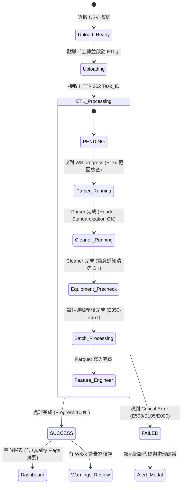
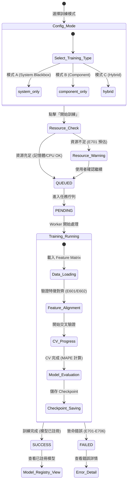
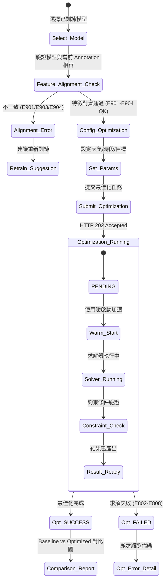

# PRD v1.1: Web UI 前端頁面流程與狀態圖 (UI Flow & State Diagram)

**文件版本:** v1.1 (Full Pipeline Coverage & Interface Contract Alignment)  
**日期:** 2026-02-23  
**範圍:** 前端視角的頁面結構、狀態轉換(State Machine)及組件設計邏輯。
**相依文件:** 
- PRD_Web_Application_Architecture_V1.1.md
- PRD_Web_API_Interface_V1.1.md
- PRD_Interface_Contract_v1.1.md
- PRD_Feature_Annotation_Specification_V1.3.md
- PRD_Model_Training_v1.3.md
- PRD_Chiller_Plant_Optimization_V1.2.md
- PRD_Equipment_Dependency_Validation_v1.0.md

**修訂紀錄 (v1.0 → v1.1):**
- 新增 `/training`、`/equipment-validation`、`/quality` 路由
- 新增 Model Training 完整狀態圖（含資源預估、Checkpoint、Cross-Validation）
- 新增 Optimization 狀態圖（含 Feature Alignment 驗證、Warm Start）
- Feature Wizard 對齊 Feature Annotation v1.3 三個 Sheet
- 錯誤層級 Badge 完整對齊 Interface Contract v1.1

---

## 1. 站點地圖與導覽 (Sitemap & Navigation)

```text
/login                           - 登入頁面
/dashboard                       - 總覽儀表板 (即時耗能、節能成效、品質指標)
/etl
  ├── /etl/upload                - 手動上傳 CSV 與啟動 Pipeline
  └── /etl/logs                  - Pipeline 執行歷史紀錄與錯誤報告 (E000-E999)
/features
  ├── /features/annotations      - Web 版 Column Annotations 編輯器
  ├── /features/group-policies   - Group Policies 管理
  └── /features/equipment-rules  - Equipment Constraints 設定
/training
  ├── /training/start            - 建立新的訓練任務
  ├── /training/tasks            - 訓練任務列表與進度
  └── /training/models           - Model Registry 瀏覽與版本管理
/optimization
  ├── /optimization/run          - 啟動最佳化模擬操作面板
  └── /optimization/report       - 最佳化成果對比圖 (Baseline vs Optimized)
/quality
  ├── /quality/flags             - Quality Flags 分佈與趨勢
  └── /quality/equipment         - Equipment Validation 違規報表
/settings                        - 系統權限與偏好設定
```

---

## 2. 核心頁面 UI Flow 與行為

### 2.1 總覽儀表板佈局 (Dashboard UI)
*   **Top Bar**: 廠區選擇 Dropdown (`cgmh_ty`, `kmuh`)、全域警鈴 (Notification Bell)、**Temporal Baseline 顯示** (Pipeline 基準時間)。
*   **KPI Cards**: 
    1. 當日總節電量 (kWh)
    2. 當前整體 COP (效能係數)
    3. 活躍中的錯誤/警告警報數（含 Equipment Violation 數量）
    4. **Quality Score** — 根據 Quality Flags 比例計算（100% - flagged_ratio）
*   **Main Chart**: 時序折線圖 (Time-series Line Chart)，X 軸為時間，Y 軸為當前負載與預測負載。**Quality Flags** 標記以背景色塊呈現（如 FROZEN 區段為灰色底、OUTLIER 為紅色三角警示點）。
*   **Alert Panel**: 顯示來自 `SYSTEM_ALERT` WebSocket 的即時錯誤 (如 E102, E355, E901)。
*   **Equipment Status Panel**: 設備狀態面板，以圖示顯示主機群開/關狀態，標記有 Equipment Validation 違規的設備。

### 2.2 資料匯入與 Pipeline 啟動 (ETL Flow)


*   **UX 防呆**:
    - 在 `ETL_Processing` 階段，前端需鎖定「再次上傳」按鈕 (Disable state)，直到成功或失敗為止。
    - 進度條需顯示當前階段名稱（Parser / Cleaner / Equipment Precheck / BatchProcessor / FeatureEngineer）。
    - Equipment Precheck 若有違規（E353-E357），以非阻塞的 Warning Toast 顯示，不中斷流程。

### 2.3 模型訓練狀態流 (Model Training Flow)


*   **UX 特殊處理**:
    - Resource_Check 階段需顯示：預估記憶體、預估訓練時間、建議 CPU 核心數。
    - Training 進度條需標示 CV 的 Fold 進度（如 3/5 Folds Completed）。
    - Checkpoint 儲存時前端顯示 💾 圖示閃爍動畫。

### 2.4 最佳化模擬狀態流 (Optimization Flow)



### 2.5 Web 版特徵精靈 (Feature Annotation v1.3 Setup)
此頁面取代原本的 Excel `Feature_Template_v1.3.xlsx`，讓工程師透過網頁 UI 操作。

**Tab 1: Column Annotations**（對齊 Feature Annotation v1.3 Sheet 1）
*   **Data Grid Component**: 類似 Airtable / AG-Grid 的互動式表格。
*   **Schema 欄位**:
    *   `Column Name` (Read-only，由 CSV 帶入)
    *   `Physical Type` (Dropdown 單選: temperature, flow_rate, power, status, humidity, gauge, chiller_load, cooling_tower_load... 共 18 種)
    *   `Unit` (Dropdown 依據 Physical Type 連動連鎖選單)
    *   `Device Role` (Radio Group: primary, backup, seasonal)
    *   `Is Target` (Toggle Switch) -> 若打開 Toggle，則 `Enable Lag` 自動停用 (呼應 E405 防護)。
    *   `Equipment ID` (Text Input: e.g. CH-01, CT-02)
    *   `Ignore Warnings` (Multi-Select: W401, W402, W403...)
    *   `Status` (Badge: confirmed / pending / deprecated)
*   **Action**: 點擊 `Save & Apply` 時，發送 `PUT /api/v1/facilities/:site_id/equipment/annotations`。

**Tab 2: Group Policies**（對齊 Feature Annotation v1.3 Sheet 2）
*   **表格欄位**: 策略名稱、匹配類型 (prefix/suffix/physical_type)、匹配值、預設模板、自定義 Lag 間隔、設備類別。
*   **Action**: `PUT /api/v1/facilities/:site_id/group-policies`

**Tab 3: Equipment Constraints**（對齊 Feature Annotation v1.3 §5）
*   **約束類型清單**: requires, mutex, sequence, min_runtime, min_downtime
*   **視覺化**: 以 Flow Chart 或 Tree View 呈現設備間的依賴關係（如 Chiller → Pump → Cooling Tower）。
*   **Action**: `PUT /api/v1/facilities/:site_id/equipment-constraints`

**Excel 上傳入口**:
*   額外提供 `上傳 Excel` 按鈕，觸發 `POST /api/v1/facilities/:site_id/annotation/upload-excel`，並展示轉換進度與 E406 同步驗證結果。

---

## 3. 狀態對應與元件設計 (Component States)

### 3.1 錯誤與警告標籤元件 (Status / Badge Chips)
根據 `PRD_Interface_Contract_v1.1.md` 的完整分層規範：

| 層級 | UI 顏色配置 | 適用情境 (Error Code) |
|:---|:---|:---|
| **CRITICAL** | Red / Error | `E000` (時間基準遺失), `E1xx` (解析失敗), `E5xx` (架構違規), `E7xx` (訓練中斷), `E901-E903` (特徵對齊失敗) |
| **HIGH** | Orange / Warning (Strong) | `E205` (批次含未來資料), `E350` (設備邏輯預檢), `E400` (Annotation 版本), `E802` (約束不可行), `E904` (設備限制不一致) |
| **WARNING** | Yellow / Warning | `W4xx` (數值異常如 W403 高零值比), `E356-E357` (最小運行/停機時間違規), `E75x` (Hybrid 一致性) |
| **INFO** | Blue / Info | `temporal_continuity` 狀態, `E000-W` (Pipeline 執行時間過長), `E757` (輕載區間高變異) |

### 3.2 讀取中骨架屏 (Skeleton Loading)
*   **情境**: 當前端透過 `GET /api/v1/optimization/results/:task_id` 向後台詢問報表時，如果 Task 處於 `RUNNING` 狀態：
*   **UI 行為**: 
    1. 隱藏圖表元件。
    2. 顯示 Skeleton Loader 以及中央進度條 (Circular Progress)。
    3. 顯示 WebSocket 拋出的 `message` (e.g. "計算非線性最佳化矩陣中...")。
    4. **顯示 Temporal Baseline 標籤** (e.g. "資料基準時間: 2026-02-14 00:00 UTC")。

### 3.3 Equipment Validation 違規視覺化
*   **情境**: Dashboard 中的設備觸狀態面板
*   **UI 行為**:
    1. 設備圖示上方標記違規 Badge（紅色小圓點數字）。
    2. 點擊展開違規詳情（約束類型、違規時間、嚴重度）。
    3. 連結至 `/quality/equipment` 查看歷史趨勢。

### 3.4 Model Registry 卡片
*   **情境**: `/training/models` 頁面
*   **卡片內容**:
    1. 模型名稱與版本
    2. 訓練模式 (System / Component / Hybrid)
    3. Feature Alignment Hash 狀態 (✅ 已驗證 / ⚠️ 需重新驗證)
    4. Annotation Checksum (與當前 YAML 的比對狀態)
    5. 訓練時間、MAPE、使用的設備限制清單
